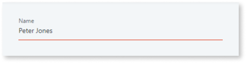
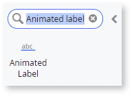
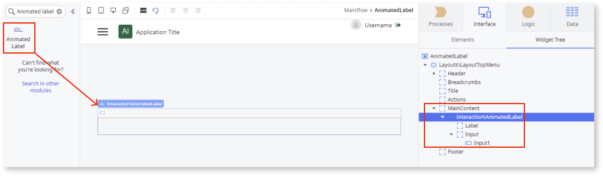
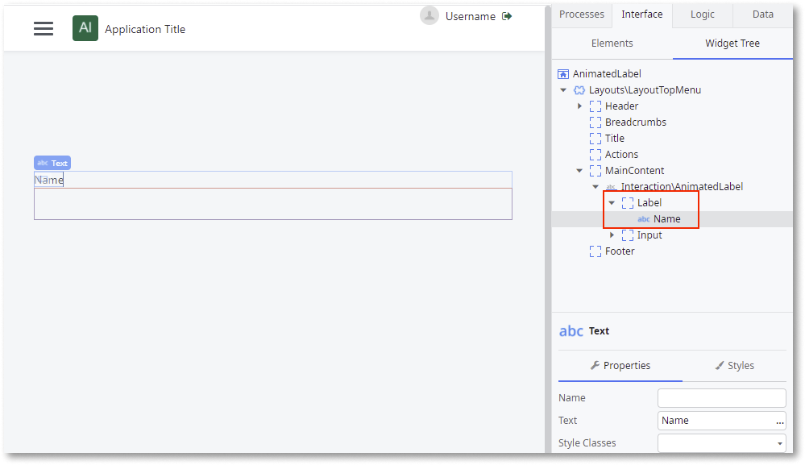
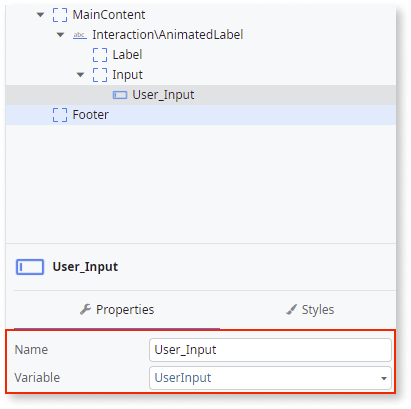
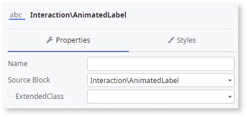

# Animated Label

Applies to Mobile Apps and Reactive Web Apps only

You can use the Animated Label UI Pattern to animate a label when there is a user input.

 

**How to use the Animated Label UI Pattern**

1. In Service Studio, in the Toolbox, search for `Animated Label`.

    The Animated Label widget is displayed.

    

    If the UI widget doesn't display, it's because the dependency isn't added. This happens because the Remove unused references setting is enabled. To make the widget available in your app:

    1. In the Toolbox, click **Search in other modules**.

    1. In **Search in other Modules**, remove any spaces between words in your search text.
    
    1. Select the widget you want to add from the **OutSystemsUI** module, and click **Add Dependency**. 
    
    1. In the Toolbox, search for the widget again.

1. From the Toolbox, drag the Animated Label widget into the Main Content area of your application's screen.

    

    By default, the Animated Label widget contains Label and Input placeholders. The Input placeholder contains a variable of type Text. You can use this variable throughout your app.

1. Enter the relevant text in the Label placeholder. In this example, we enter `Name`.

    

1. Enter a name and select a type for the Input variable.

    In this example, we enter the name User_Input and select UserInput as the variable type.

    

1. On the **Properties** tab, you can change the look and feel of the Animated Label by setting the (optional) properties.

    

After following these steps and publishing the module, you can test the pattern in your app.

## Properties

| Property                       | Description                                                                                                                                                                                                                                                                                                                                                                                                                                                                                                                                                                                                                                  |
|--------------------------------|----------------------------------------------------------------------------------------------------------------------------------------------------------------------------------------------------------------------------------------------------------------------------------------------------------------------------------------------------------------------------------------------------------------------------------------------------------------------------------------------------------------------------------------------------------------------------------------------------------------------------------------------|
| ExtendedClass (Text): Optional | Adds custom style classes to the Pattern. You define your [custom style classes](../../../look-feel/css.md) in your application using CSS.  Examples   <ul><li>Blank - No custom styles are added (default value).</li><li>"myclass" - Adds the ``myclass`` style to the UI styles being applied.</li><li>"myclass1 myclass2" - Adds the ``myclass1`` and ``myclass2`` styles to the UI styles being applied.</li></ul>You can also use the classes available on the OutSystems UI. For more information, see the [OutSystems UI Framework Cheat Sheet](https://outsystemsui.outsystems.com/OutsystemsUiWebsite/CheatSheet). |
