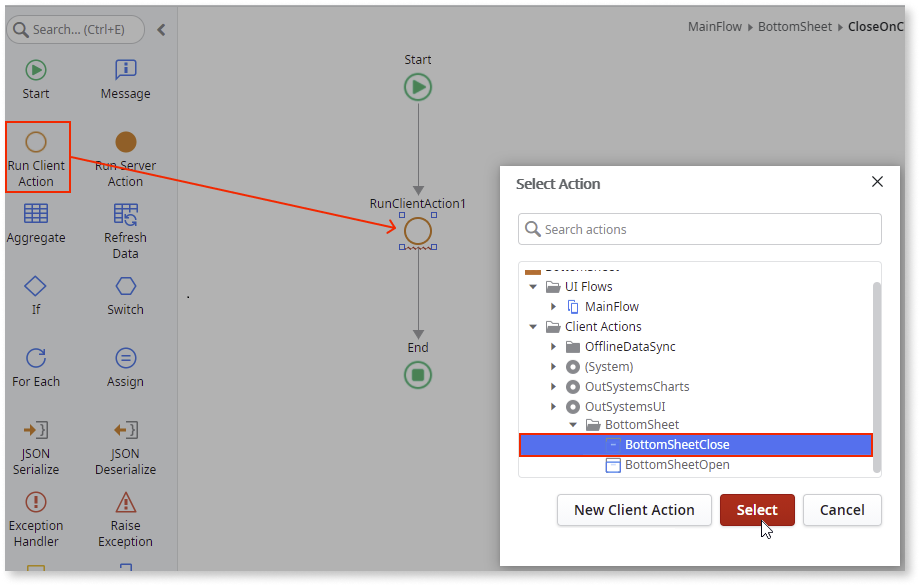

# Bottom Sheet

Applies to Mobile Apps only

You can use the Bottom Sheet Pattern to display additional information. This additional information is displayed at the bottom of the screen and supports the user's understanding of the main content.

**How to use the Bottom Sheet UI Pattern**

In this example, we create a button that opens and closes the Bottom Sheet widget.

1. In Service Studio, in the Toolbox, search for `Bottom Sheet`.

    The Bottom Sheet widget is displayed.

    

    If the UI widget doesn't display, it's because the dependency isn't added. This happens because the Remove unused references setting is enabled. To make the widget available in your app:

    1. In the Toolbox, click **Search in other modules**.

    1. In **Search in other Modules**, remove any spaces between words in your search text.

    1. Select the widget you want to add from the **OutSystemsUI** module, and click **Add Dependency**.

    1. In the Toolbox, search for the widget again.

1. From the Toolbox, drag the Bottom Sheet widget into the Main Content area of your application's screen and on the **Properties** tab, in the **Name** field, enter a name for the Bottom Sheet widget.

    

    By default, the Bottom Sheet widget contains a **TopBar** and a **Content** placeholder.

    

1. Add the relevant content to the TopBar and Content placeholders.

    

    In this example, we add text, an icon, and a button to close the widget.

1. To close the bottom sheet, select the **Close** button, and on the **Properties** tab, from the **On Click** dropdown, select **New Client Action**.  

    

1. Drag a **Run Client Action** to the client action, add from the **Select Action** popup, navigate to the **BottomSheetClose** action and click **Select**.

    

1. On the **Properties** tab, set the **WidgetId** to **BottomSheet.Id**.

    

1. In this example we create a button to open the Bottom sheet by dragging the **Button** widget just below the **Bottom Sheet** widget and on the **Properties** tab, in the **Text** field, enter the text you want to appear on the button.

    

1. Select the button, and on the **Properties** tab, from the **On Click** dropdown, select **New Client Action**.

1. Drag a **Run Client Action** to the client action, add from the **Select Action** popup, navigate to the **BottomSheetOpen** action and click **Select**.

    

1. On the **Properties** tab, set the **WidgetId** to **BottomSheet.Id**.

1. You can customize the Bottom Sheet by selecting the pattern, and on the **Properties** tab, set the relevant (optional) properties.

    

After following these steps and publishing the module, you can test the pattern in your app.

## Properties

|Property|Description|
|---|---|
|Shape (Shape Identifier): Optional|Defines the Bottom Sheet shape. The predefined options are: SoftRounded, Rounded, and Sharp.  For example, Entities.Shape.Rounded inherits the rounded style. This is the default shape.|
|ShowHandler (Boolean): Optional|If set to True, a handler is displayed on top of the Bottom Sheet. The default value is True. If set to False, no handler is displaed.|
| ExtendedClass (Text): Optional|Adds custom style classes to the Pattern. You define your [custom style classes](../../../look-feel/css.md) in your application using CSS.  Examples <ul><li>Blank - No custom styles are added (default value).</li><li>"myclass" - Adds the ``myclass`` style to the UI styles being applied.</li><li>"myclass1 myclass2" - Adds the ``myclass1`` and ``myclass2`` styles to the UI styles being applied.</li></ul>You can also use the classes available on the OutSystems UI. For more information, see the [OutSystems UI Cheat Sheet](https://outsystemsui.outsystems.com/OutSystemsUIWebsite/CheatSheet). |

## Events

### Bottom Sheet

|Event| Description|
|---|---|
|OnToggle: Optional|Event is triggered when the Bottom Sheet is opened or closed.|
