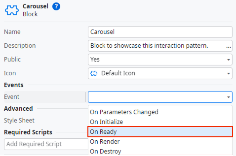
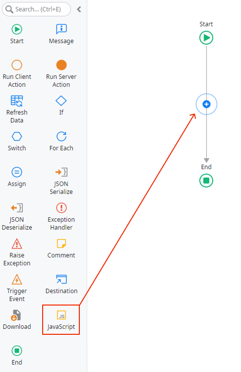
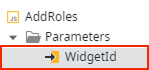
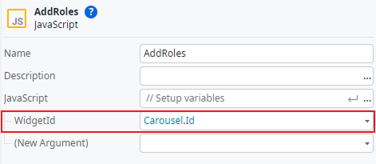
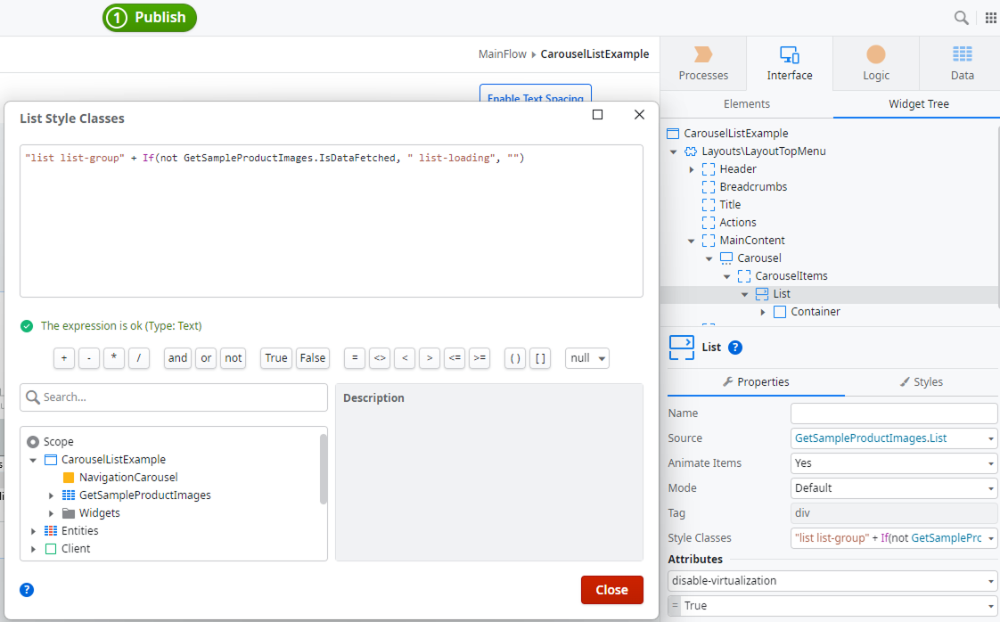

# Carousel

<div class="info" markdown="1">

Applies to Mobile Apps and Reactive Web Apps only

</div>

<div class="info" markdown="1">

**This documentation is not valid for deprecated components.** To check if your component is deprecated and how to migrate old versions, see the [Patterns and Versions Overview](https://outsystemsui.outsystems.com/OutsystemsUiWebsite/MigrationOverview).

To find out what version of OutSystems UI you are using, see [OutSystems UI version](../../intro.md#outsystems-ui-version).

</div>

You can use the Carousel UI Pattern to display multiple items in a horizontal slide.  The Carousel Pattern optimizes screen space by displaying only a few images from a larger collection which you can view using the navigation controls.


<div class="info" markdown="1">

The Carousel Pattern is based on the Splide.js library (v3). For more information about the Carousel’s behaviors and extensibility methods, see [Splide.js](https://splidejs.com/).  

</div>

## How to use the Carousel UI Pattern

1. In Service Studio, in the Toolbox, search for `Carousel`.
  
     The Carousel widget is displayed.

    

    If the UI widget doesn't display, it's because the dependency isn't added. This happens because the Remove unused references setting is enabled. To make the widget available in your app:

    1. In the Toolbox, click **Search in other modules**.

    1. In **Search in other Modules**, remove any spaces between words in your search text.

    1. Select the widget you want to add from the **OutSystemsUI** module, and click **Add Dependency**.

    1. In the Toolbox, search for the widget again.

1. From the Toolbox, drag the Carousel widget into the Main Content area of your application's screen.

    

    By default, the Carousel pattern contains a **CarouselItems** placeholder with a **List** widget and **Image** widget. If you want a Carousel with static images, you can remove the **List** widget and add your images inside the **CarouselItems** placeholder.

1. Add your content to the **Carousel Items** placeholder.

    In this example, the List is deleted, and 3 Image widgets are added.  

    

1. Select the **Image** widget, and on the **Properties** tab, from the **Image** drop-down, select or import the image you want in the Carousel.

    **Note:** In this example, the image Type is set to Local image. You can also add External and Binary Data images. In this example, the image property Type is set to **Local** image. You can also add [External and Binary Data](../../../image/display-image.md) images.

    

1. Repeat step 4 for each of the images in the Carousel.

1. You can configure the Carousel by selecting the pattern, and on the **Properties** tab, set the relevant (optional) properties, for example, **Navigation** or **ItemsPerSlide**.For more configurations, expand the **OptionalConfigs** property.

      

After following these steps and publishing the module, you can test the pattern in your app.

## Properties

| **Property**|**Description**|
|---|---|
|Navigation (CarouselNavigation Identifier): Optional | Defines the type of navigation for the carousel. The available options are:<ul><li>Dots</li><li>Arrows</li><li>Both (dots and arrows)</li><li>None</li></ul> |
|Height (Text): Optional| Defines a custom height for the carousel. The parameter accepts any CSS format, except percentage (library constraint). The default value is 'auto'. This means that the height is adapted to the same height as the parent element in the DOM.|
|ItemsPerSlide (CarouselItems): Optional|Defines the number of items shown per slide according to the device. <ul><li>Desktop (Integer): Defines the number of items that are shown simultaneously on a desktop. By default, 1 item is displayed.</li><li>Tablet (Integer): Defines the number of items that are shown simultaneously on a tablet. By default, 1 item is displayed.</li><li>Phone (Integer): Defines the number of items that are shown simultaneously on a phone. By default, 1 item is displayed.</li></ul> |
|OptionalConfigs (CarouselOptionalConfigs): Optional| Defines additional parameters to customize the Carousel behavior and functionality.|
|OptionalConfigs.AutoPlay (Boolean): Optional| If set to True, the Carousel changes slides automatically. This is the default value. |
|OptionalConfigs.Loop (Boolean): Optional|Enables the continuous slide of the Carousel even after it reaches the end.|
|OptionalConfigs.Padding (Text): Optional|Defines the distance between the Carousel edges and the visible items on each slide.<br/>Accepts any css size unit (such as px, vw, %) or even css variables.<br/>Example: "100px" |
|OptionalConfigs.ItemsGap (Text): Optional| Defines the distance between each Carousel item.<br/>Accepts any css size unit (such as px, vw, %) or even css variables.<br/>Example: "var(--space-base)".|
|OptionalConfigs.StartingPosition (Integer): Optional| Defines the first element to show in the Carousel.|
|ExtendedClass (Text): Optional| Adds custom style classes to the Pattern. You define your [custom style classes](../../../look-feel/css.md) in your application using CSS. <br/>Examples <ul><li>Blank - No custom styles are added (default value).</li><li>"myclass" - Adds the ``myclass`` style to the UI styles being applied.</li><li>"myclass1 myclass2" - Adds the ``myclass1`` and ``myclass2`` styles to the UI styles being applied.</li></ul><br/>You can also use the classes available on the OutSystems UI. For more information, see the [OutSystems UI Cheat Sheet](https://outsystemsui.outsystems.com/OutSystemsUIWebsite/CheatSheet). |

## Events

### Carousel

|Event| Description  |
|---|---|
|Initialized: Optional | Event triggered after the Carousel is initialized. |
|OnSlideMoved: Optional | Event triggered after the Carousel slides move.  |

## Compatibility with other patterns

Avoid using the Carousel inside patterns with swipe events, such as the **Tabs** and **Stacked Cards** patterns.

## Accessibility – WCAG 2.2 AA compliance

By default, the Carousel UI pattern requires a small update to fully comply with WCAG 2.2 AA standards. You must manually update it to fix the following issues:

* **Pagination controls** must meet the minimum target size of 24 px, making them easier to use for people with motor impairments or situational challenges.

* **Images can’t have the `tabpanel` role**. This role is only valid on containers, such as `<div>` or `<section>`, associated with a tab in a tablist.

* **Lists inside the Carousel** must have the correct roles so that screen readers interpret them properly.

Updating the Carousel ensures the pattern is more accessible for everyone, including people with visual or motor impairments.

### Fix pagination controls

1. In **Service Studio**, go to the **Interface** tab.

1. In the **Themes** folder, double-click the **Style Sheet** of your theme.

    

1. Add the following CSS code to **`.splide__pagination__page`** selector:

    ```css
    .splide__pagination__page {
        height: 12px;
        margin: 6px;
        width: 12px;
    }
    ```
    
    

1. Adjust the values if needed to change the dot size, but make sure the clickable area is **at least 24px**.

    <div class="info" markdown="1">

     The original width and height of the dots was **8px**. In this update, the dots are enlarged to improve visibility and reduce extra spacing between them.

     </div>

1. Publish the module.

### Remove the incorrect role from images

<div class="info" markdown="1">

This issue occurs **only when you use static images directly inside the Carousel**, such as in the example provided in the OutSystems UI Style Guide Preview. The Carousel script assigns roles to its direct child elements. By enclosing each image in a container, the image is no longer a direct child, preventing the incorrect role from being applied.

</div>

1. In **Service Studio**, go to the **Interface** tab, and select **Widget Tree**.

1. In the **Carousel** pattern, search for the **CarouselItems** placeholder.

   

1. Right-click an **Image** widget, and select **Enclose in Container**.

   

1. Repeat step 3 for every **Image** inside the Carousel.

1. Publish the module.

### Assign list roles in the Carousel

1. In **Service Studio**, go to the **Interface** tab, and select the **Screen/Block** where you use the Carousel with a list.

1. In the **Screen/Block** properties, select the **OnReady** event. A client action is created.

    

1. In the **OnReady** client action, drag a **JavaScript** node to the flow, from the left panel.

   

1. In the **JavaScript** node, add an input parameter named **WidgetId** (type **Text**).

   

1. Set **WidgetId** to the Carousel block/widget ID (for example, `Carousel.Id`).

    

1. Add the following script to assign the correct roles:

    ```javascript
    // Setup variables
    const carouselObj = document.getElementById($parameters.WidgetId);
    if (!carouselObj) {
        return;
    }
    let listEl = carouselObj.querySelector('.osui-carousel .list');
    let retryHandle;

    function applyRoles(currListEl) {
        if (!currListEl) return;
        currListEl.setAttribute('role', 'list');

        // Apply to direct children only
        const items = currListEl.querySelectorAll(':scope > *');
        items.forEach((item) => {
            item.setAttribute('role', 'listitem');
        });
    }

    function waitListRender() {
        if (listEl && !listEl.classList.contains('list-loading') && listEl.children.length) {
            applyRoles(listEl);
            if (retryHandle) {
                clearTimeout(retryHandle);
            }
        } else {
            retryHandle = setTimeout(waitListRender, 100);
        }
    }

    // First try the OutSystems List
    if (listEl) {
        waitListRender();
    } else {
        // Fallback to static Splide list
        listEl = carouselObj.querySelector('.osui-carousel .splide__list');
        if (listEl) {
            applyRoles(listEl);
        }
    }
    ```

1. Confirm the **List** has `disable-virtualization` set to `True`.

1. Confirm the **List** applies the `list-loading` class based on the query’s `IsDataFetched` state.

   

1. Click **Done**, then publish the module and test it.

### Result

* The Carousel pagination dots now have a minimum **24px** clickable area.

* The Carousel script applies the `tabpanel` role only to containers. Images don’t receive a role, as expected.

* If you use a list in the Carousel, it now has the correct roles assigned.

* Lists inside the Carousel are announced correctly by screen readers with **list** and **listitem** roles.

Test the pattern in your app to confirm the update.
