# How to use OutSystems Data Grid Web

Before starting, make sure that the components [OutSystems Data Grid Web](https://www.outsystems.com/forge/component-overview/5554/) and [OutSystems Data Grid Web Sample](https://www.outsystems.com/forge/component-overview/5555/) are installed in your environment.

Check also [OutSystems Data Grid Web video tutorials](<https://www.youtube.com/playlist?list=PLxALhSwsaivxRsBZ4kEfzvH4cqU9q0nso>) on YouTube.

## Create interface to view data

Follow these steps to create a grid interface where users can view and filter data.

1. Create a new Web App and add the references. Search for **DataGridComponent** and add all elements. Then search for **DataGridWebExample** and add only elements under the **Entities** tree.

1. Create a REST endpoint to return a JSON required by Data Grid. Right-click on **Logic** > **Integrations** > **REST** and select **Expose REST API**. Name this REST API "Suppliers". Create a new REST API Method, name it "GetAll" and design it so it returns all entries from the Supplier Entity (find it in **Data** > **DataGridWebExample**). The data type of the Suppliers Output Parameter should be Supplier List.
    
    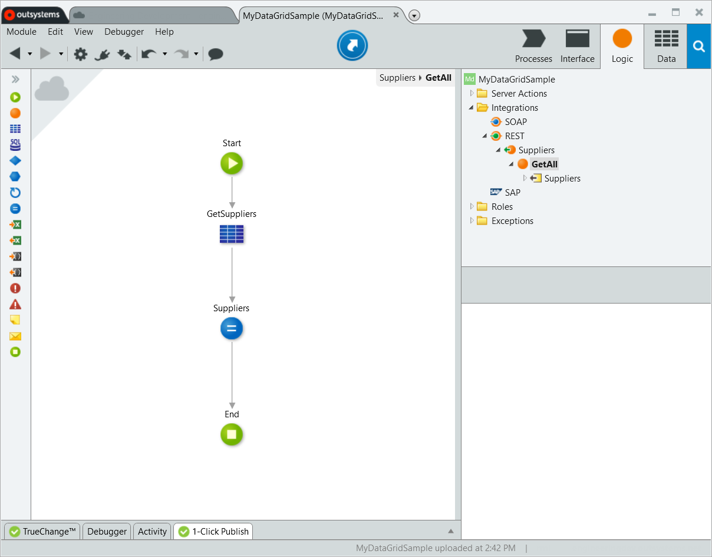

1. Create a Server Action to get the REST URI. Right-click **Logic** > **Server Actions** and select **Add Server Action**. Name the action "GetAllSuppliers" and design it so it returns a URL parameter with the value **GetOwnerURLPath()** + `"rest/Suppliers/GetAll"`.
 
    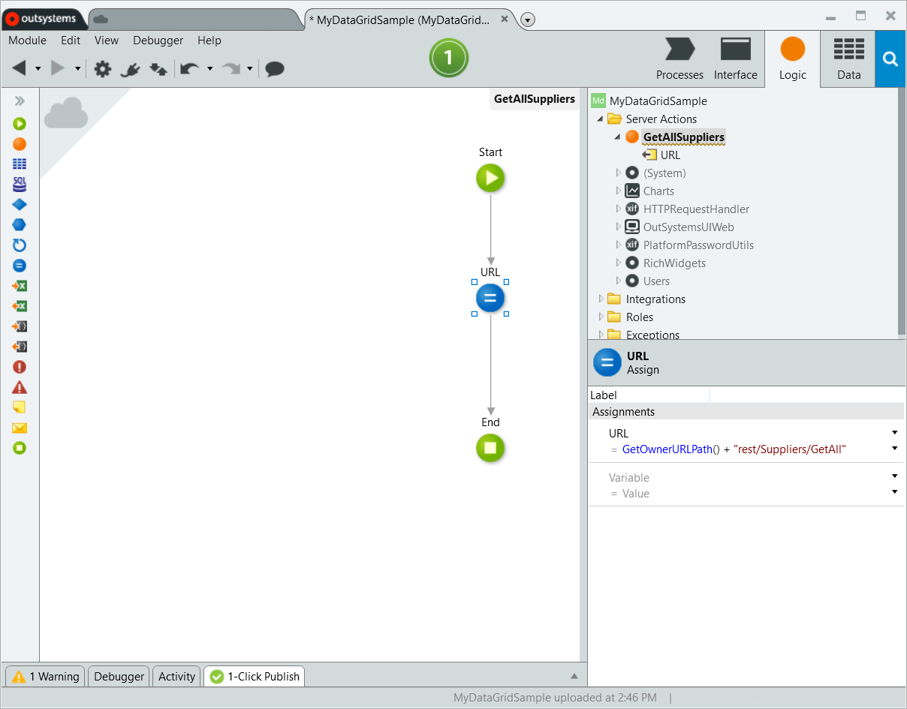

1. Create a new empty Screen and add a Preparation. Name the Screen "ScreenDataGridRead", and in Preparation add GetAllSuppliers to the Action logic.

1. Add the Data Grid Container Block. Navigate to **Interface** > **DataGridComponent** > **Structures** and drag **GridContainer** to the main section of "ScreenDataGridRead". Name it "MyDataGrid". You get an error at this point, but that's fine as we don't provide any data to it yet.

1. Provide data to the Data Grid. With "MyDataGrid" selected, locate **RestURL** property and select GetAllSuppliers.URL.

1. Insert some columns. To add a column, navigate to **Interface** > **DataGridComponent** > **Columns**, drag **GridColumnText** and drop it in "MyDataGrid". Name the column "ColumnSupplierCode", and in its **JSONField** property enter `"SupplierCode"` (with quotes). Repeat for the Supplier Name field, with the **JSONField** property `"SupplierName"`. 
 
    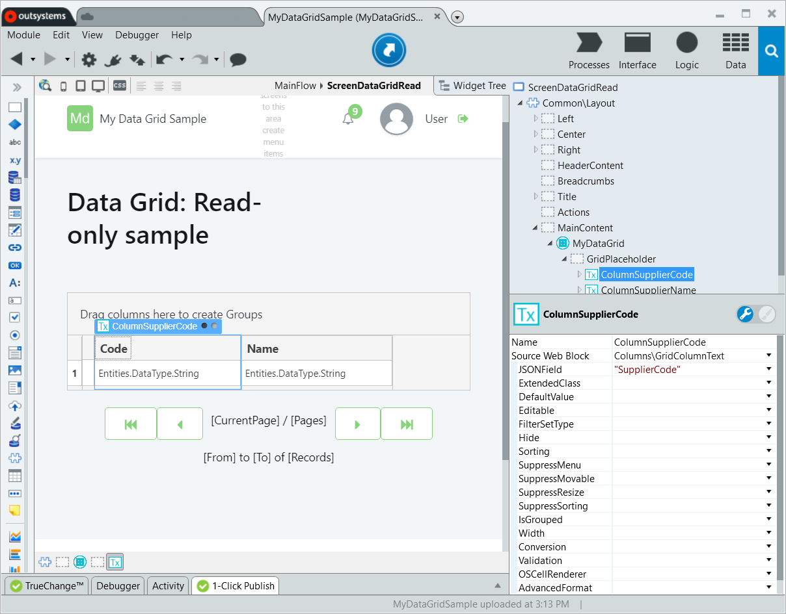

1. Publish the app and visit the page in a browser. You should see a Data Grid and be able to use the features enabled by default, for example, show/hide columns and contextual filters.   

    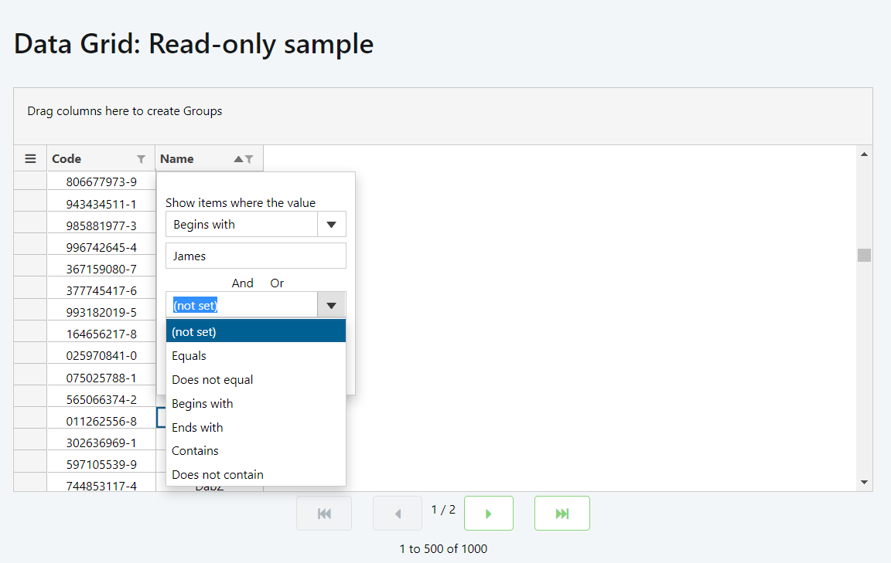

## Create interface to view, edit, and save data

Continue with these steps to create a grid interface where users can edit and save data, not only view it.
 
1. Create a Server Action to get the REST URI. Right-click **Logic** > **Server Actions** and select **Add Server Action**. Name the action "SaveAllSuppliers" and design it so it returns a URL parameter with the value **GetOwnerURLPath()** + `"rest/Suppliers/SaveAll"`.

1. Create a REST endpoint to receive the JSON required by the app. Go to **Logic** > **Integrations** > **REST** > "Suppliers" and create a REST API Method with the name "SaveAll". Set the **HTTP Method** of "SaveAll" to **POST**.

1. Design the API Method so it receives a Text data type parameter and name it "JSON". Set the **Receive In** property of this Input Parameter to **Body**.

1. Edit the logic of "SaveAll" to save the data. Drag the **JSON Deserialize** Tool to the Action logic and in the tool properties set: **JSON String** to "JSON" input parameter and **Data Type** to "Supplier List". Finalize the Action logic so it saves the received records (you can use CreateOrUpdateSupplier Action of the Supplier Entity).

    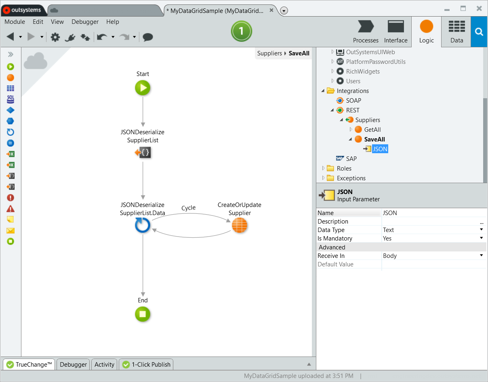

1. Create a new Screen by copying and pasting the Screen "ScreenDataGridRead" and renaming it to "ScreenDataGridSave". Place the SaveAllSuppliers Server Action in the Preparation logic of "ScreenDataGridSave". Note: We are reusing elements from the previous step. All the steps in this section now refer to "ScreenDataGridSave".

1. Enable the cell editing and row selecting. Select "MyDataGrid" and in the properties set **CheckboxSelection** to True.  Also, select each column of the grid and in properties set **Editable** to True.

1. Add the save button. Navigate to **Interface** > **DataGridComponent** > **Actions**, drag **SendSelectedRowsButton** and place it in the Screen. Enter "Save selected" as the Button label. With the Button still selected, find the **RestURL** property and set it to SaveAllSuppliers.URL.
    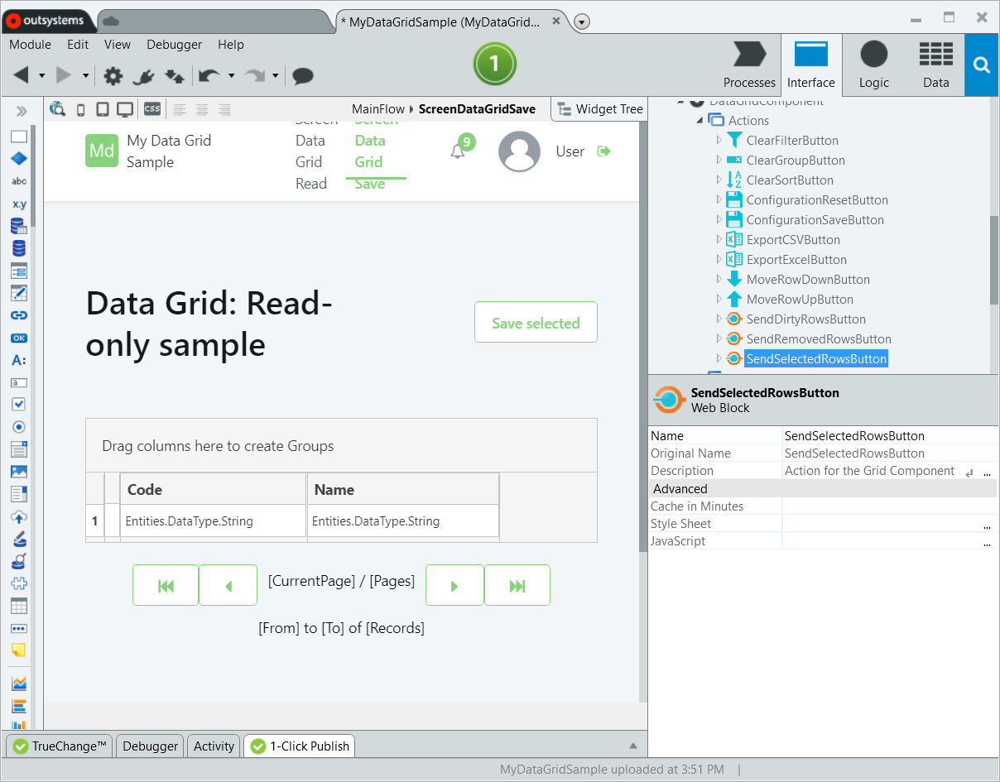

8. Publish the app and visit the page in a browser. Edit some cells, select the check boxes of the rows you want to save and click Save Selected. The message "Data updated successfully" shows.
     
    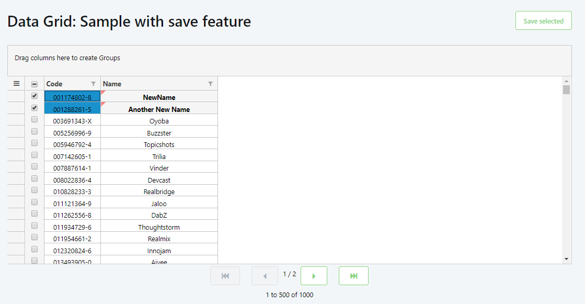

## Implementing the server-side validation

After the client-side validation, the rows with errors are not sent to the server. You may choose not to validate the data on the client side and send it to the server even if they might not be valid. In that case, have a server-side validation logic that validates the data, saves it to the database, and then sends the validated data back to the Data Grid.

These are some suggested steps to implement server-side validation and saving data in a Server Action.

  1. In your Data Grid widget, use **SendDirtyRowsButton** or **SendSelectedRowsButton** and set the **CanSendErrorFreeRow** property to true.
  2. In the Server Action that validates and saves the data, set an output parameter of the JSONResponse data type. JSONResponse is a structure from the Data Grid component.
  3. Parse the JSON from your Data Grid, process the data and check for your error conditions.
  4. In the true branch of the error condition (when there's an error) append the error to the list of the errors.
  5. In the false branch of the error condition (when there's no error), update the data in the database.
  6. Return the JSONResponse with the data and feedback message back to you Data Grid widget.

### Example

You can find examples of validation in the DataGrid Example module from the [OutSystems Data Grid Web Sample component](https://www.outsystems.com/forge/component-overview/5555/data-grid-sample). Open **DataGrid Example** module and go to **Logic** > **Integrations** > **REST** > **Orders** > **SaveOrders**. Here is an overview of the Action.

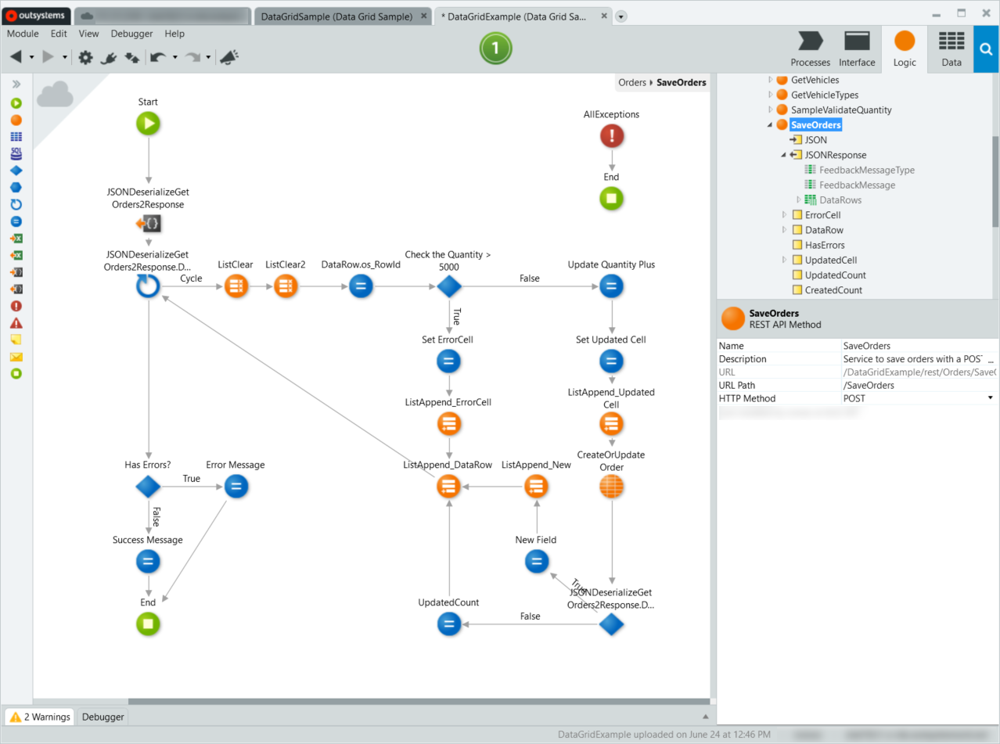

On the Server Action there's an output parameter with the data type JSONResponse (from the Data Grid component).

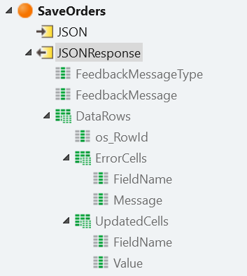

The `os_RowID` row identification is set to identify where in the UI to show the error. 

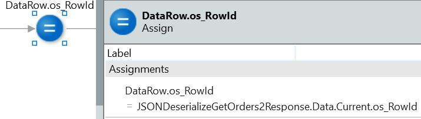

The details about the error are set in the `ErrorCell` local variable.

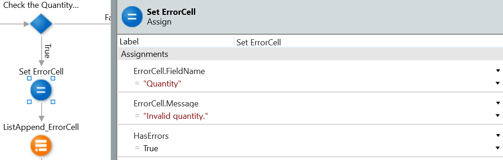

The info about the error is appended to `DataRow.ErrorCells` list of errors. The data for the entire row is then added to a list and passed to the JSONResponse output.

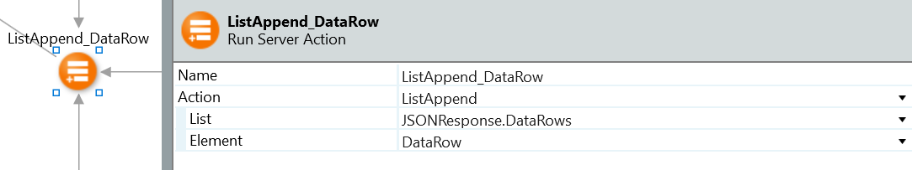

When the Data Grid widget receives the data and if there is an error, the cell with the error is shown with a red border. The error message pops up when you move the mouse pointer over the cell.

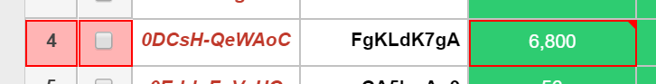

## Use of Data Grid

Some of the use cases for Data Grid, an Excel-like interface, are bulk data entry, reporting capabilities with sorting, filtering, and editing.

### Where Data Grid fits

Here are some examples when using Data Grid benefits user experience.

* Users need to enter or edit data in bulk.
* Data has a strong hierarchical relation and users quickly want an overview.
* Users need to edit or access any cell.
* Users need an interface with formatting features and have relations and conditions.
* Users need, in general, richer experience than tables can provide.

### Where a table fits better

Here are some examples where using Data Grid might be too complex for users.

* Users only need to access only one column, not several at the same time.
* Users do not need to see all fields and can find data by scrolling.
* Cells have no direct hierarchical relation to each other.
* Users need to "save view", which means the real functionality they need is configuration, not customization. A customizable table is a better choice.
* The target app is Mobile App, where a bigger grid format is difficult to manage, particularly in smartphones.
