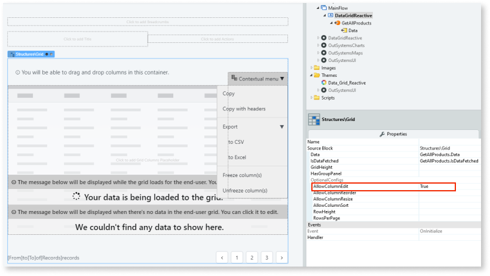
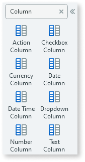
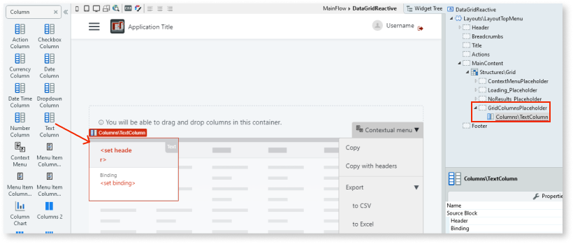
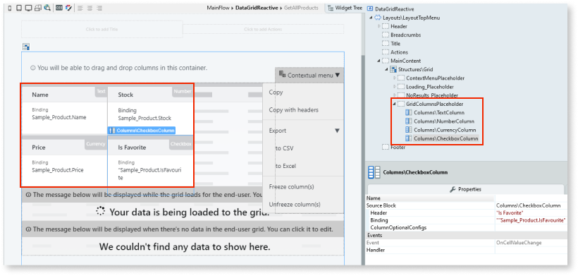
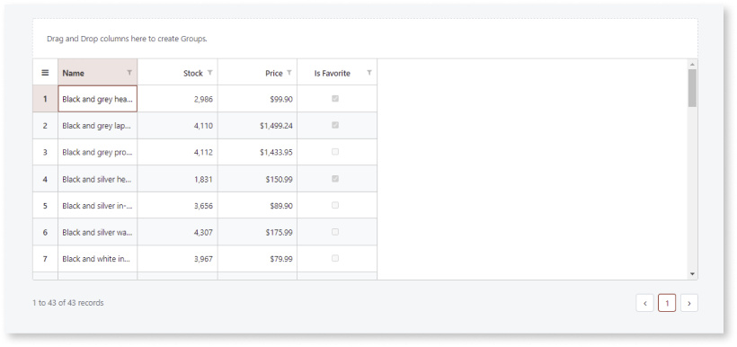

# How to edit data in the OutSystems Data Grid

This example shows how to edit data in the Grid using columns.

**Prerequisites:** 

* Complete [How to use the OutSystems Data Grid component](how-to-view-data.md).

1. Select the **Grid** component, and on the **Properties** tab, expand **Optional Configs** and set the **AllowColumnEdit** property to **True**. 

    This allows the Grid values to be edited. 

   

1. In the Toolbox, search for Column.

    The Grid Column widgets are displayed.

   

1. Drag the relevant Column type to the **GridColumnsPlaceholder**. 

    In this example, the **Text Column** is used.

   

1. On the Text Column **Properties** tab, enter the **Header** and **Binding** information.

    The **Header** property displays in the column’s header. In this example, **"Name"** is entered. 
 
    The **Binding** property displays the name of the entity and the attribute in the column. In this example, the entity is called Sample_Product and the Attribute is Name, so the Binding property is **"Sample_Product.Name"**.

    

1. Repeat steps 3 and 4 for the Column widgets you want to display on your Grid. 

    This examples uses the following:

    | **Widget** | **Property** |
    |---|---|
    |**Number Column** | Header: "Stock"   Binding: "Sample_Product.Stock"|
    | **Currency Column**| Header: "Price"  Binding: "Sample_Product.Price" | 
    |**Checkbox Column** | Header: "Is Favorite" Binding: "Sample_Product.IsFavourite" |  

    

After following these steps and publishing the module, you can test the component in your app. Double-click a cell to edit it's content.

**Result**

**Note:** When you edit a cell, that cell and the corresponding line is marked with a black triangle to indicate a change in data. 
