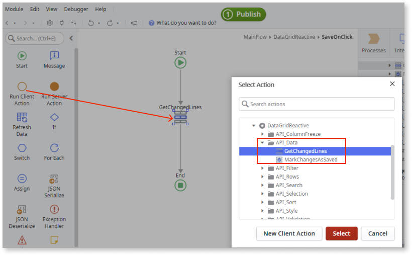

# How to save changes to the OutSystems Data Grid

This example shows how to edit the Grid data and save those changes to the database.

**Prerequisites:**

* Complete [How to edit data in the Grid component](how-to-edit-data.md).

1. Select the Grid component and on the **Properties** tab, enter a **Name**.

    In this example, **ProductGrid** is entered.

    

1. Add a Save button to the screen.

    In this example, the button is added to the Actions placeholder.

    This button saves the changed data in the grid  to the server's database.

    

1. On the **Properties** tab, from the **On Click** dropdown, select **New Client Action**.

    

1. Add a **Run Client Action** to the flow, select the **GetChangedLines** from the **API_Data folder**, and click **OK**.

    

1. Enter the **GridWidgetId**.

    In this example, ProductGrid.Id is entered.

    

1. Add a **JSON Deserialize** to the flow.

    The JSON Deserialize node is added because any data changed in the Grid is in JSON format.

    

1. From the **JSON String** dropdown, select **ChangedLines.EditedLines** of the client action **GetChangedLines**.

    

1. From the **Data Type** dropdown, select **List** and select the relevant element type from the list.

    In this example, the **Sample_Product** aggregate is used so the **Data Type** is **Sample_Product List**.

    

    **Note:** It is necessary to select the correct **Data Type** to deserialize the changed data.

1. On the **Logic** tab, create a Server Action and add an input parameter. The input parameter receives the data to be updated in the database. Select the input parameter's **Data Type**, in this example, Sample_Product List.

    

1. Add the logic that updates the data in the database.

    In this example the following is added:

    | **Logic** | **Property** | **Value** |
    |---|---|---|
    | **For Each**  | Record List | EditedProducts (Input Parameter) |
    | **Run Server Action** | Source | EditedProducts.Current |

    

1. Return to the **Save** button logic and call the **UpdateProducts** server action and set the **EditedProdcuts** to the output of the **JSON Deserialize** node.

    

1. After saving the data in the database, you must remove the change indicator in each of the cells. To do this, call the **MarkChangesAsSaved** API client action and set the **GridWidgetId** to the Grid Id.

    

After following these steps and publishing the module, you can test the component in your app. If you change cell contents and then click Save changes, the data is saved in the database and the change indicator in each of the cells disappear.

**Result**

