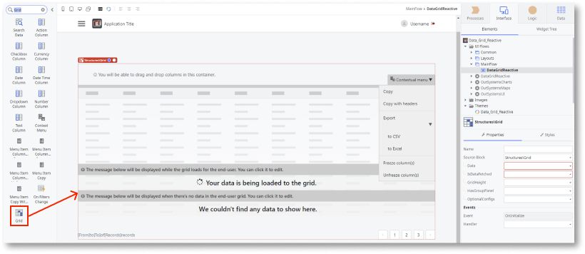

# How to use the OutSystems Data Grid

**Prerequisites** 

* Download and install the [OutSystems Data Grid (O11)](https://www.outsystems.com/forge/component-overview/9764/data-grid-reactive) component from Forge.

This example fetches data from a database and displays it in the grid. (This example does not define any column structure.) 

1. In Service Studio, in the Toolbox, search for Grid.

    The Grid widget is displayed.

    

1. From the Toolbox, drag the Grid widget into the Main Content area of your application's screen.

    

    By default, the Grid widget contains the following placeholders:

    * ContextMenu
    * Loading (displayed while data is being fetched from the server)
    * NoResults (displayed when no results are returned)
    * GridColumns

    

    You can change the content of these placeholders as required.

1. Create a Data Action to fetch the data you want to display in the grid.

    

1. Enter a name for the Action's output parameter (for example, Data) and ensure the **Data Type** is **Text**.

    This output parameter is used to receive the data fetched from the database.

    

1. On the **Data** tab, drag the data source entity onto the flow.

    

    An aggregate (in this example, GetProducts) is automatically created. 

1. On the **Logic** tab, drag the **ArrangeData** Server Action onto the flow.

    The **Grid** block receives data in JSON format. The **ArrangeData** Server Action (**only available for O11**) analyzes this data, serializes it, and retrieves the information from each column, whether it be in, for example, string, number, or boolean format.

    

1. Set the **Data Action** property to the aggregate result. 

    All of the aggregate data is passed to the action.

    **Note:** Because the **ArrangeData** Server Action action can receive any data structure, you must use the **ToObject** function. **ArrangeData is only available for O11**.

    

1. Drag an **Assign** onto the flow and set the **Data** action output parameter to the **ArrangeData.DataJSON** property.

    

1. Return to the main screen and select the Grid. On the **Properties** tab, set the **Data** property to the output of the Data Action you created earlier (step. 3).

    

1. Bind the Grid's **IsDataFetched** property to the Data Action property **IsDataFetched**.

    

After following these steps and publishing the module, you can test the component in your app.

**Result**

## Properties

| **Properties** | **Description** |
|---|---|
| Data (Text): Mandatory  | The data displayed in the Grid.  |
| IsDataFetched (Boolean): Mandatory | Defines what is displayed while data is loading. | 
| GridHeight (Integer): Optional  |  Sets the Grid's height in pixels. Default height is 400 pixels. |  
| HasGroupPanel (Boolean): Optional  | Enables the group panel to allow dragging columns and apply the grouping by the fields corresponding to the dragged columns. Default value is True. |  
| AllowColumnEdit (Boolean): Optional  | Allows columns to be edited. Default value is False.  |   
| AllowColumnReorder (Boolean): Optional  | Allows columns to be reordered. Default value is True. | 
| AllowColumnResize (Boolean): Optional  | Allows column width to be resized. Default value is True. |  
| AllowColumnSort (Boolean): Optional  | Allows sorting data by column. Default value is True. | 
| KeyBinding (Text): Optional  | Set the primary key field of the data. Expected format: 'Entity.Attribute'.  Use this field when doing Server-side validations.  Don’t want to refresh the grid after adding lines. Combine with UpdateAddedLineKey and GetRowNumberByKey actions. | 
| RowHeight (Integer): Optional  | Sets the row height in pixels. Default height is 48 pixels. | 
| RowsPerPage (Integer): Optional  | Sets the number of rows displayed per page. Default value is 50.| 
| ShowAggregateValues (Boolean): Optional  | Set to True to display a line below the grid with the column values aggregated (sum, min, max, etc.).  By default, the parameter is set to False.  To define the aggregation function of a given numeric (Number or Currency) column, use the SetColumnAggregate client action.| 
| SanitizeInputValues (Boolean): Optional  | Set True to assure the values inputed in the grid will be sanitized or False if you want to explicitly allow custom code to run.| 
| ServerSidePagination (Boolean): Optional  | Set to True if you want to enable server-side pagination. By default, False.| 
| RowHeader (RowHeader Identifier): Optional  | Defines what is shown on the first column of the grid. Default value is *Entities.RowHeader.RowNumber*.| 

