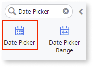
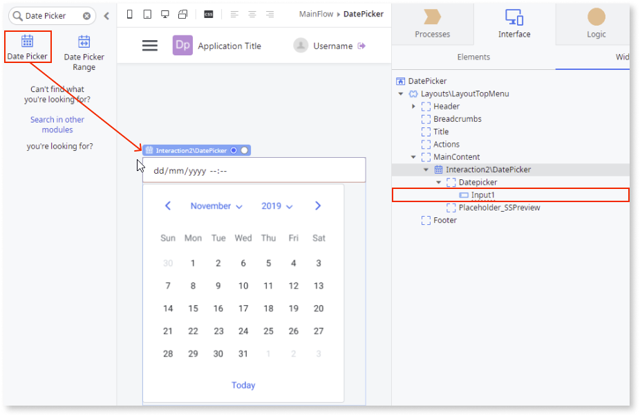
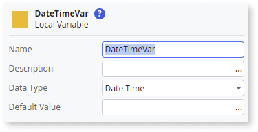
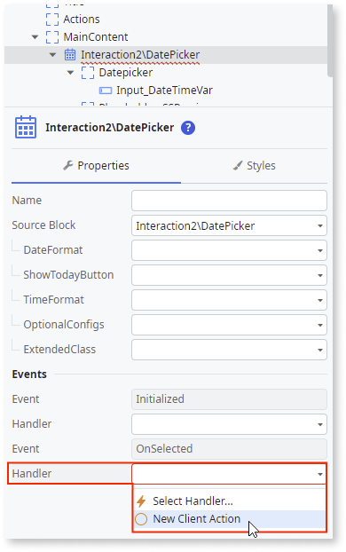
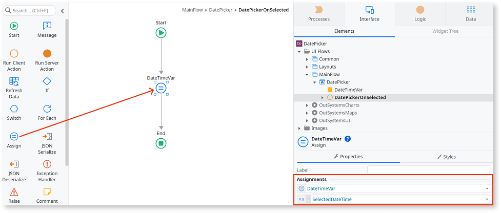
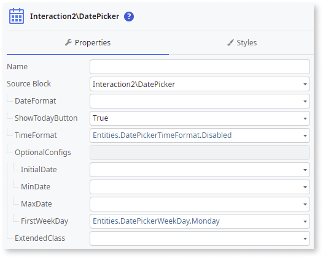
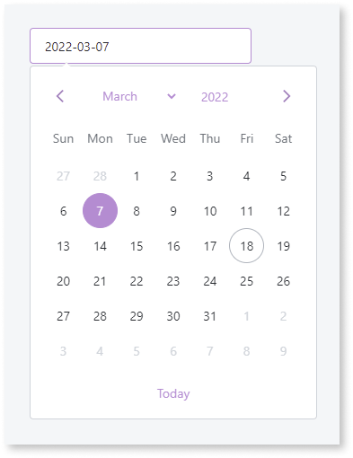

# Date Picker

Applies to Mobile Apps and Reactive Web Apps only

**This documentation is not valid for deprecated components.** To check if your component is deprecated and how to migrate old versions, see the [Patterns and Versions Overview](https://outsystemsui.outsystems.com/OutsystemsUiWebsite/MigrationOverview).

To find out what version of OutSystems UI you are using, see [OutSystems UI version](../../intro.md#outsystems-ui-version).

You can use the Date Picker UI Pattern to allow users to select a single date using a calendar. The Date Picker Pattern is based on the [flatpickr library](https://flatpickr.js.org/). For more advanced options, you can refer to this library.

In this example, the user selects a date from the calendar, the date is saved in a variable and then displayed in an input widget.

1. In Service Studio, in the Toolbox, search for `Date Picker`.

    The Date Picker widget is displayed.

    

    If the UI widget doesn't display, it's because the dependency isn't added. This happens because the Remove unused references setting is enabled. To make the widget available in your app:

    1. In the Toolbox, click **Search in other modules**.

    1. In **Search in other Modules**, remove any spaces between words in your search text.
    
    1. Select the widget you want to add from the **OutSystemsUI** module, and click **Add Dependency**. 

    1. In the Toolbox, search for the widget again.

1. From the Toolbox, drag the Date Picker widget into the Main Content area of your application's screen.

    By default, the Date Picker contains an **Input** widget (type Date Time).

    

1. Create a variable by selecting the **Input** widget, and on the **Properties** tab, select **New Local Variable** from the **Variable** dropdown.

    This variable stores any value entered into or received by the Input widget.

    

1. Enter a name for the variable (in this example **DateTimeVar**). This variable stores the date selected by the user.

    

1. To create an **OnSelect** event for the Date Picker, on the **Properties** tab, from the **Handler** dropdown, select New **Client Action**.

    

1. To access the date selected by the user, create an **Assign** and set the **DateTimeVar** to **SelectedDateTime**.

    
    

1. You can configure the Datepicker by selecting the pattern, and on the **Properties** tab, set the relevant optional properties. For more configurations, expand the **OptionalConfigs** property.

    

After following these steps and publishing the module, you can test the pattern in your app.

**Result**

## Properties

| Properties| Description|
|---|---|
|DateFormat (Text): Optional| Defines the input date format. If empty, the date format is the same as the server format. When using formats with time, make sure to set the **TimeFormat** property. The following are some examples:<ul><li>"DD/MM/YYYY" - 15/05/2022 </li> <li>"MM/DD/YYYY" - 05/15/2022</li><li>"DD MMM YYYY" - 15 May 2022</li><li>"DD-MMM-YYYY" - 15-May-2022</li><li>"DD.MMM.YYYY" - 15.May.2022</li><li>"MMM DDD, YYYY" - May Sun, 2022</li><li>"MMM DDD, YY" - May Sun, 22</li></ul>|
|ShowTodayButton (Boolean): Optional| If True, the **Today** button is displayed below the Date Picker. This button allows users to pick the date of the current day. If False, the **Today** Button is not displayed. The default value is False.  |
|TimeFormat (DatePickerTimeFormat Identifier): Optional| Defines the time format(12 hours or 24 hours). By default, no time is shown (Disabled).|
|OptionalConfigs (DatePickerOptionalConfigs): Optional| Defines additional parameters to customize the Date Picker behavior and functionality.|
|OptionalConfigs.InitialDate (Date Time): Optional| Defines the initial selected date for the DatePicker. If not set, no initial date is selected.|
|OptionalConfigs.MinDate (DateTime): Optional| All days before this date are disabled.|
|OptionalConfigs.MaxDate (DateTime): Optional| All days after this date are disabled.|
|OptionalConfigs.FirstWeekDay (DatePickerWeekDay Identifier): Optional | Defines which week day is displayed first.  |
|OptionalConfigs.ShowWeekNumbers (Boolean): Optional | Displays the week number on the left side of the Date Picker.  |
|ExtendedClass (Text): Optional| Adds custom style classes to the Pattern. You define your [custom style classes](../../../look-feel/css.md) in your application using CSS.   Examples <ul><li>_Blank_ - No custom styles are added (default value).</li><li>"myclass" - Adds the ``myclass`` style to the UI styles being applied.</li><li>"myclass1 myclass2" - Adds the ``myclass1`` and ``myclass2`` styles to the UI styles being applied.</li></ul>You can also use the classes available on the OutSystems UI. For more information, see the [OutSystems UI Framework Cheat Sheet](https://outsystemsui.outsystems.com/OutsystemsUiWebsite/CheatSheet). |

## Events

### Date Picker

|Event| Description | 
|---|---|
|Initialized: Optional| Event triggered after the Date Picker instance is ready.| 
|OnSelected: Mandatory| Event triggered each time a date is selected.| 

