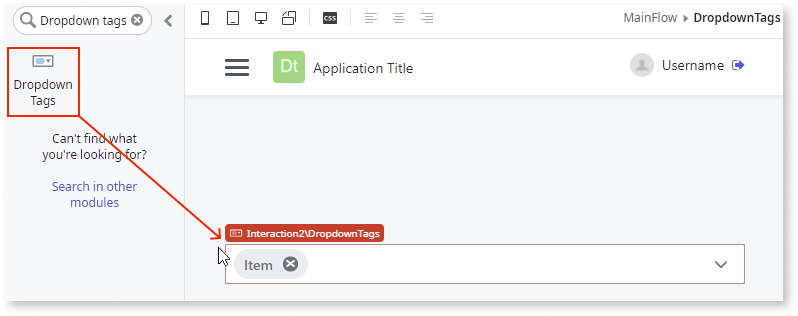

# Dropdown Tags

Applies to Mobile Apps and Reactive Web Apps only

**This documentation is not valid for deprecated components.** To check if your component is deprecated and how to migrate old versions, see the [Patterns and Versions Overview](https://outsystemsui.outsystems.com/OutsystemsUiWebsite/MigrationOverview).

To find out what version of OutSystems UI you are using, see [OutSystems UI version](../../intro.md#outsystems-ui-version).

The Dropdown Tags UI Pattern offers multiple choice options to the user when using a dropdown search.

**How to use the Dropdown Tags UI Pattern**

In this example, we create a dropdown tags search for a list of employees and a message that displays the number of selected items.

1. In Service Studio, in the Toolbox, search for `Dropdown Tags`.

    The Dropdown Tags widget is displayed.

    

    If the UI widget doesn't display, it's because the dependency isn't added. This happens because the Remove unused references setting is enabled. To make the widget available in your app:

    1. In the Toolbox, click **Search in other modules**.

    1. In **Search in other Modules**, remove any spaces between words in your search text.
    
    1. Select the widget you want to add from the **OutSystemsUI** module, and click **Add Dependency**. 
    
    1. In the Toolbox, search for the widget again.

1. From the Toolbox, drag the Dropdown Search widget into the Main Content area of your application's screen.

    

1. Select and right-click your screen name, and select **Fetch Data from Database**.

1. To add a database entity, click the screen, and from the **Select Source** pop-up, select the relevant database entity and click **Select**.

    In this example, the **Sample_Employee** entity is selected. 

    

    The **GetEmployees** aggregate is automatically created.

    

1. Return to your screen by double-clicking the screen name, select the **Dropdown Tags** widget, and on the **Properties** tab, set the mandatory properties (**OptionsList**, **Value**, **Label**).

    

1. From the **Handler** dropdown of the OnChanged event, select **New Client Action**.

    

1. Add the relevant logic to the client action. 

    In this example:
    
    1. Add a Message to the client action.
    1. Add the following logic to the expression editor:

        `CurrentList.Length`

    1. Click **Close**. 
    
        This displays the number of selected items.

        

1. To configure the Dropdown Tags, select the pattern, and on the **Properties** tab, set the relevant optional properties. For more configurations, expand the **OptionalConfigs** property.

    

After following these steps and publishing the module, you can test the pattern in your app. The result of this example should look something like the following:

## Properties

|Property|Description|
|---|---|
|OptionsList (DropdownOption List): Mandatory| Defines the list of options to show in dropdown.|
|OptionsList.Value (Text): Mandatory|Defines the item's value, which specifies the value submitted from the dropdown when you select an option. Examples of what you can define as the item's value are the item's ID, the item's index, etc.|
|OptionsList.Label (Text): Mandatory|Defines the item's label, which is the text displayed on the dropdown.|
|OptionsList.ImageUrlOrIconClass (Text): Optional|Defines an image URL or a CSS class. If you define a an image URL, an image is added, otherwise the information is used as a class selector and an icon is added.|
|OptionsList.GroupName (Text): Optional|Defines the name of the group where the item belongs. Use this property to divide the dropdown options into groups. The Group Name appears in the heading of the group.|
|OptionsList.Description (Text): Optional|Defines the text that displays below the option value in the Dropdown options list. Use this property to give more details about the option.|
|StartingSelection (DropdownOption List): Optional|Defines the list of options that appears pre-selected in the Dropdown Tags. The property is static. It is only valid for the initial Dropdown Tags state and is not updated dynamically.|
|StartingSelection.Value (Text): Mandatory|Defines the item's value.|
|StartingSelection.Label (Text): Mandatory|Defines the item's text.|
|StartingSelection.ImageUrlOrIconClass (Text): Optional|Defines an image URL or a CSS class. If you define a an image URL, an image is added, otherwise the information is used as a class selector and an icon is added.|
|StartingSelection.GroupName (Text): Optional|Defines the name of the group where the item belongs. Use this property to divide the dropdown options into groups. The Group Name appears in the heading of the group.|
|StartingSelection.Description (Text): Optional| Defines the text that displays below the option value in the Dropdown options list. Use this property to give more details about the option.|
|Prompt (Text): Optional|Defines the text to display when there are no items selected and to serve as an empty value.  The default message is: **Select...** |
|OptionalConfigs (DropdownTagsOptionalConfigs): Optional | Extra configurations.|
|OptionalConfigs.IsDisabled (Boolean): Optional | Set as True to disable the Dropdown. the default value is False.| 
|OptionalConfigs.NoResultsText (Text): Optional|Defines the text that is displayed when there are no results to show.  The default message is: **There are no options to show.**|
|OptionalConfigs.SearchPrompt (Text): Optional| Defines the prompt text that appears in the search input.   The default message is: **Search...**|
|OptionalConfigs.NoOptionsText (Text): Optional |Defines the message that displays in the Dropdown list when there are no options available.  The default message is: **There are no options to show.**|
|ExtendedClass (Text): Optional| Adds custom style classes to the Pattern. You define your [custom style classes](../../../look-feel/css.md) in your application using CSS.  Examples   <ul><li>Blank - No custom styles are added (default value).</li><li>"myclass" - Adds the ``myclass`` style to the UI styles being applied.</li><li>"myclass1 myclass2" - Adds the ``myclass1`` and ``myclass2`` styles to the UI styles being applied.</li></ul>You can also use the classes available on the OutSystems UI. For more information, see the [OutSystems UI Cheat Sheet](https://outsystemsui.outsystems.com/OutSystemsUIWebsite/CheatSheet).|

## Events

### Dropdown Tags

|Event| Description| 
|---|---|
|Initialized: Optional | Event triggered after the DropdownTags instance is ready. | 
|OnChanged: Mandatory| Event triggered each time an option is selected.| 
