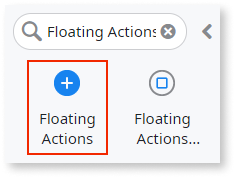
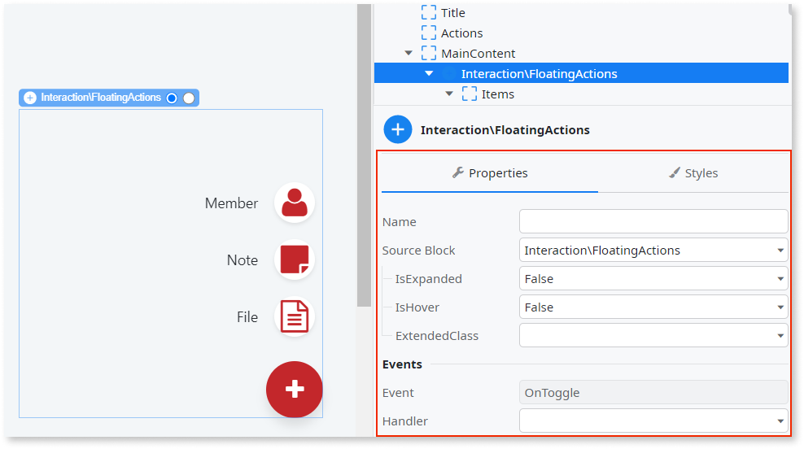

# Floating Actions

Applies to Mobile Apps and Reactive Web Apps only

You can use the Floating Actions UI Pattern to display an action that floats in the bottom right corner of the screen, providing access to a set of additional actions.

Use the Floating Action UI Pattern to show the primary action on a screen. You can choose actions such as create, share, explore, but it is advised to avoid actions such as delete, archive, or an alert. Exclude limited actions such as cut-and-paste text or actions that should be in a toolbar.

**How to use the Floating Actions UI Pattern**

1. In Service Studio, in the Toolbox, search for `Floating Actions`.

    The Floating Actions widget is displayed.

    

    If the UI widget doesn't display, it's because the dependency isn't added. This happens because the Remove unused references setting is enabled. To make the widget available in your app:

    1. In the Toolbox, click **Search in other modules**.

    1. In **Search in other Modules**, remove any spaces between words in your search text.

    1. Select the widget you want to add from the **OutSystemsUI** module, and click **Add Dependency**.

    1. In the Toolbox, search for the widget again.

1. From the Toolbox, drag the Floating Actions widget into the Main Content area of your application's screen.

    

    By default, the Floating Actions widget contains a Button placeholder (with an icon) and an Items placeholder with 3 Floating Actions Item widgets (each containing a Label and Item placeholder). You can add or delete the Floating Actions Item widgets as required.

1. Add the relevant content to the placeholders.

    In this example, we add text to the Label placeholders and linked icons to the Item placeholders.  

    

1. Select the Floating Actions widget, and on the **Properties** tab, set the relevant properties, for example, whether the actions are expanded and visible when the page loads.

    

After following these steps and publishing the module, you can test the pattern in your app.

## Properties

### Floating Actions

| Property                       | Description                                                                                                                                                                                                                                                                                                                                                                                                                                                                                                                                                                                                                        |
|--------------------------------|------------------------------------------------------------------------------------------------------------------------------------------------------------------------------------------------------------------------------------------------------------------------------------------------------------------------------------------------------------------------------------------------------------------------------------------------------------------------------------------------------------------------------------------------------------------------------------------------------------------------------------|
| IsExpanded (Boolean): Optional | If True, the floating actions are expanded and immediately visible on screen. If False, the floating actions are not visible. This is the default.                                                                                                                                                                                                                                                                                                                                                                                                                                                                                 |
| IsHover (Boolean): Optional    | If True, the floating actions are triggered by hovering the mouse pointer over them. If False, the floating actions are not triggered by hovering the mouse pointer over them. This is the default.                                                                                                                                                                                                                                                                                                                                                                                                                                |
| ExtendedClass (Text): Optional | Adds custom style classes to the Pattern. You define your [custom style classes](../../../look-feel/css.md) in your application using CSS.  Examples   <ul><li>Blank - No custom styles are added (default value).</li><li>"myclass" - Adds the ``myclass`` style to the UI styles being applied.</li><li>"myclass1 myclass2" - Adds the ``myclass1`` and ``myclass2`` styles to the UI styles being applied.</li></ul>You can also use the classes available on the OutSystems UI. For more information, see the [OutSystems UI Cheat Sheet](https://outsystemsui.outsystems.com/OutSystemsUIWebsite/CheatSheet). |

### Floating Actions Item

| Property                       | Description                                                                                                                                                                                                                                                                                                                                                                                                                                                                                                                                                                                                                        |
|--------------------------------|------------------------------------------------------------------------------------------------------------------------------------------------------------------------------------------------------------------------------------------------------------------------------------------------------------------------------------------------------------------------------------------------------------------------------------------------------------------------------------------------------------------------------------------------------------------------------------------------------------------------------------|
| ExtendedClass (Text): Optional | Adds custom style classes to the Pattern. You define your [custom style classes](../../../look-feel/css.md) in your application using CSS.  Examples   <ul><li>Blank - No custom styles are added (default value).</li><li>"myclass" - Adds the ``myclass`` style to the UI styles being applied.</li><li>"myclass1 myclass2" - Adds the ``myclass1`` and ``myclass2`` styles to the UI styles being applied.</li></ul>You can also use the classes available on the OutSystems UI. For more information, see the [OutSystems UI Cheat Sheet](https://outsystemsui.outsystems.com/OutSystemsUIWebsite/CheatSheet). |
