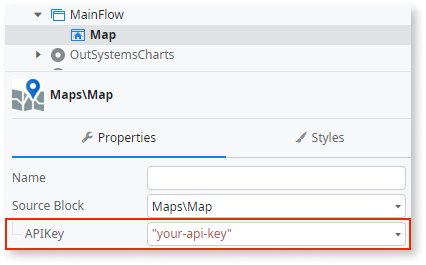
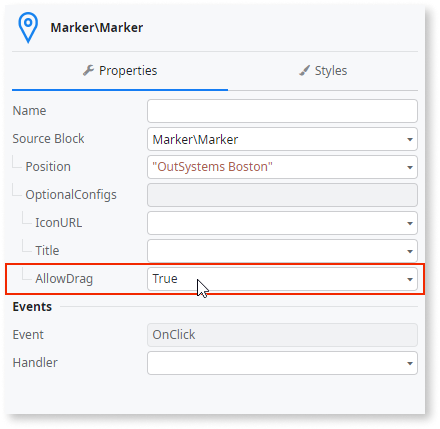
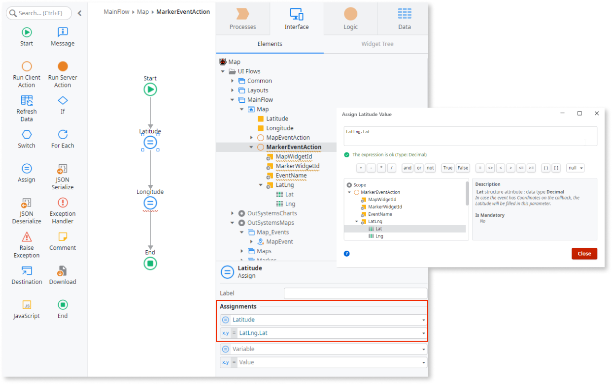

# How to get draggable marker coordinates  

Applies to Mobile Apps and Reactive Web Apps only

**Prerequisites**

* Download and install the [OutSystems Map component](https://www.outsystems.com/forge/component-overview/9909/outsystems-maps) from Forge.

This example demonstrates how to change the location of a map marker and get the coordinates of the new location.

1. In Service Studio, in the Toolbox, search for `Map`.

    The Map widget is displayed.

    

    If the UI widget doesn't display, it's because the dependency isn't added. This happens because the Remove unused references setting is enabled. To make the widget available in your app:

    1. In the Toolbox, click **Search in other modules**.

    1. In **Search in other Modules**, remove any spaces between words in your search text.
    
    1. Select the widget you want to add from the **OutSystemsUI** module, and click **Add Dependency**. 
    
    1. In the Toolbox, search for the widget again.

1. From the Toolbox, drag the Map widget into the Main Content area of your application's screen.

    

1. On the **Properties** tab, enter an API key so that the "For development purposes" watermark is removed. 

    

1. From the Toolbox, drag the Marker block onto the **Drag markers here** screen area.

    

1. On the **Properties** tab, define the Marker's initial coordinates in the **Position** property. 

    

1. To allow users to move a marker, expand the **OptionalConfigs** and set **AllowDrag** to True.

    

1.  To get the new marker coordinates, drag the **Marker Event** block inside the **MarkerEvents** placeholder and on the **Properties** tab, set the **EventName** property as **DragEnd**.

    

1. Create two new local variables (Latitude and Longitude) to store the new coordinate values.

    

1. Create a handler for the event and assign the new marker coordinates to the variables.

    

1. Add two expression widgets to the screen with the **Latitude** and **Longitude** variables to display the marker coordinates in your application. 

    

1. On the **Properties** tab, set the new variables **Default value** to the Boston US office (Latitude: 42.351657835 Longitude: -71.046881100).

    

After following these steps and publishing the module, you can test the component in your app.

**Result**

