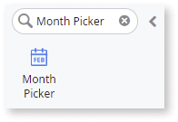
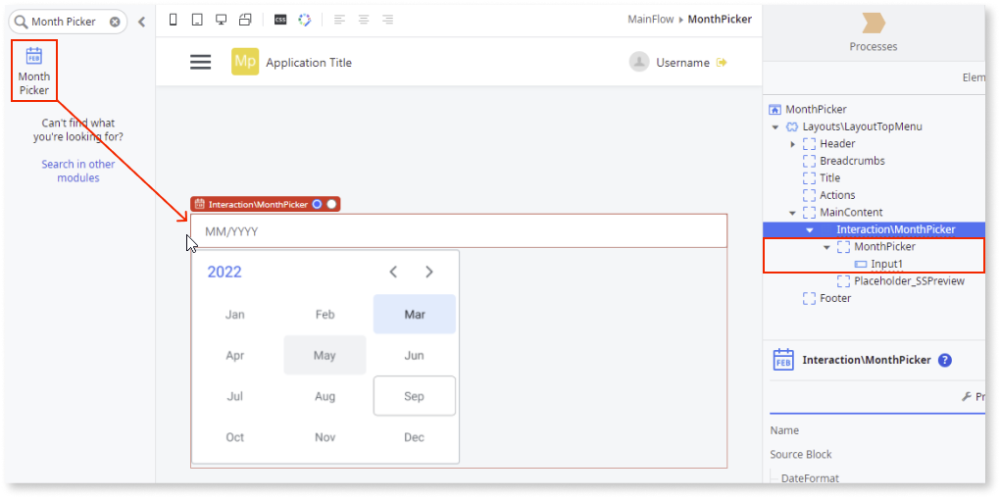
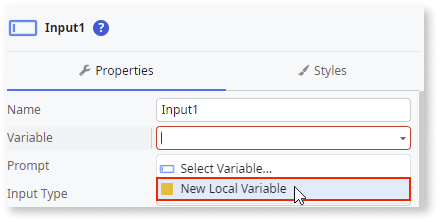
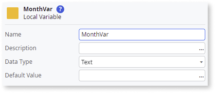
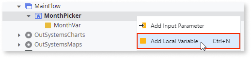
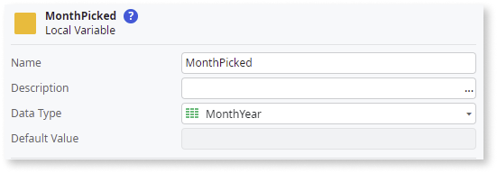
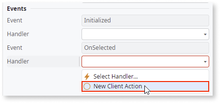
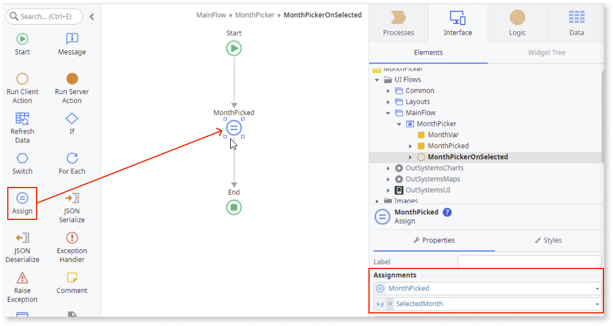
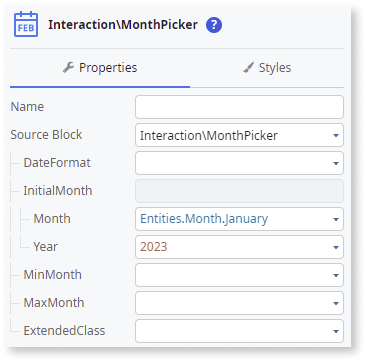
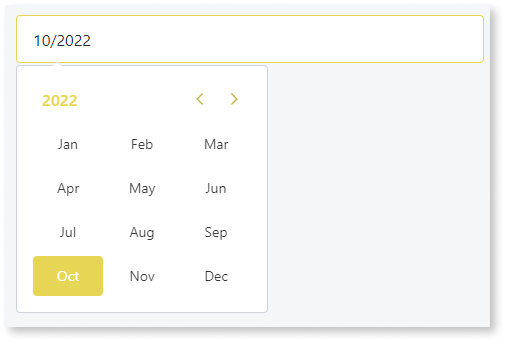

# Month Picker

You can use the Month Picker UI Pattern to allow users input a month of the year. The Month Picker Pattern is based on the [flatpickr library](https://flatpickr.js.org/) For more advanced options, you can refer to this library.

## How to use the Month Picker UI Pattern

1. In Service Studio, in the Toolbox, search for `Month Picker`.

    The Month Picker widget is displayed.

    

    If the UI widget doesn't display, it's because the dependency isn't added. This happens because the Remove unused references setting is enabled. To make the widget available in your app:

    1. In the Toolbox, click **Search in other modules**.

    1. In **Search in other Modules**, remove any spaces between words in your search text.

    1. Select the widget you want to add from the **OutSystemsUI** module, and click **Add Dependency**.

    1. In the Toolbox, search for the widget again.

1. From the Toolbox, drag the Month Picker widget into the Main Content area of your application's screen.

    

    By default, the Month Picker contains an **Input** widget (type Text).

1. Create a local variable by selecting the Input widget, and, on the **Properties** tab, select **New Local Variable** from the **Variable** dropdown.

    This variable stores any value entered into or received by the input widget.

    

1. Enter a name for the variable (in this example **MonthVar**) and select **Text** as the **Data Type**.

    

1. Right-click your main screen and add another local variable.

    This variable stores the month selected by the user.

    

1. Enter a name for the variable (in this example **MonthPicked**) and select **MonthYear** as the **Data Type**.

    

1. To create an **OnSelect** event for the Month Picker, select the Month Picker widget, and on the **Properties** tab, from the **Handler** dropdown, select **New Client Action**.

    

1. To access the month selected by the user, create an **Assign** and set the **MonthPicked** to **SelectedMonth**.

    

1. You can configure the Month Picker by selecting the pattern, and on the **Properties** tab, set the relevant (optional) properties.

    

After following these steps and publishing the module, you can test the pattern in your app.

## Properties

| Property  | Description  |
|---|---|
|DateFormat (Text): Optional | Defines the input date format. If empty, the date format will be the same as the server format. When using formats with time, make sure to set the TimeFormat property.  Here are some of the examples that you can use: <ul><li>"MM/YYYY" -> 03/2022</li><li>"MMM YYYY" -> Mar 2022</li><li>"MMM-YYYY" -> Mar-2022</li><li>"MMM.YYYY" -> Mar.2022</li><li>"MMM, YY" -> Mar, 22</li></ul>|
|InitialMonth (MonthYear): Optional | Defines the initial selected month and year for the Month Picker. If not set, no initial month is selected.|  
|MinMonth (MonthYear): Optional| Defines the minimum month that can be selected. Any month before this is disabled and cannot be selected.|
|MaxMonth (MonthYear): Optional | Defines the maximum month that can be selected. Any month after this is disabled and cannot be selected.|
|ExtendedClass (Text): Optional | Adds custom style classes to the Pattern. You define your [custom style classes](../../../look-feel/css.md) in your application using CSS.  Examples: <ul><li>Blank - No custom styles are added (default value).</li><li>"myclass" - Adds the ``myclass`` style to the UI styles being applied.</li><li>"myclass1 myclass2" - Adds the ``myclass1`` and ``myclass2`` styles to the UI styles being applied.</li></ul>You can also use the classes available on the OutSystems UI. For more information, see the [OutSystems UI Cheat Sheet](https://outsystemsui.outsystems.com/OutSystemsUIWebsite/CheatSheet).  |

## Events

|Event| Description  |
|---|---|
|Initialized: Optional  | Event triggered after the MonthPicker instance is ready. |
|OnSelected: Mandatory  | Event triggered when the user selects a month.  |
