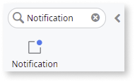
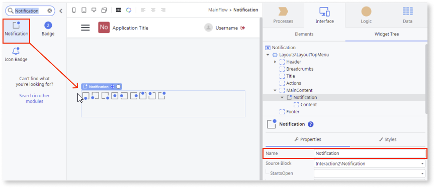
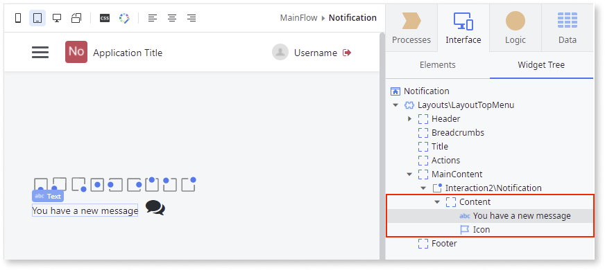
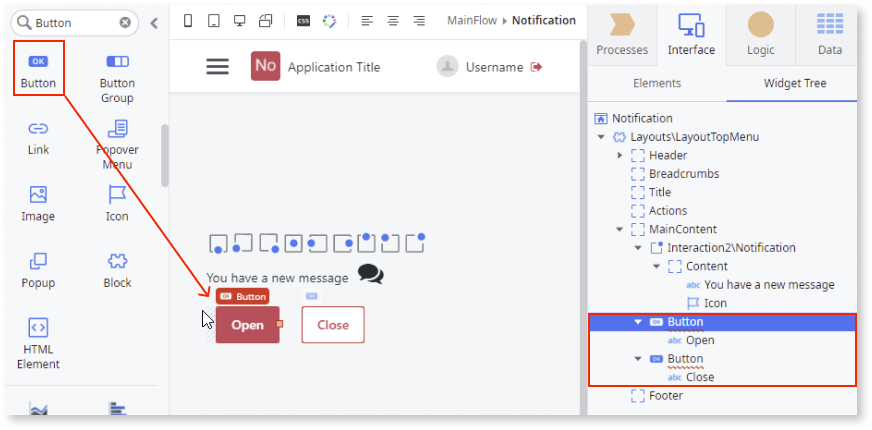
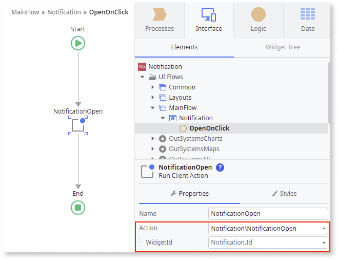
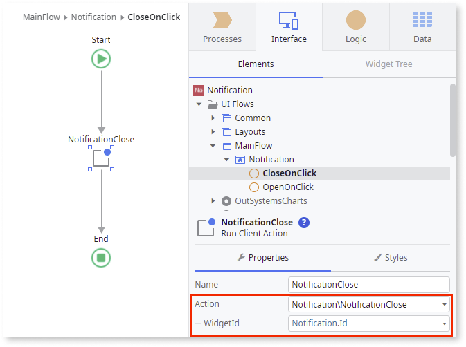
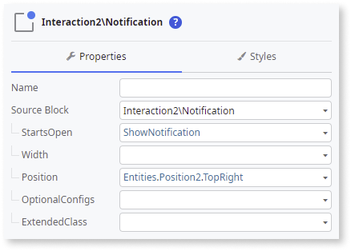
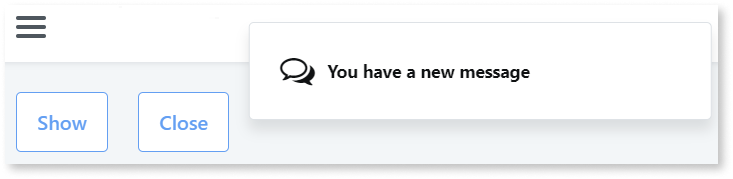

# Notification

Applies to Mobile Apps and Reactive Web Apps only

**This documentation is not valid for deprecated components.** To check if your component is deprecated and how to migrate old versions, see the [Patterns and Versions Overview](https://outsystemsui.outsystems.com/OutsystemsUiWebsite/MigrationOverview).

To find out what version of OutSystems UI you are using, see [OutSystems UI version](../../intro.md#outsystems-ui-version).

**This component doesn't facilitate push notifications**. For more information about push notifcations, see the following articles:

* [Firebase Cloud Messaging Plugin](../../../../../integration-with-systems/mobile-plugins/firebase/firebase-messaging.md)

* [How to Use Push Notifications with OneSignal](https://success.outsystems.com/documentation/how_to_guides/integrations/how_to_use_push_notifications_with_onesignal/)

* [How to Use Push Notifications with Pushwoosh](https://success.outsystems.com/documentation/how_to_guides/integrations/how_to_use_push_notifications_with_pushwoosh/)

The Notification UI Pattern is a contextual short message that provides important information to the user, such as app crashes, new updates, task reminders, and new messages.

**How to use the Notification UI Pattern**

1. In Service Studio, in the Toolbox, search for `Notification`.

    The Notification widget is displayed.

    

    If the UI widget doesn't display, it's because the dependency isn't added. This happens because the Remove unused references setting is enabled. To make the widget available in your app:

    1. In the Toolbox, click **Search in other modules**.

    1. In **Search in other Modules**, remove any spaces between words in your search text.
    
    1. Select the widget you want to add from the **OutSystemsUI** module, and click **Add Dependency**. 
    
    1. In the Toolbox, search for the widget again.

1. From the Toolbox, drag the Notification widget into the Main Content area of your application's screen and on the **Properties** tab, enter a **Name**.

    

 1. Add the relevant content to the Content placeholder. 

    In this example, an icon and some text are added. 

    

1. From the Toolbox, drag 2 **Button** widgets into the Main Content area of your application's screen to **Open** and **Close** the Notification. 

    

1. Define the actions for the buttons and set the **WidgetId** to the Notification widget.

    In this example, for the **Open** button, the **On Click** event is set to a **New Client Action** that runs the **NotificationOpen** client action. For the **Close** button, the **On Click** event is set to a **New Client Action** that runs the **NotificationClose** client action.

    

    

1. You can configure the Notification by selecting the pattern, and on the **Properties** tab, set the relevant (optional) properties. For more configurations, expand the **OptionalConfigs** property.

    

After following these steps and publishing the module, you can test the pattern in your app.

## Properties

| Property | Description |
|---|---|
| StartsOpen(Boolean): Optional| Defines the initial state of the Notification. If True, the notification is open. Use one of the following actions to change the value afterward:<ul><li>NotificationOpen</li><li>NotificationClose</li></ul>  |
| Width(Text): Optional | Defines the Notification width. Accepts any kind of unit (px, %, vw). The default width is "370px". If the value defined is bigger than the screen size, the notification width will be 100%. |
| Position(Position Identifier): Optional| Defines the position where the notification appears on the screen.  The predefined options are:<ul><li>Bottom</li><li>BottomLeft</li><li>BottomRight</li><li>Center</li><li>Left</li><li>Right</li><li>Top</li><li>TopLeft</li><li>TopRight</li></ul>Examples<ul><li>"Entities.Position.Right" - The notification is displayed on the right side of the screen.</li><li>"Entities.Position.Bottom" - The notification is displayed on the bottom of the screen.</li></ul> |
| OptionalConfigs(NotificationOptionalConfigs): Optional | Defines additional parameters to customize the notification behavior and functionality. |
| OptionalConfigs.InteractToClose(Boolean): Optional | Set to True to close the notification when the user clicks on it. |
| OptionalConfigs.CloseAfterTime(Integer): Optional| Defines the delay time (in milliseconds) to close the notification. Example: "3000" |
| ExtendedClass (Text): Optional| Adds custom style classes to the Pattern. You define your [custom style classes](../../../look-feel/css.md) in your application using CSS.  Examples <ul><li>Blank - No custom styles are added (default value).</li><li>"myclass" - Adds the ``myclass`` style to the UI styles being applied.</li><li>"myclass1myclass2" - Adds the ``myclass1`` and ``myclass2`` styles to the UI styles being applied.</li></ul>You can also use the classes available on the OutSystems UI. For more information, see the [OutSystems UI Cheat Sheet](https://outsystemsui.outsystems.com/OutSystemsUIWebsite/CheatSheet). |

## Events

|Event| Description  | 
|---|---|
|Initialized: Optional  | Event triggered when the Notification instance is ready. | 
|OnToggle: Optional  | Triggered when the Notification is toggled.  | 

