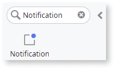
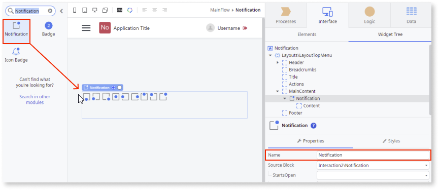
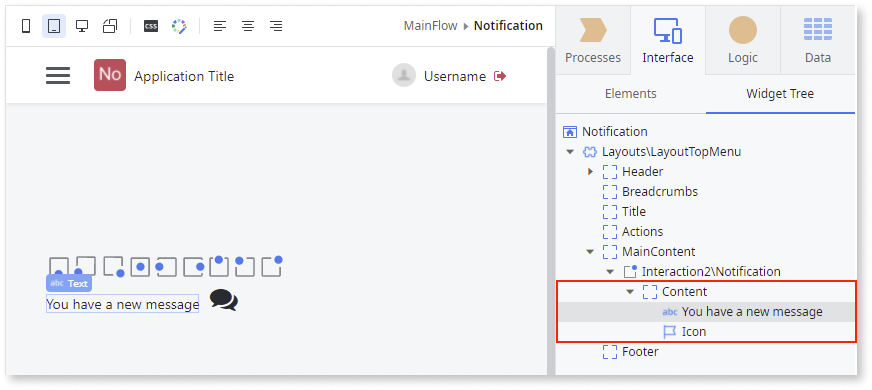
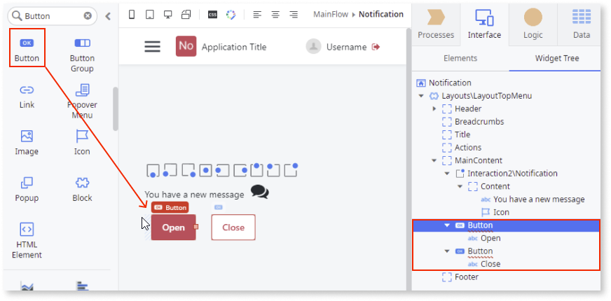
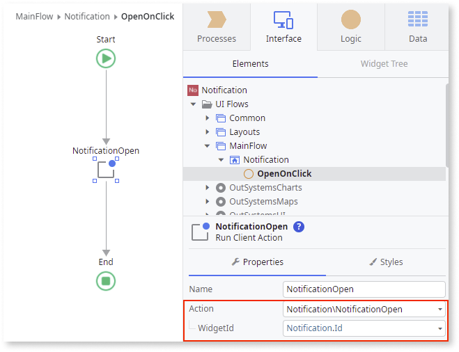
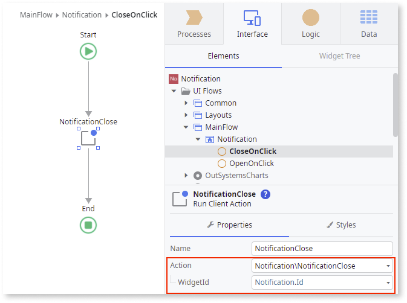
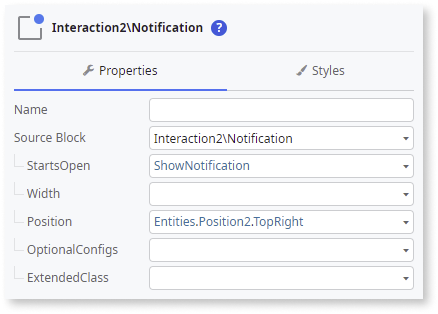
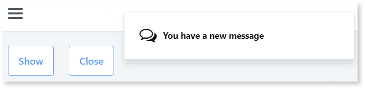
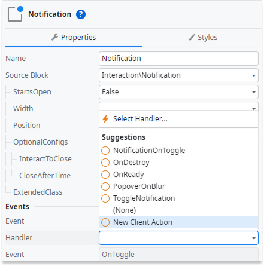
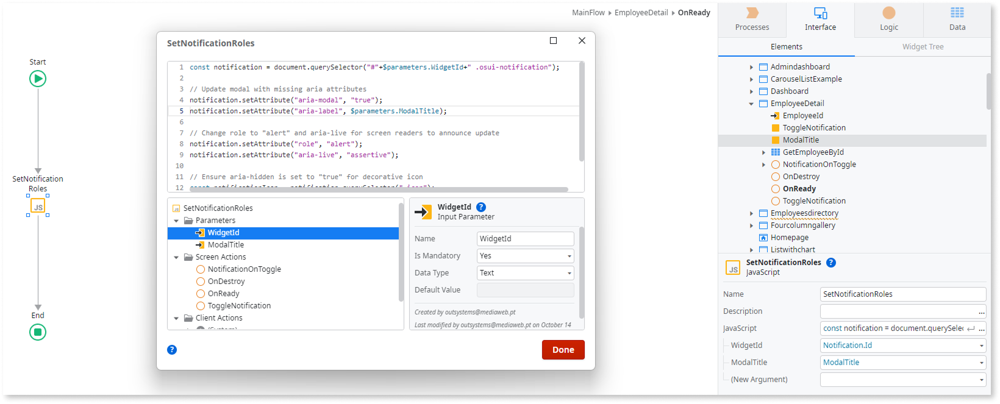

---
tags:
  - Accessibility
  - Events
  - Front-End
  - Mobile app
  - OutSystems UI
  - UI
  - UI Patterns
summary: Explore how to implement and customize the Notification UI Pattern in OutSystems 11 (O11) for effective user communication in mobile and reactive web apps.
locale: en-us
guid: 90ae661d-b0d0-4001-b2b1-efe5c50bb056
app_type: mobile apps, reactive web apps
platform-version: o11
figma: https://www.figma.com/file/iBD5yo23NiW53L1zdPqGGM/Developing%20an%20Application?node-id=213:33
audience:
  - Developer
  - Front-end developer
outsystems-tools:
  - service studio
coverage-type:
  - remember
  - apply
  - evaluate
isautopublish: true
---

# Notification

<div class="info" markdown="1">

Applies to Mobile Apps and Reactive Web Apps only

</div>

<div class="info" markdown="1">

**This documentation is not valid for deprecated components.** To check if your component is deprecated and how to migrate old versions, see the [Patterns and Versions Overview](https://outsystemsui.outsystems.com/OutsystemsUiWebsite/MigrationOverview).

To find out what version of OutSystems UI you are using, see [OutSystems UI version](../../intro.md#outsystems-ui-version).

</div>

<div class="info" markdown="1">

**This component doesn't facilitate push notifications**. For more information about push notifcations, see the following articles:

* [Firebase Cloud Messaging Plugin](../../../../../integration-with-systems/mobile-plugins/firebase/firebase-messaging.md)

* [How to Use Push Notifications with OneSignal](https://success.outsystems.com/documentation/how_to_guides/integrations/how_to_use_push_notifications_with_onesignal/)

* [How to Use Push Notifications with Pushwoosh](https://success.outsystems.com/documentation/how_to_guides/integrations/how_to_use_push_notifications_with_pushwoosh/)

</div>

The Notification UI pattern is a contextual short message that provides important information to the user, such as app crashes, new updates, task reminders, and new messages.

## How to use the Notification UI pattern

1. In Service Studio, in the Toolbox, search for `Notification`.

    The Notification widget is displayed.

    

    If the UI widget doesn't display, it's because the dependency isn't added. This happens because the Remove unused references setting is enabled. To make the widget available in your app:

    1. In the Toolbox, click **Search in other modules**.

    1. In **Search in other Modules**, remove any spaces between words in your search text.

    1. Select the widget you want to add from the **OutSystemsUI** module, and click **Add Dependency**.

    1. In the Toolbox, search for the widget again.

1. From the Toolbox, drag the Notification widget into the Main Content area of your application's screen and on the **Properties** tab, enter a **Name**.

    

1. Add the relevant content to the Content placeholder.

    In this example, an icon and some text are added.

    

1. From the Toolbox, drag 2 **Button** widgets into the Main Content area of your application's screen to **Open** and **Close** the Notification.

    

1. Define the actions for the buttons and set the **WidgetId** to the Notification widget.

    In this example, for the **Open** button, the **On Click** event is set to a **New Client Action** that runs the **NotificationOpen** client action. For the **Close** button, the **On Click** event is set to a **New Client Action** that runs the **NotificationClose** client action.

    

    

1. You can configure the Notification by selecting the pattern, and on the **Properties** tab, set the relevant (optional) properties. For more configurations, expand the **OptionalConfigs** property.

    

After following these steps and publishing the module, you can test the pattern in your app.



## Properties

| Property | Description |
| --- | --- |
| StartsOpen(Boolean): Optional | Defines the initial state of the Notification. If True, the notification is open. Use one of the following actions to change the value afterward: **NotificationOpen** or **NotificationClose**. |
| Width(Text): Optional | Defines the Notification width. Accepts any kind of unit (px, %, vw). The default width is "370px".<br/>If the value defined is bigger than the screen size, the notification width is 100%. |
| Position(Position Identifier): Optional | Defines the position where the notification appears on the screen.<br/><br/>The predefined options are: **Bottom**, **BottomLeft**, **BottomRight**, **Center**, **Left**, **Right**, **Top**, **TopLeft**, and **TopRight**.<br/><br/>Examples:<br/>**"Entities.Position.Right"** - The notification is displayed on the right side of the screen.<br/>**"Entities.Position.Bottom"** - The notification is displayed on the bottom of the screen. |
| OptionalConfigs(NotificationOptionalConfigs): Optional | Defines additional parameters to customize the notification behavior and functionality. |
| OptionalConfigs.InteractToClose(Boolean): Optional | Set to True to close the notification when the user clicks on it. |
| OptionalConfigs.CloseAfterTime(Integer): Optional | Defines the delay time (in milliseconds) to close the notification.<br/>Example: "3000" |
| ExtendedClass (Text): Optional | Adds custom style classes to the pattern. You define your [custom style classes](../../../look-feel/css.md) in your application using CSS.<br/><br/>Examples:<br/>**Blank** - No custom styles are added (default value).<br/>**"myclass"** - Adds the ``myclass`` style to the UI styles being applied.<br/>**"myclass1myclass2"** - Adds the ``myclass1`` and ``myclass2`` styles to the UI styles being applied.<br/><br/>You can also use the classes available on the OutSystems UI. For more information, see the [OutSystems UI Cheat Sheet](https://outsystemsui.outsystems.com/OutSystemsUIWebsite/CheatSheet). |

## Events

| Event | Description |
| --- | --- |
| Initialized: Optional | Event triggered when the Notification instance is ready. |
| OnToggle: Optional | Triggered when the Notification is toggled. |

## Accessibility – WCAG 2.2 AA compliance {#accessibility}

By default, the **Notification** UI pattern is accessible, but it requires small manual tweaks to fully comply with WCAG 2.2 AA guidelines.

By default, the Notification uses the role `alertdialog`. This is appropriate when the notification includes **interactive elements**, such as buttons or links that require user action.  
If the notification is **non-interactive**—for example, a short status or feedback message like “You have new messages”—you should use the role `alert` instead.

Using the correct role ensures that assistive technologies announce notifications at the right time and in the right context.

### Decision table: choose the correct role

| Criteria | `alertdialog` | `alert` |
| --- | --- | --- |
| **Purpose** | Used for **modal dialogs** that interrupt the user and require them to take action before continuing. | Used for **informational messages** that notify the user about a change in status without interrupting their workflow. |
| **Typical scenario** | A confirmation or error message that needs a response, such as “Are you sure you want to delete this record?” | A passive update, such as “Record saved successfully” or “You have new messages.” |
| **User interaction** | Contains **interactive elements**, such as buttons or links (for example, _OK_, _Cancel_, or _Retry_). | **Non-interactive** — no input or buttons required from the user. |
| **Behavior for assistive technologies (AT)** | Announced as a **modal dialog**, taking focus and preventing users from interacting with the rest of the page until they respond. | Announced immediately as an **assertive live region**, without taking focus or blocking interaction. |
| **Required attributes** | `role="alertdialog"` + `aria-modal="true"` + accessible name (`aria-labelledby` or `aria-label`). Optionally add a description (`aria-describedby`). | `role="alert"` + `aria-live="assertive"`. Hide decorative icons with `aria-hidden="true"`. |
| **Focus behavior** | Focus moves inside the dialog and is trapped there until the dialog is dismissed. | Focus stays where it is; the alert is simply announced. |
| **Examples** | “Session about to expire — **Extend** or **Sign out**.” / “Error — **Retry** or **Cancel**.” | “Profile updated successfully.” / “Connection lost.” |

<div class="warning" markdown="1">

> For simple alerts, consider using a custom-styled **Feedback Message** instead of the Notification pattern.

</div>

---

### Update Notification ARIA settings via JavaScript

If you need to adjust the HTML manually, follow the steps below to apply the correct ARIA attributes:

1. In **Service Studio**, open the **Interface** tab.

1. Select the **Screen** or **Block** that uses **Notification**.

1. In the **Widget Tree**, search for **Notification**. Then, in **Properties**, select the **Initialized** event to create a **Client Action**.

     

1. In the **Initialized** Client Action, drag a **JavaScript** node to the flow.

     

1. In the **JavaScript** node, add an input parameter named **WidgetId** and another one named **Modal Title** (both type **Text**).

1. Set **WidgetId** parameter to the Notification block widget ID (for example, `Notification.Id`).

     

1. Add the following code, and keep only the parts relevant to your use case.

    ```javascript
    const notification = document.querySelector("#"+$parameters.WidgetId+" .osui-notification");
    
    // Update modal with missing aria attributes
    notification.setAttribute("aria-modal", "true");
    notification.setAttribute("aria-label", notification.innerText);

    // Change role to "alert" and aria-live for screen readers to announce update
    notification.setAttribute("role", "alert");
    notification.setAttribute("aria-live", "assertive");

    // Ensure aria-hidden is set to "true" for decorative icon
    const notificationIcon = notification.querySelector(".icon");
    if (notificationIcon) {
        notificationIcon.setAttribute("aria-hidden", "true");
    }
    ```
  
1. Publish the module and test your app.

### Result

After applying these adjustments, the **Notification** UI pattern is more accessible and works correctly with screen readers.

* **Non-interactive notifications** are announced immediately as alerts without disrupting focus.  

* **Interactive notifications** are recognized as modal dialogs when `aria-modal="true"` is present, with proper naming and focus behavior.
