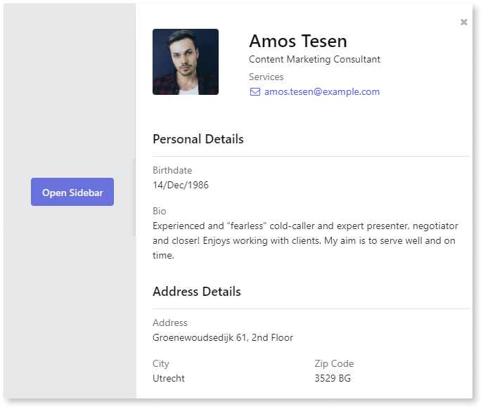
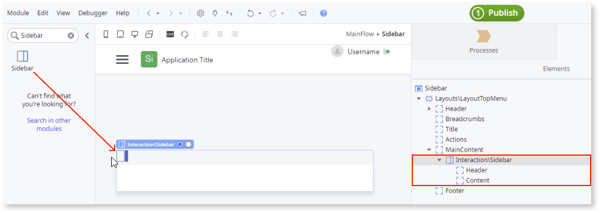
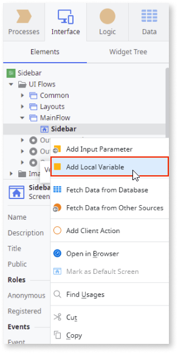
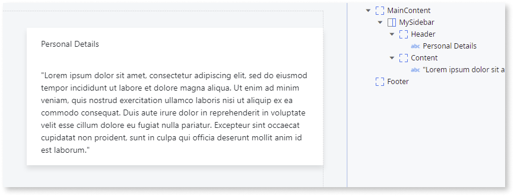
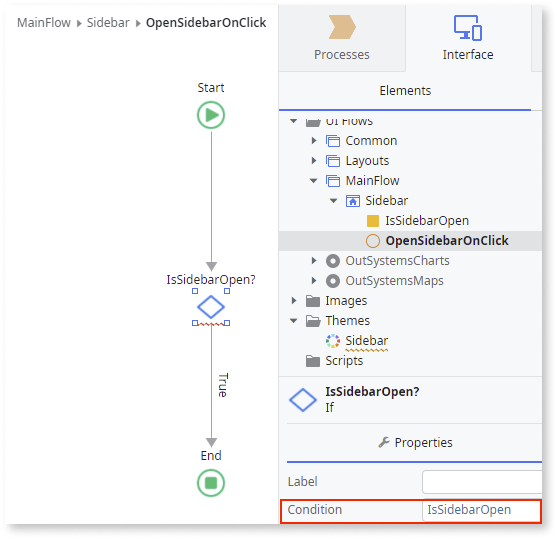
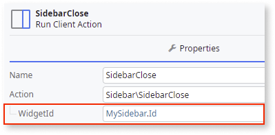
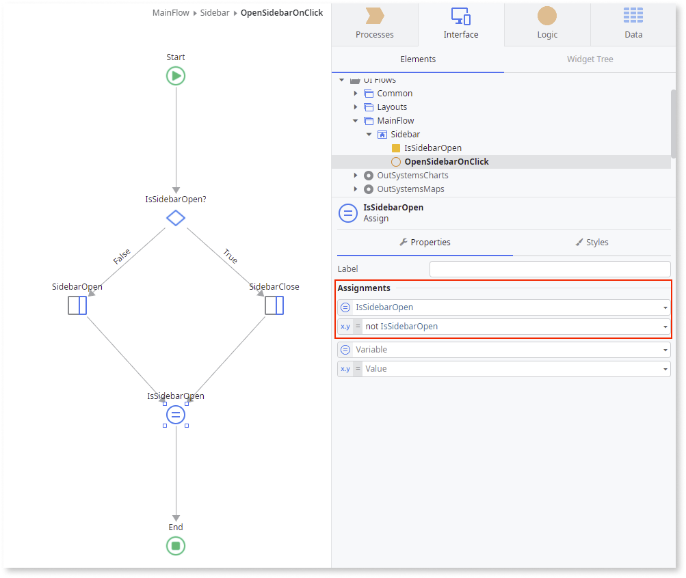
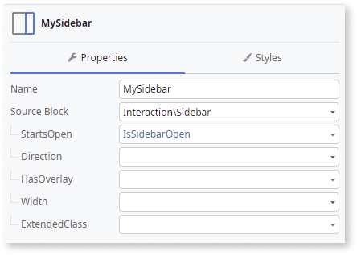

# Sidebar

Applies to Mobile Apps and Reactive Web Apps only

**This documentation is not valid for deprecated components.** To check if your component is deprecated and how to migrate old versions, see the [Patterns and Versions Overview](https://outsystemsui.outsystems.com/OutsystemsUiWebsite/MigrationOverview).

You can use the Sidebar UI Pattern to display additional information in the margin of the main content. The additional information supports the user's understanding of the main content.

**Note:** To avoid conflicts with the browser native gestures, the Sidebar pattern only works with gestures on Native Apps not running as PWA.  

**How to use the Sidebar UI Pattern**

In this example, we create a button that opens and closes the Sidebar widget.

1. In Service Studio, in the Toolbox, search for `Sidebar`.

    The Sidebar widget is displayed.

    

    If the UI widget doesn't display, it's because the dependency isn't added. This happens because the Remove unused references setting is enabled. To make the widget available in your app:

    1. In the Toolbox, click **Search in other modules**.

    1. In **Search in other Modules**, remove any spaces between words in your search text.

    1. Select the widget you want to add from the **OutSystemsUI** module, and click **Add Dependency**.

    1. In the Toolbox, search for the widget again.

1. From the Toolbox, drag the Sidebar widget into the Main Content area of your application's screen.

    

    By default, the Sidebar widget contains Header and Content placeholders.

1. On the **Properties** tab, in the **Name** field, enter a name for the Sidebar widget.

    In this example, we enter it `MySidebar`.

    

1. Select and right-click your screen name, and select **Add Local Variable**.

    

1. Enter a name for the variable.

    In this example, name the variable ``IsSidebarOpen``, set the **Data Type** as Boolean, and the **Default Value** to **False**.

    

1. Select the Sidebar widget, and on the **Properties** tab, from the **StartsOpen** dropdown, select the newly created variable.

    

1. Add your content to the **Header** and **Content** placeholders, for example, forms, images and text.

    In this example we add some text.

    

1. From the Toolbox, drag the **Button** widget just below the **Sidebar** widget and on the **Properties** tab, in the **Text** field, enter the text you want to appear on the button.

    In this example, we enter `Open Sidebar`.

    

1. To create a screen action to toggle the Sidebar:

    a. Double-click the **Open Sidebar** button.

    b. Drag an **If** statement to the screen action, and on the **Properties** tab, set the **Condition** to the **IsSidebarOpen** variable.

    

    c. On the **True** branch, add the **SidebarClose** client action and set the **WidgetId** parameter to the Sidebar Id.

    

    d. On the **False** branch, add the **SidebarOpen** client action and set the **WidgetId** parameter to the Sidebar Id.

    e. Drag an **Assign** to the screen action and set **IsSidebarOpen** variable to ``not IsSidebarOpen``.

    

1. You can customize the Sidebar by selecting the pattern, and on the **Properties** tab, set the relevant (optional) properties.

    

After following these steps and publishing the module, you can test the pattern in your app.

## Properties

| Property | Description |
|---|---|
|StartsOpen (Boolean): Optional| Set to True to display the Sidebar. The default value is False.|
|Direction (Direction Entity): Optional | Set the position where the Sidebar appears on the screen. The predefined options are Left and Right.  Examples:<ul><li>Entities.Direction.Right - The sidebar is displayed on the right side of the screen.</li><li>Entities.Direction.Left - The sidebar is displayed on the left side of the screen. </li></ul>  |
|HasOverlay (Boolean): Optional| Set to True, to show an overlay when the Sidebar is open. When you click on the overlay, the Sidebar is closed.|
|Width (String): Optional| Defines the Sidebar width. Accepts any kind of unit (px, %, vw). Default value is 500px. |
|ExtendedClass (Text): Optional| Adds custom style classes to the Pattern. You define your [custom style classes](../../../look-feel/css.md) in your application using CSS.  Examples <ul><li>Blank - No custom styles are added (default value).</li><li>"myclass" - Adds the ``myclass`` style to the UI styles being applied.</li><li>"myclass1 myclass2" - Adds the ``myclass1`` and ``myclass2`` styles to the UI styles being applied.</li></ul>You can also use the classes available on the OutSystems UI. For more information, see the [OutSystems UI Cheat Sheet](https://outsystemsui.outsystems.com/OutSystemsUIWebsite/CheatSheet). |

## Events

|Event| Description  |
|---|---|
|OnToggle: Optional  | Event triggered when the Sidebar is toggled. |
 |

## Accessibility – WCAG 2.2 AA compliance

The default version of this pattern complies with WCAG 2.2 AA accessibility standards. No changes or manual work are required. If you customize the pattern, validate your implementation to confirm it still meets accessibility requirements.
