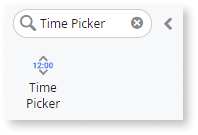
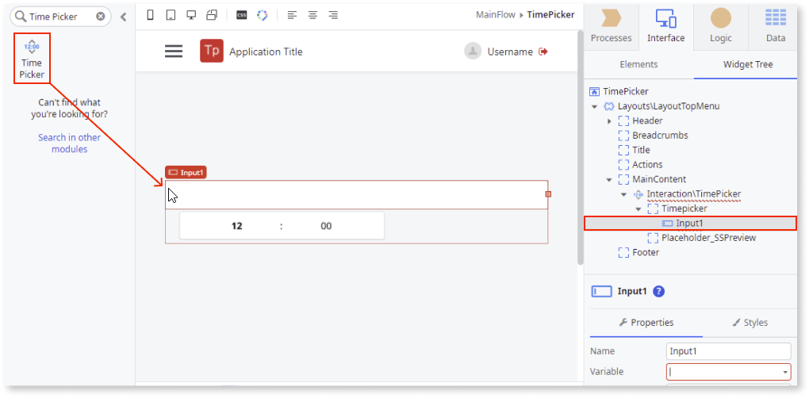
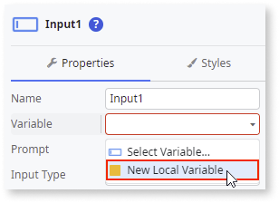
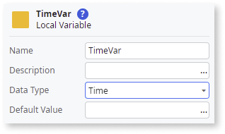
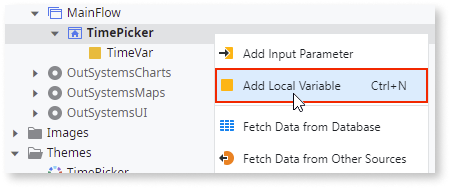
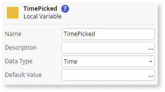
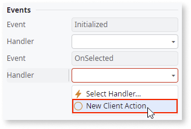
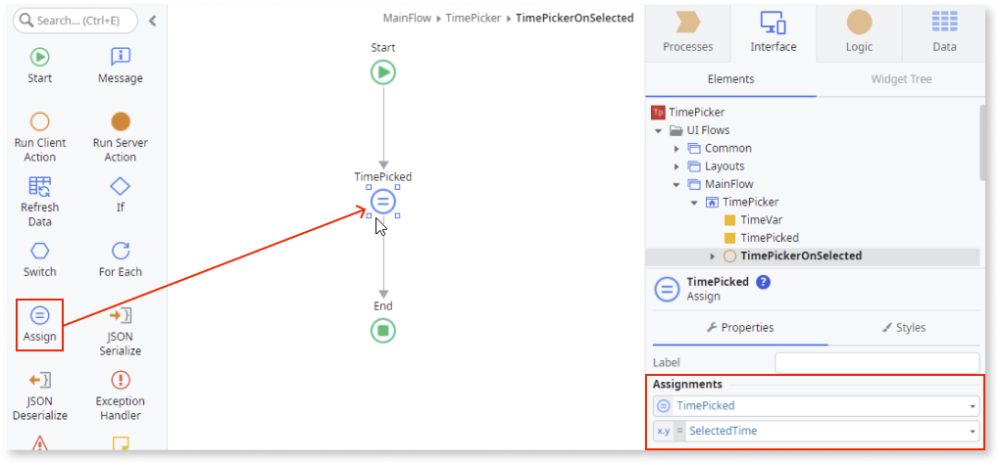
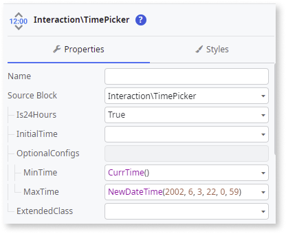
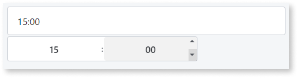

# Time Picker

You can use the Time Picker UI Pattern to allow users input a time of day in either a 24-hour or AM/PM format. The Time Picker Pattern is based on the [flatpickr library](https://flatpickr.js.org/) For more advanced options, you can refer to this library.

## How to use the Time Picker UI Pattern

1. In Service Studio, in the Toolbox, search for `Time Picker`.

    The Time Picker widget is displayed.

    

    If the UI widget doesn't display, it's because the dependency isn't added. This happens because the Remove unused references setting is enabled. To make the widget available in your app:

    1. In the Toolbox, click **Search in other modules**.

    1. In **Search in other Modules**, remove any spaces between words in your search text.

    1. Select the widget you want to add from the **OutSystemsUI** module, and click **Add Dependency**.

    1. In the Toolbox, search for the widget again.

1. From the Toolbox, drag the Time Picker widget into the Main Content area of your application's screen.

    

    By default, the Time Picker contains an **Input** widget (type Text).

1. Create a variable by selecting the **Input** widget, and, on the **Properties** tab, select **New Local Variable** from the **Variable** dropdown.

    

    This variable stores any value entered into or received by the input widget.

1. Enter a name for the variable (in this example **TimeVar**) and select **Time** as the **Data Type**.

    

1. Right-click your main screen and add another local variable.

    

    This variable stores the time selected by the user.

1. Enter a name for the variable (in this example **TimePicked**) and select **Time** as the **Data Type**.

    

1. To create an **OnSelect** event for the Time Picker, select the widget and on the **Properties** tab, from the **Handler** dropdown, select **New Client Action**.

    

1. To access the time selected by the user, create an **Assign** and set the **TimePicked** to **SelectedTime**.

    

1. You can configure the Time Picker by selecting the pattern, and on the **Properties** tab, set the relevant (optional) properties. For more configurations, expand the **OptionalConfigs** property.

    

After following these steps and publishing the module, you can test the pattern in your app.

## Properties

| Property  | Description|
|---|---|
|TimeFormat (Text): Optional | Defines the input time format. If empty, the time format is defined based on the Is24Hours parameter. When using formats with time, make sure to set the TimeFormat property.  Here is a list of formatting tokens that you can use: <ul><li>H → Hours (24 hours)</li><li>h → Hours (12 hours)</li><li>G → Hours (12 hours), 2 digits with leading zeros</li><li>i → Minutes</li><li>s → Seconds</li><li>S → Seconds, 2 digits with leading zeros</li><li>K → AM/PM</li></ul>You may escape formatting tokens using \\\\.   Examples:<ul><li>“H:i” → 15:30</li><li>"G:i K" → 03:30 PM</li><li>"h\\hi\\m K" → 3h30m PM</li><li>"H \\\\ho\\\\ur\\\\s i \\\\m\\\\i\\\\n\\\\ute\\\\s" → 15 hours 30 minutes</li></ul>|
|Is24Hours (Boolean): Optional | Set to True to display the time in a 24 hour format without AM/PM selection. By default, the time is displayed using a 24 hour format.  |
|InitialTime (Time): Optional | Defines the initial selected time for the Time Picker. If not set, no initial time is displayed in the input and the Time Picker will start at 12:00. |
| OptionalConfigs(TimePickerOptionalConfigs): Optional | Defines additional parameters to customize Time Picker behavior and functionality. |
| OptionalConfigs.MinTime (Time): Optional | Defines the minimum time that can be selected. The time before this is disabled. |
| OptionalConfigs.MaxTime (Time): Optional | Defines the maximum time that can be selected. The time after this is disabled.|
| ExtendedClass (Text): Optional| Adds custom style classes to the Pattern. You define your [custom style classes](../../../look-feel/css.md) in your application using CSS.  Examples: <ul><li>Blank - No custom styles are added (default value).</li><li>"myclass" - Adds the ``myclass`` style to the UI styles being applied.</li><li>"myclass1 myclass2" - Adds the ``myclass1`` and ``myclass2`` styles to the UI styles being applied.</li></ul>You can also use the classes available on the OutSystems UI. For more information, see the [OutSystems UI Cheat Sheet](https://outsystemsui.outsystems.com/OutSystemsUIWebsite/CheatSheet). |

## Events

|Event| Description  |
|---|---|
|Initialized: Optional  | Event triggered after the TimePicker instance is ready. |
|OnSelected: Mandatory  | Event triggered when the user selects a time.  |
