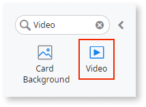
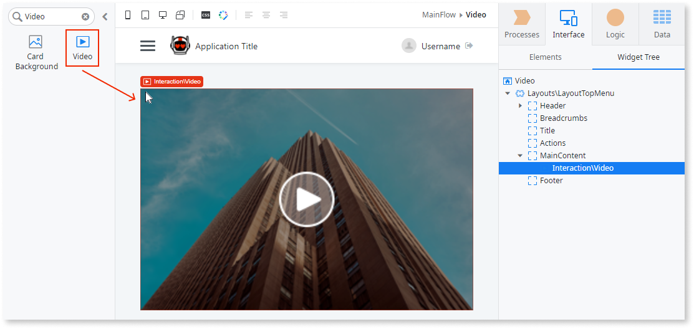
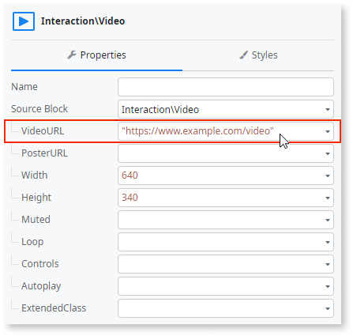
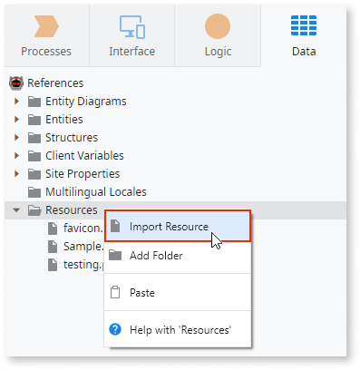
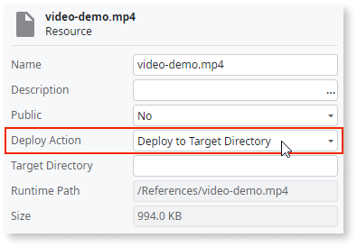
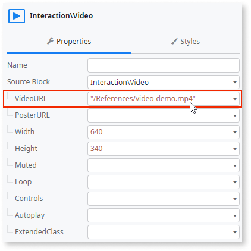
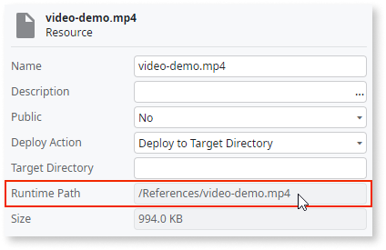
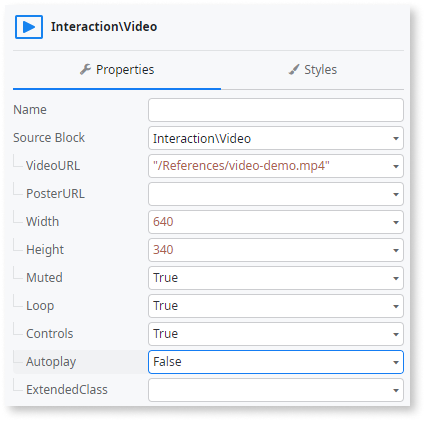

# Video

Applies to Mobile Apps and Reactive Web Apps only

You can use the Video UI pattern to embed a native video player into your application.

**Note:** If you want to stream videos from YouTube, Vimeo, or others, refer to the [How to Add Video to Your Applications](https://success.outsystems.com/documentation/how_to_guides/front_end/how_to_add_video_to_your_applications/) article.

## How to use the Video UI Pattern

1. In Service Studio, in the Toolbox, search for `Video`.

    The Video widget is displayed.

    

    If the UI widget doesn't display, it's because the dependency isn't added. This happens because the Remove unused references setting is enabled. To make the widget available in your app:

    1. In the Toolbox, click **Search in other modules**.

    1. In **Search in other Modules**, remove any spaces between words in your search text.

    1. Select the widget you want to add from the **OutSystemsUI** module, and click **Add Dependency**.

    1. In the Toolbox, search for the widget again.

1. From the Toolbox, drag the Video widget into the Main Content area of your application's screen.

    

1. On the **Properties** tab, set the **VideoURL** property to the source video file you want to embed in your app.

    * If using an external source file, insert the file URL.

        

    * If using a local file, include the video in a module as a resource and use the runtime path as follows:

        1. On the **Data** tab, right-click the **Resources** folder and select **Import Resource**.

            

        1. Browse and select the video file you want to add and click **Open**.

        1. On the **Resource** properties tab, from the **Deploy Action** drop-down, select **Deploy to Target Directory**.

            

        1. On the **Interface** tab, from the **Widget Tree**, select the Video pattern.

        1. In the **VideoURL** property, enter the runtime path of the video file.

            

            **Tip**: You can copy the runtime path from the Resource Runtime Path property tab.

            

1. On the Video **Properties** tab, you can also define (optional) properties, such as the height and width of the video and the audio settings.

    

After following these steps and publishing the module, you can test the pattern in your app.

## Properties

| Property                     | Description                                                                                                                                                                                                                                                                                                                                                                                                                                                                                                                                                                                                                       |
|------------------------------|-----------------------------------------------------------------------------------------------------------------------------------------------------------------------------------------------------------------------------------------------------------------------------------------------------------------------------------------------------------------------------------------------------------------------------------------------------------------------------------------------------------------------------------------------------------------------------------------------------------------------------------|
| VideoURL (Text): Mandatory   | The video file URL or the runtime path of the resource video file.                                                                                                                                                                                                                                                                                                                                                                                                                                                                                                                                                                |
| PosterURL (Text): Optional   | The URL to the poster image that displays before the video starts.                                                                                                                                                                                                                                                                                                                                                                                                                                                                                                                                                                |
| Width (Text): Optional       | Width (in pixel or percentage) of the video.  Examples  <ul><li>_Blank_ - The video is 100% wide. This is the default value.</li><li>_150_ - The video is 150px wide.</li></ul>                                                                                                                                                                                                                                                                                                                                                                                                                                   |
| Height (Text): Optional      | Height (in pixel or percentage) of the video.  Examples  <ul><li>_Blank_ - The video is 100% high. This is the default value.</li><li>_150_ - The video is 150px high.</li></ul>                                                                                                                                                                                                                                                                                                                                                                                                                                  |
| Muted (Boolean): Optional    | If True, the video audio is muted. If False, the video audio is not muted. This is the default.                                                                                                                                                                                                                                                                                                                                                                                                                                                                                                                                   |
| Loop (Boolean): Optional     | If True, the video replays as soon as it ends. If False, the video does not replay. This is the default.                                                                                                                                                                                                                                                                                                                                                                                                                                                                                                                          |
| Controls (Boolean): Optional | If True, the video controls are enabled. If False, the video controls are disabled. This is the default. **Note** In the case of mobile apps, the controls are always enabled.                                                                                                                                                                                                                                                                                                                                                                                                                                                |
| Autoplay (Boolean): Optional | If True, the video starts once the page is loaded. If False, the video doesn't start immediately. This is the default.                                                                                                                                                                                                                                                                                                                                                                                                                                                                                                            |
| ExtendedClass                | Adds custom style classes to the Pattern. You define your [custom style classes](../../../look-feel/css.md) in your application using CSS.  Examples  <ul><li>Blank - No custom styles are added (default value).</li><li>"myclass" - Adds the ``myclass`` style to the UI styles being applied.</li><li>"myclass1 myclass2" - Adds the ``myclass1`` and ``myclass2`` styles to the UI styles being applied.</li></ul>You can also use the classes available on the OutSystems UI. For more information, see the [OutSystems UI Cheat Sheet](https://outsystemsui.outsystems.com/OutSystemsUIWebsite/CheatSheet). |
