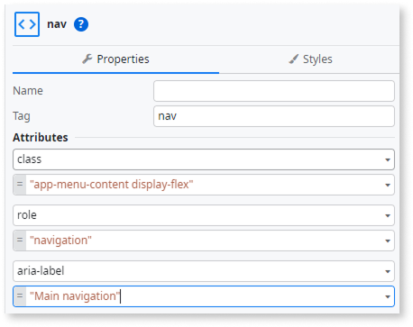
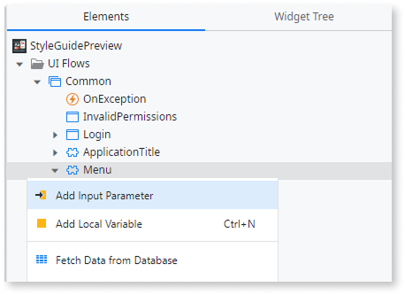
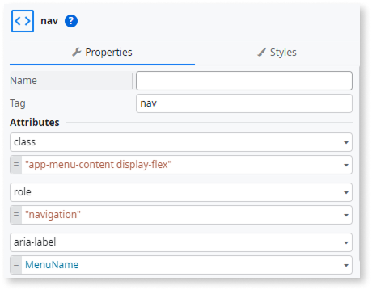

# Reactive app layouts

Applies to Reactive Web Apps only.

Layouts define the overall page structure of your app, including the header, navigation, and main content areas. OutSystems UI provides several layout blocks you can use as a starting point and customize to match your app’s design and navigation model.

These layouts aren't exposed directly in the OutSystems UI module as reusable blocks. Instead, they are created in your app from the selected application template, so each application starts with its own copy of the layouts, making it easier to customize them independently as needed.

Common layouts include:

* **LayoutBlank** – A minimal layout with no predefined structure, useful for standalone pages such as login or error screens.

* **LayoutBase** – A generic base layout with header and content areas. Typically used for website-style pages with full-width sections, different background colors, and visual effects.

* **LayoutBaseSection** – A customizable full-width section intended to be used inside the **LayoutBase** content area, to split the page into multiple content or call-to-action sections.

* **LayoutTopMenu** – A base layout with a top navigation bar, usually for small back-office applications or apps with a limited number of navigation items.

* **LayoutSideMenu** – A layout with a prominent side menu for navigation. It supports multiple configuration options and works best in larger applications with many navigation items.

Use layouts to ensure consistency across screens and to centralize changes to common structures, such as navigation, header content, or global actions.

## Customizing a layout

Most layout changes fall into two categories: visual tweaks and structural changes. Use the following short procedures for the option that best fits what you need.

### Adjust layout spacing, colors, and typography

1. In **Service Studio**, open the layout block (for example, `LayoutSideMenu`).
1. In the layout **Properties**, set **ExtendedClass** to a custom CSS class (for example, `MyApp_LayoutSideMenu`).
1. In the **Themes** folder, open the app **Style Sheet** and define the CSS rules for that class.
1. Publish the module.

### Structural changes to a layout

Because layouts are created in each app from templates, customizing these blocks affects only your application and doesn't change OutSystems UI or other apps.

1. In **Interface → Layouts**, duplicate the layout block you want to change (for example, `LayoutSideMenu` → `LayoutSideMenu_Custom`).
1. Edit the new layout block (add or remove placeholders, change header elements, add toolbars, etc.).
1. On each screen that should use the new structure, update the **Layout** property to `LayoutSideMenu_Custom`.
1. Publish the module.

## Accessibility - WCAG 2.2 AA compliance

These accessibility (A11Y) improvements are primarily required for versions earlier than **OutSystemsUI v2.28.0**.  
Starting from version **v2.28.0**, the `aria-label` value is already defined by default. If a different descriptive text is intended, it should be explicitly updated to reflect the desired navigation context.

By default, the **Layouts** provided in OutSystems are fully aligned with **WCAG 2.2 AA**. However, to further improve accessibility and ensure better support for assistive technologies, it's recommended to add a unique `aria-label` directly to the `<nav>` element.

Providing a descriptive and unique aria-label helps screen reader users clearly identify the purpose of each navigation region, improving overall navigation and compliance with accessibility standards.

This section documents known behaviors and, where applicable, provides concrete steps you can follow to improve accessibility.

### Option 1: add a unique `aria-label` directly on `<nav>`

Use this option if the navigation landmark always represents the same region (for example, the main site navigation) and doesn't need to change per instance.

1. In **Service Studio**, open the layout where the **Menu** block is used.

1. In the **Widget Tree**, select the `<nav>` element.

1. In the `<nav>` **Properties**, under **Attributes**, set: `aria-label="Main navigation"`

    

1. Publish the module.

### Option 2: add `aria-label` using an input parameter

Use this option if you want each instance of the **Menu** block to define its own navigation label via a parameter.

1. In **Service Studio**, open the layout or block where the **Menu** block is used (for example, `LayoutSideMenu`).

1. Double-click the **Menu** block to open it. Then, in the **Interface** tree, right-click the **Menu** block and add an **Input Parameter** named `MenuName` (Type **Text**, mandatory).

    

1. In the **Widget Tree**, select the `<nav>` element associated with the **Menu** block.

1. In the `<nav>` **Properties**, under **Attributes**, set: `aria-label=MenuName`

    

1. In the **LayoutSideMenu** block instance, set the value of `MenuName` (for example, `Main navigation` or `Header navigation`).

1. Publish the module.

### Result

Each `<nav>` element that you update in **Layout Side Menu** now exposes a meaningful `aria-label`, enabling screen readers and other assistive technologies to distinguish between navigation regions. When all navigation landmarks are labelled, this improves the overall structure of page landmarks and helps users understand where they are in the application.

Test pages that use **Layout Side Menu** to confirm that screen readers announce each navigation region with the expected label.
