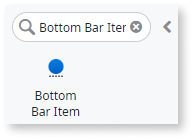
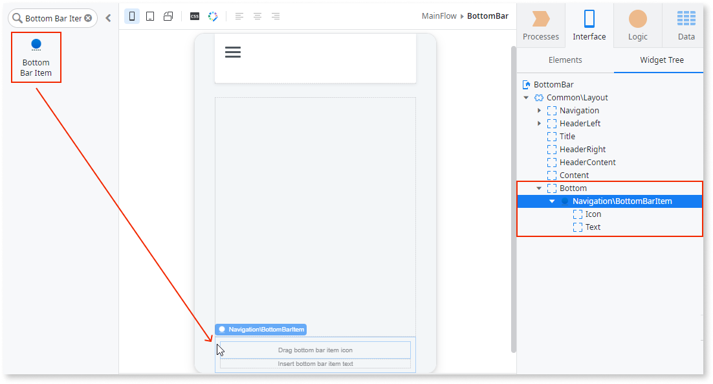
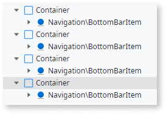
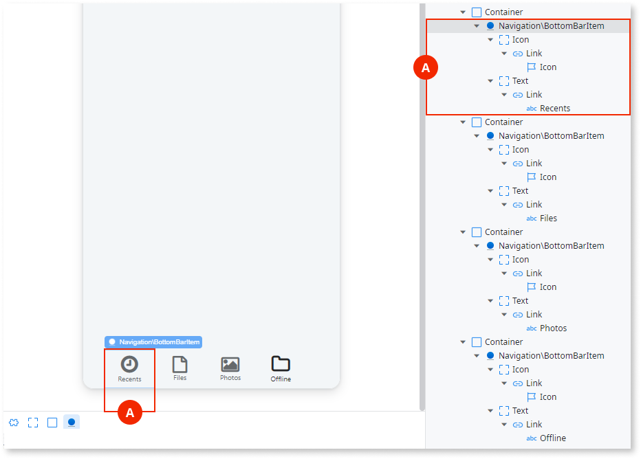

# Bottom Bar Item

Applies to Mobile Apps and Reactive Web Apps only

You can use the Bottom Bar Item UI Pattern to provide access to a bottom navigation drawer and up to four actions, including the floating action button. Main pieces of core functionality are made available with one tap while allowing rapid switching between features.

**How to use the Bottom Bar Item UI Pattern**

1. In Service Studio, in the Toolbox, search for `Bottom Bar Item`.
  
    The Bottom Bar Item widget is displayed.

    

    If the UI widget doesn't display, it's because the dependency isn't added. This happens because the Remove unused references setting is enabled. To make the widget available in your app:

    1. In the Toolbox, click **Search in other modules**.

    1. In **Search in other Modules**, remove any spaces between words in your search text.
    
    1. Select the widget you want to add from the **OutSystemsUI** module, and click **Add Dependency**. 
    
    1. In the Toolbox, search for the widget again.

1. From the Toolbox, drag the Bottom Bar Item  widget into the Bottom placeholder area of your application's screen.

    

    By default, the Bottom Bar Item contains Icon and Text placeholders. You can add as many Bottom Bar Items as required.

    In this example, we add another three more Bottom Bar Items.

    

1. For each of the Bottom Bar Items, add the relevant content.

    In this example we add linked icons and linked text to each of placeholders.

    

After following these steps and publishing the module, you can test the pattern in your app.

## Properties

### Bottom Bar Item

| Property                       | Description                                                                                                                                                                                                                                                                                                                                                                                                                                                                                                                                                                                                            |
|--------------------------------|------------------------------------------------------------------------------------------------------------------------------------------------------------------------------------------------------------------------------------------------------------------------------------------------------------------------------------------------------------------------------------------------------------------------------------------------------------------------------------------------------------------------------------------------------------------------------------------------------------------------|
| ExtendedClass (Text): Optional | Adds custom style classes to the Pattern. You define your [custom style classes](../../../look-feel/css.md) in your application using CSS. 
Examples <ul><li>Blank - No custom styles are added (default value).</li><li>"myclass" - Adds the ``myclass`` style to the UI styles being applied.</li><li>"myclass1 myclass2" - Adds the ``myclass1`` and ``myclass2`` styles to the UI styles being applied.</li></ul>
You can also use the classes available on the OutSystems UI. For more information, see the [OutSystems UI Cheat Sheet](https://outsystemsui.outsystems.com/OutSystemsUIWebsite/CheatSheet). |
