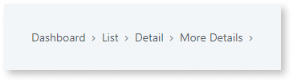
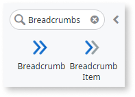
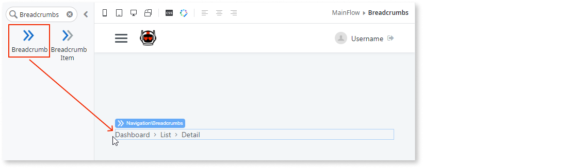
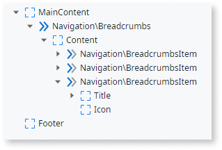
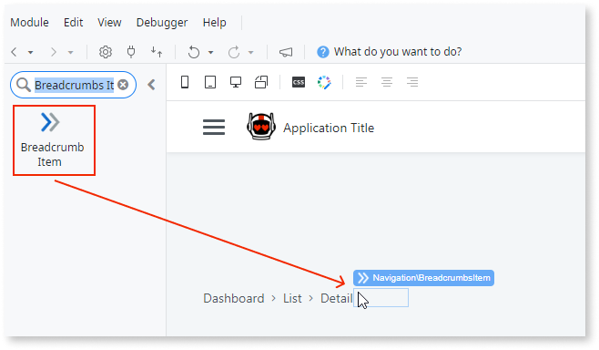
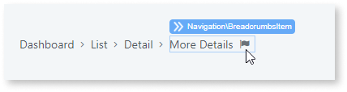
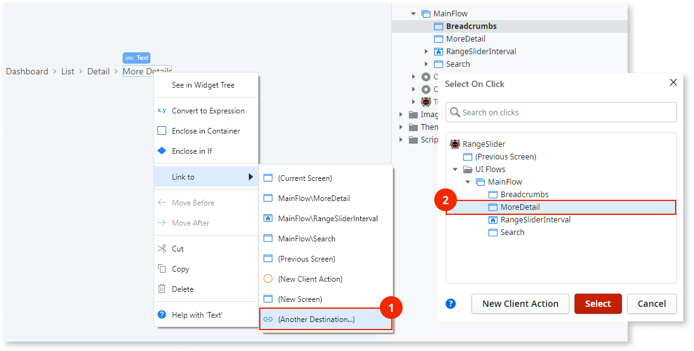

# Breadcrumbs

Applies to Mobile Apps and Reactive Web Apps only

You can use the Breadcrumbs UI Pattern as a navigational aid that helps users keep track of their location within the app.

**How to use the Breadcrumbs UI Pattern**

The following use case adds the Breadcrumbs UI Pattern to one screen. If you want Breadcrumbs to appear on multiple screens in your app, we recommend adding the pattern to a **web block**. For more information, see [Create and Reuse Screen Blocks](../../../reuse/block-create-reuse.md).

1. In Service Studio, in the Toolbox, search for `Breadcrumbs`.
  
    The Breadcrumbs widget is displayed.

    

    If the UI widget doesn't display, it's because the dependency isn't added. This happens because the Remove unused references setting is enabled. To make the widget available in your app:

    1. In the Toolbox, click **Search in other modules**.

    1. In **Search in other Modules**, remove any spaces between words in your search text.
    
    1. Select the widget you want to add from the **OutSystemsUI** module, and click **Add Dependency**. 
    
    1. In the Toolbox, search for the widget again.

1. From the Toolbox, drag the Breadcrumbs widget into the Main Content area of your application's screen.

    

    By default, the Breadcrumbs widget contains three Breadcrumb Item widgets. Each Breadcrumb Item represents a location in the breadcrumb trail. You can add or delete Breadcrumb Items as required. In this example, we add another Breadcrumb Item.

    

1. From the Toolbox, drag another Breadcrumbs Item into your Breadcrumbs Pattern.

    
        
1. In the Title placeholder, enter the breadcrumb title (in this example, **More Details**) and drag an Icon widget into the Icon placeholder.

    

1. So that each of the Breadcrumb Items are navigational, we add links. To do this, select and right-click the text inside the Breadcrumb Item placeholder, select **Link to**, and select the relevant link destination. In this example, we link the **More Details** Breadcrumb Item to an existing page called **More Details** . Repeat this process for each of the Breadcrumb Items.

    

1. So that the new **More Details** Breadcrumb Item icon matches the others, select the Icon widget, and on the **Properties** tab, set the **Icon** property to `angle-right`.

After following these steps and publishing the module, you can test the pattern in your app.

## Properties

### Breadcrumbs

| Property                       | Description                                                                                                                                                                                                                                                                                                                                                                                                                                                                                                                                                                                                              |
|--------------------------------|--------------------------------------------------------------------------------------------------------------------------------------------------------------------------------------------------------------------------------------------------------------------------------------------------------------------------------------------------------------------------------------------------------------------------------------------------------------------------------------------------------------------------------------------------------------------------------------------------------------------------|
| ExtendedClass (Text): Optional | Adds custom style classes to the Pattern. You define your [custom style classes](../../../look-feel/css.md) in your application using CSS. 
Examples <ul><li>Blank - No custom styles are added (default value).</li><li>"myclass" - Adds the ``myclass`` style to the UI styles being applied.</li><li>"myclass1" "myclass2" - Adds the ``myclass1`` and ``myclass2`` styles to the UI styles being applied.</li></ul>
You can also use the classes available on the OutSystems UI. For more information, see the [OutSystems UI Cheat Sheet](https://outsystemsui.outsystems.com/OutSystemsUIWebsite/CheatSheet). |

### Breadcrumb Item

| Property                       | Description                                                                                                                                                                                                                                                                                                                                                                                                                                                                                                                                                                                                              |
|--------------------------------|--------------------------------------------------------------------------------------------------------------------------------------------------------------------------------------------------------------------------------------------------------------------------------------------------------------------------------------------------------------------------------------------------------------------------------------------------------------------------------------------------------------------------------------------------------------------------------------------------------------------------|
| ExtendedClass (Text): Optional | Adds custom style classes to the Pattern. You define your [custom style classes](../../../look-feel/css.md) in your application using CSS. 
Examples <ul><li>Blank - No custom styles are added (default value).</li><li>"myclass" - Adds the ``myclass`` style to the UI styles being applied.</li><li>"myclass1" "myclass2" - Adds the ``myclass1`` and ``myclass2`` styles to the UI styles being applied.</li></ul>
You can also use the classes available on the OutSystems UI. For more information, see the [OutSystems UI Cheat Sheet](https://outsystemsui.outsystems.com/OutSystemsUIWebsite/CheatSheet). |
