# Overflow Menu

Applies to Mobile Apps and Reactive Web Apps only

You can use the Overflow Menu pattern to show additional options when there is a space constraint on the UI.

**Note:** This example uses an Overflow Menu to display an option to remove a row in a table. For that, you must reference the **Sample_Employee** from the **OutSystemsSampleDataDB** module and **ListRemove** from the **System**.

**How to use the Overflow Menu UI Pattern**

1. In Service Studio, in the Toolbox, search for `Table`.

    The Table widget is displayed.

    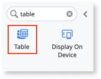

1. From the Toolbox, drag the Table widget into the Main Content area of your application's screen.

    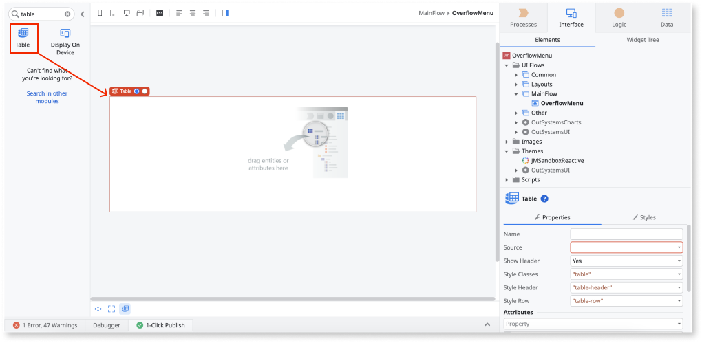

1. Select and right-click your screen name, and select **Fetch Data from Database**.

    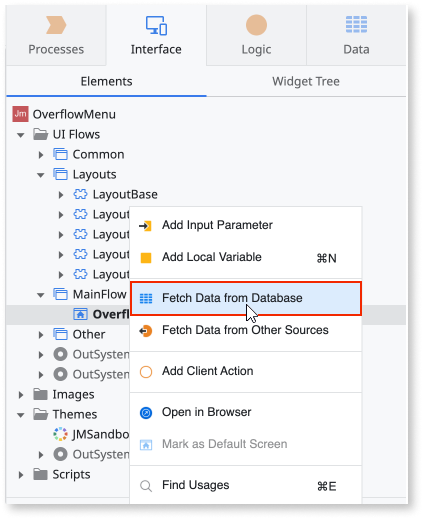

1. To add a database entity, click the screen, and from the **Select Source** pop-up, select the relevant database entity and click **Select**.

    In this example, the **Sample_Employee** entity is selected.

    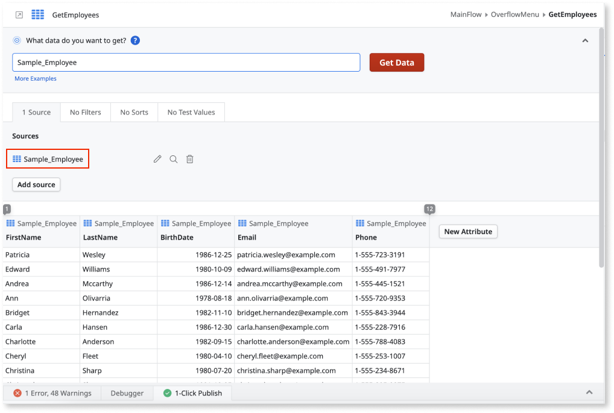

    The **GetEmployees** aggregate is automatically created.

    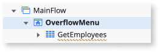

1. Drag the **GetEmployees** aggregate into the table widget.

    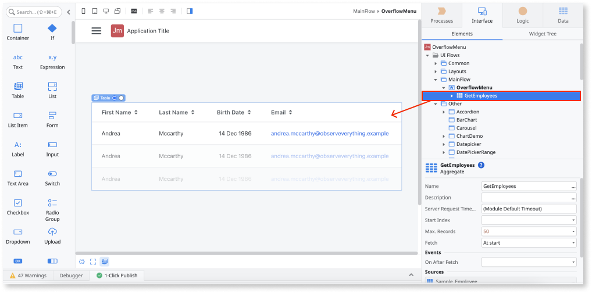

1. Right-click the last header cell and select **Add New Column Right**.

    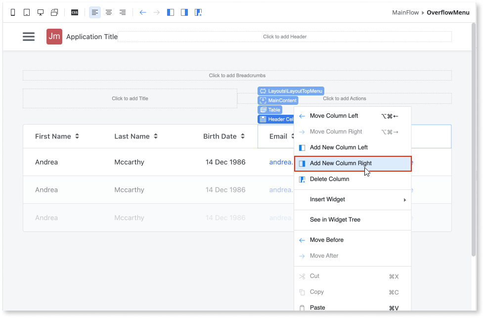

1. Go back to the Toolbox and search for the **Overflow Menu**.

    The **Overflow Menu** widget is displayed.

    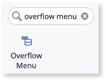

    If the UI widget doesn't display, it's because the dependency isn't added. This happens because the Remove unused references setting is set. To make the widget available in your app:

    1. In the Toolbox, click **Search in other modules**.

    1. In **Search in other Modules**, remove any spaces between words in your search text.
    
    1. Select the widget you want to add from the **OutSystemsUI** module, and click **Add Dependency**. 
    
    1. In the Toolbox, search for the widget again.

1. From the Toolbox, drag the **Overflow Menu** widget into the **Row Cell** of the row you just created.

    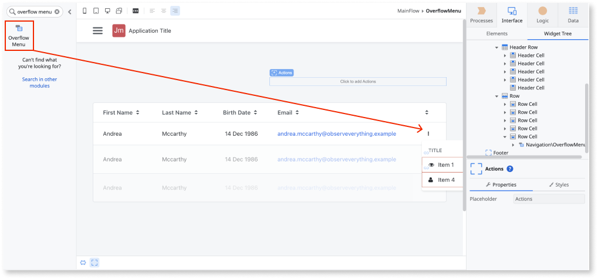

    By default, the Overflow Menu widget contains a **TriggerContent** placeholder with an **Icon** and a **Menu** placeholder that contains a **Title** and five **Links**. You can add/remove as many items to the **Menu** placeholder as required. In this example, only one link is kept.

1. Remove all the elements inside the **Menu** placeholder, except one of the links.

    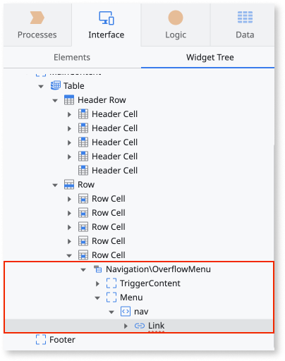

    In this example, this link is used to remove the table row.

1. To add the **Trash** icon to the link, click on the icon inside the **Link** element, and select the **Trash** icon. 

    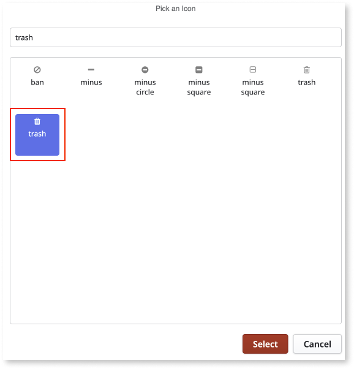

1. Replace the text on the link to **Remove Employee**. 

    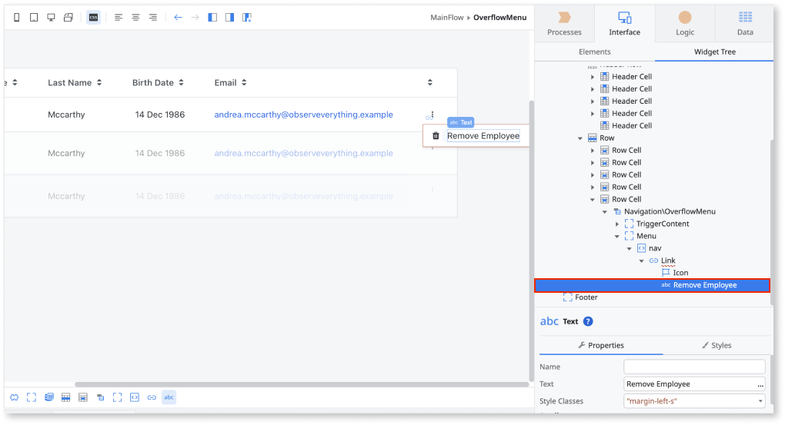

1. To use this link to remove a row from the table, click on the **Link** widget and, on the OnClick event, select **New Client Action**.

    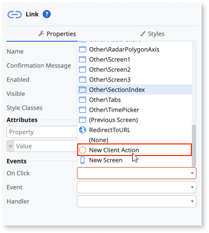

1. Add the relevant logic to the client action.

    For this example, click on the plus button and search for **ListRemove** and select **Call ListRemove**.

    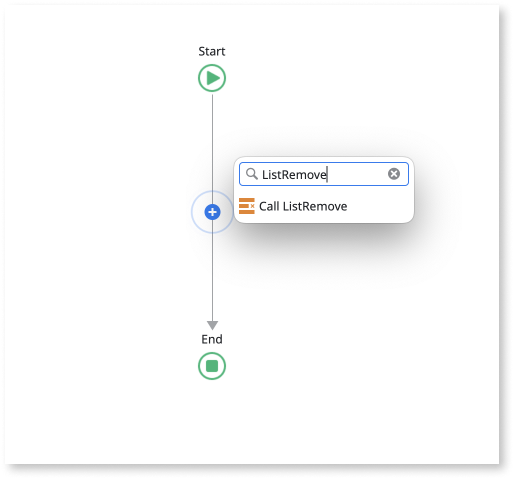

1. Click **ListRemove** and on the **Position** property, add the following expression: ``GetEmployees.List.CurrentRowNumber``.

    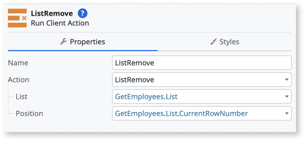

1. You can configure the Overflow Menu by selecting the pattern, and on the Properties tab, set the relevant properties.

    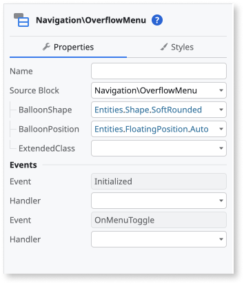

After following these steps and publishing the module, you can test the pattern in your app.  The results from this example should look something like the following:

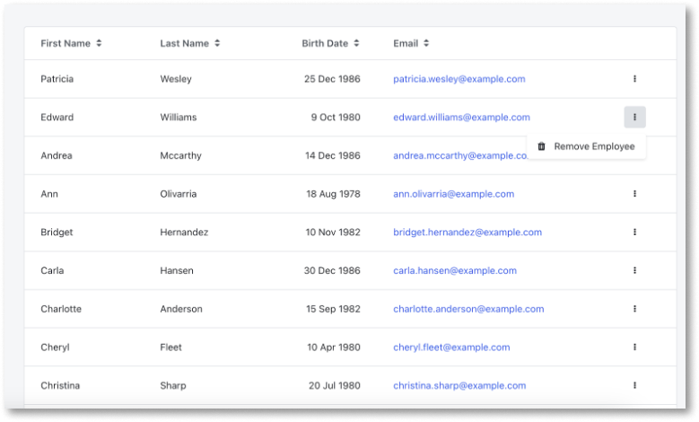
## Properties

| Property| Description |
|---|---|
|BalloonShape (Shape Identifier): Optional|Set the balloon shape. The predefined options are: <ul><li>SoftRounded</li><li>Rounded</li><li>Sharp</li></ul>  Examples<ul><li>Entities.Shape.Rounded - the inherit style is rounded. This is the default value.</li></ul>|
|BalloonPosition (FloatingPosition Identifier): Optional|Set the balloon’s position. The predefined options are:<ul><li>Auto</li><li>Top</li><li>Top start</li><li>Top end</li><li>Right</li><li>Right start</li><li>Right end</li><li>Bottom</li><li>Bottom start</li><li>Bottom end</li><li>Left</li><li>Left start</li><li>Left end</li></ul>  Examples <ul><li>Blank (Entities.BalloonPosition.Auto) - The placement of the balloon is automatically calculated based on the space available. This is the default.</li><li>Entities.BalloonPosition. Right - The balloon is displayed to the right of the element.</li></ul>|
|ExtendedClass (Text): Optional| Adds custom style classes to the Pattern. You define your [custom style classes](../../../look-feel/css.md) in your application using CSS.  Examples <ul><li>Blank - No custom styles are added (default value).</li><li>"myclass" - Adds the ``myclass`` style to the UI styles being applied.</li><li>"myclass1 myclass2" - Adds the ``myclass1`` and ``myclass2`` styles to the UI styles being applied.</li></ul>You can also use the classes available on the OutSystems UI. For more information, see the [OutSystems UI Cheat Sheet](https://outsystemsui.outsystems.com/OutSystemsUIWebsite/CheatSheet). |
