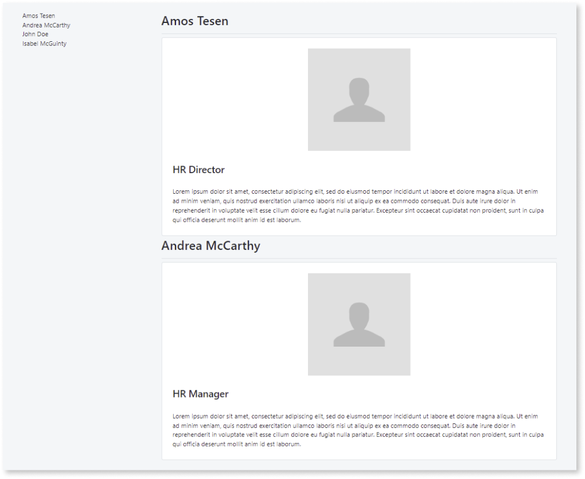
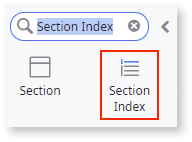
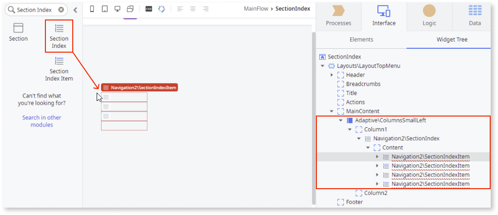
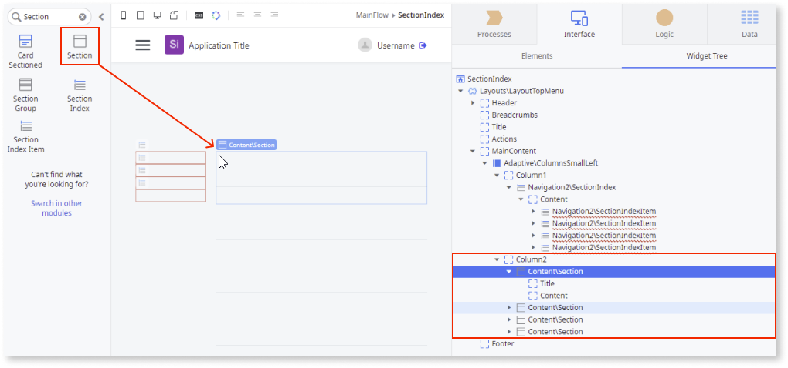
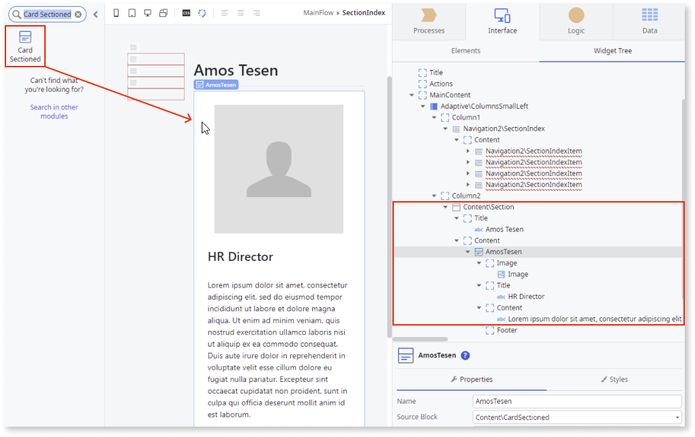
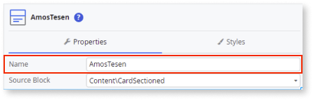
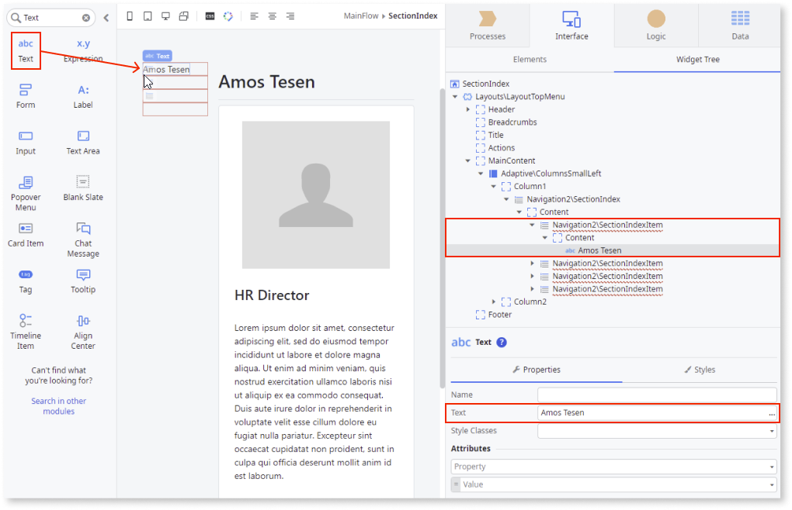
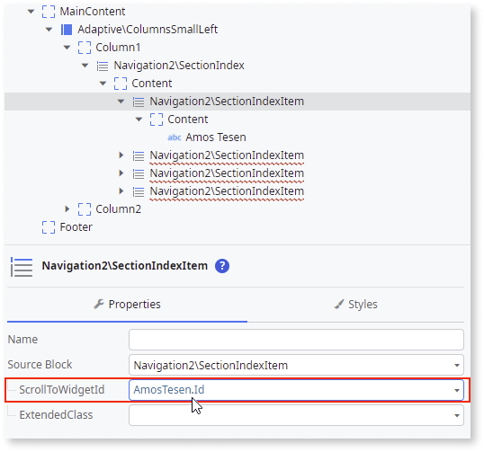
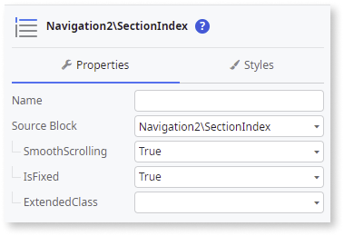

# Section Index

Applies to Mobile Apps and Reactive Web Apps only

**This documentation is not valid for deprecated components.** To check if your component is deprecated and how to migrate old versions, see the [Patterns and Versions Overview](https://outsystemsui.outsystems.com/OutsystemsUiWebsite/MigrationOverview).

To find out what version of OutSystems UI you are using, see [OutSystems UI version](../../intro.md#outsystems-ui-version).

You can use the Section Index UI Pattern to organize the content of a screen, enabling quick navigation within the page.

**How to use the Section Index UI Pattern**

1. In Service Studio, in the Toolbox, search for `Section Index`.

    The Section Index widget is displayed.

    

    If the UI widget doesn't display, it's because the dependency isn't added. This happens because the **Remove Unused Dependencies** setting is enabled. To make the widget available in your app:

    1. In the Toolbox, click **Search in other modules**.

    1. In **Search in other Modules**, remove any spaces between words in your search text.
    
    1. Select the widget you want to add from the **OutSystemsUI** module, and click **Add Dependency**. 
    
    1. In the Toolbox, search for the widget again.

1. From the Toolbox, drag the Section Index widget into the Main Content area of your application's screen.

    In this example, we drag the Section Index widget into a column (ColumnsSmallLeft). By default, the Section Index widget contains 2 Section Index Items. You can add or delete as many as required. In this example, 4 Section Index Items are required.

    

1. In the Toolbox, search for and drag the Section widget onto the screen. Add as many sections as you require for your app.

    In this example, we drag 4 Section widgets (to match the number of Section Index Items) onto the screen (Column2). Each section widget contains a **Title** and **Content** placeholder. 

    

1. Add the relevant content to Section widget's **Title** and **Content** placeholders.

    In this example, we add employee names to the **Title** placeholders, and Card Sectioned widgets with some text and images to the **Content** placeholder. 

    

1. Enter a name for each of the Card Sectioned widgets.
    
    This is so you can link them to each of the Section Index Items.

    
   
1.  In the Toolbox, search for and drag the Text widget into the first Section Index Item and enter a title (in this example, the employee's name). 

    

1. To link the Section with the Section Index Item, select the Section Index Item, and on the **Properties** tab, set the **ScrollToWidgetId** property as the Section Id. In this example,  **AmosTesen.Id**.

    

1. Repeat steps 5,6 and 7 to add content and link your sections to the remaining Section Index Items.

1. On the **Properties** tab, you can customize the Section Index's look and feel by setting any of the optional properties.

    

After following these steps and publishing the module, you can test the pattern in your app.

## Properties

### Section Index

| **Property** | **Description** |
|---|---|
|SmoothScrolling (Boolean): Optional | If True, navigation to the destination is animated. If False, the navigation is instant. The default value is True.|
|IsFixed (Text): Optional | If True, the Section Index Pattern is always in the same position on the screen. This is the default. If False, the Section Index Pattern scrolls with the page content. The default value is False.|
|ExtendedClass (Text): Optional| Adds custom style classes to the Pattern. You define your [custom style classes](../../../look-feel/css.md) in your application using CSS.  Examples <ul><li>Blank - No custom styles are added (default value).</li><li>"myclass" - Adds the ``myclass`` style to the UI styles being applied.</li><li>"myclass1 myclass2" - Adds the ``myclass1`` and ``myclass2`` styles to the UI styles being applied.</li></ul>You can also use the classes available on the OutSystems UI. For more information, see the [OutSystems UI Cheat Sheet](https://outsystemsui.outsystems.com/OutSystemsUIWebsite/CheatSheet). |

### Section Index Item

| **Property** | **Description** |
|---|---|
|ScrollToWidgetId (Text): Mandatory | The element the page navigates to.  |
| ExtendedClass (Text): Optional|Adds custom style classes to the Pattern. You define your [custom style classes](../../../look-feel/css.md) in your application using CSS.  Examples <ul><li>Blank - No custom styles are added (default value).</li><li>"myclass" - Adds the ``myclass`` style to the UI styles being applied.</li><li>"myclass1 myclass2" - Adds the ``myclass1`` and ``myclass2`` styles to the UI styles being applied.</li></ul>You can also use the classes available on the OutSystems UI. For more information, see the [OutSystems UI Cheat Sheet](https://outsystemsui.outsystems.com/OutSystemsUIWebsite/CheatSheet). |

