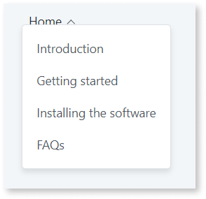
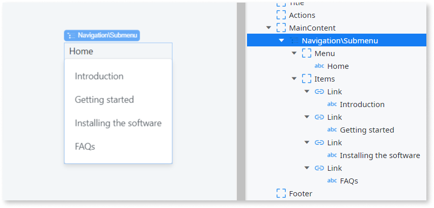

# Submenu

Applies to Mobile Apps and Reactive Web Apps only

**This documentation is not valid for deprecated components.** To check if your component is deprecated and how to migrate old versions, see the [Patterns and Versions Overview](https://outsystemsui.outsystems.com/OutsystemsUiWebsite/MigrationOverview).

To find out what version of OutSystems UI you are using, see [OutSystems UI version](../../intro.md#outsystems-ui-version).

You can use the Submenu UI Pattern to create a menu that is contained within another menu.

**How to use the Submenu UI Pattern**

1. In Service Studio, in the Toolbox, search for `Submenu`.

    The Submenu widget is displayed.

    

    If the UI widget doesn't display, it's because the dependency isn't added. This happens because the Remove unused references setting is enabled. To make the widget available in your app:

    1. In the Toolbox, click **Search in other modules**.

    1. In **Search in other Modules**, remove any spaces between words in your search text.
    
    1. Select the widget you want to add from the **OutSystemsUI** module, and click **Add Dependency**. 
    
    1. In the Toolbox, search for the widget again.

1. From the Toolbox, drag the Submenu widget into the Main Content area of your application's screen.

    

    By default, the Submenu widget contains a Menu placeholder and an Items placeholder that contains a link. You can add as many Items placeholders as required. In this example we add 3 more.

1. Add the relevant content to the Menu and Items placeholders.

    In this example, we add text to the Menu placeholder, and set the links in the Items placeholders to navigate to different pages in the app.

    

After following these steps and publishing the module, you can test the pattern in your app.

## Properties

| Property| Description |
|---|---|
| ExtendedClass (Text): Optional| Adds custom style classes to the Pattern. You define your [custom style classes](../../../look-feel/css.md) in your application using CSS.  Examples <ul><li>Blank - No custom styles are added (default value).</li><li>"myclass" - Adds the ``myclass`` style to the UI styles being applied.</li><li>"myclass1 myclass2" - Adds the ``myclass1`` and ``myclass2`` styles to the UI styles being applied.</li></ul>You can also use the classes available on the OutSystems UI. For more information, see the [OutSystems UI Cheat Sheet](https://outsystemsui.outsystems.com/OutSystemsUIWebsite/CheatSheet). |
