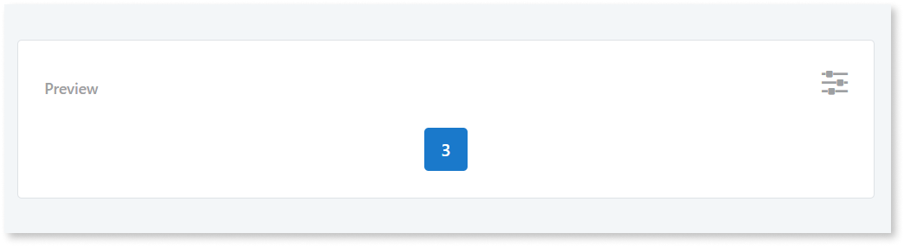
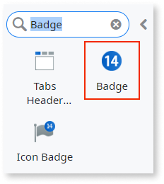
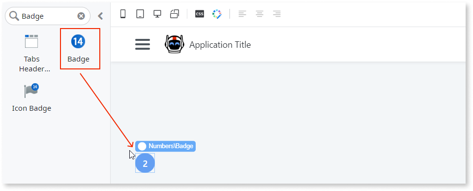
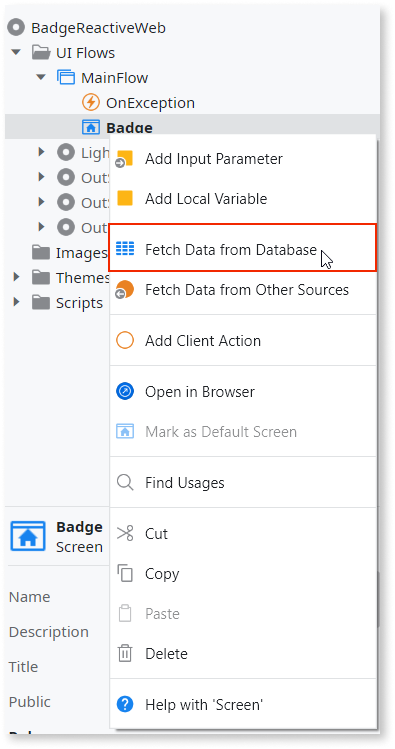
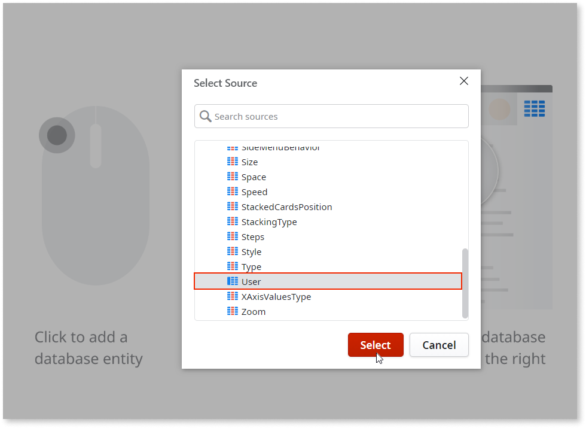
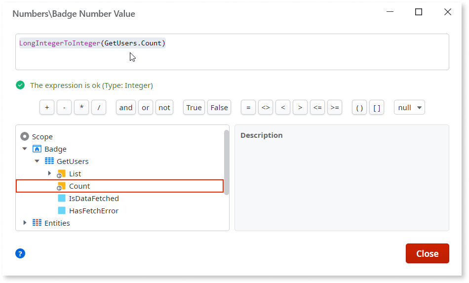
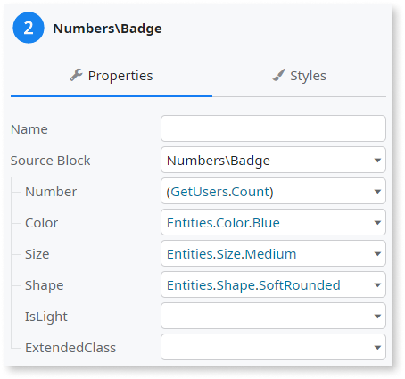
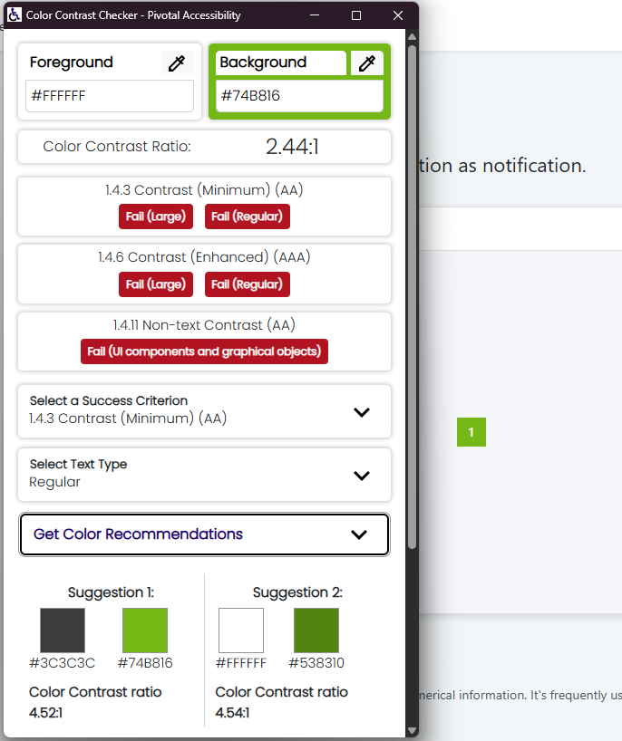

# Badge

<div class="info" markdown="1">

Applies to Mobile Apps and Reactive Web Apps only

</div>

You can use the Badge UI Pattern to display numerical information as a notification. For example, the Badge UI pattern is frequently used to notify users about the number of unread emails, unopened messages, or new tasks they may have.



## How to use the Badge UI pattern

The following example demonstrates how you can display the number of registered users on your platform.

1. In Service Studio, in the Toolbox, search for `Badge`.

    The Badge widget is displayed.

    

    If the UI widget doesn't display, it's because the dependency isn't added. This happens because the Remove unused references setting is enabled. To make the widget available in your app:

    1. In the Toolbox, click **Search in other modules**.

    1. In **Search in other Modules**, remove any spaces between words in your search text.

    1. Select the widget you want to add from the **OutSystemsUI** module, and click **Add Dependency**.

    1. In the Toolbox, search for the widget again.

1. From the Toolbox, drag the Badge widget into the Main Content area of your application's screen.

    

1. To create an aggregate that retrieves all of the users on your platform, right-click your screen name and select **Fetch Data from Database**.

    

1. Click the Aggregate screen, and from the **Select Source** popup, select the relevant database entity (in this example, **Users**), and click **Select**.

    

1. To reopen your screen, double-click on your screen name.

1. Select the Badge widget, and on the **Properties** tab, from the **Number** drop-down, select **Expression Editor**.

1. In the Expression Editor, enter the following expression and click **Close**.

    `(GetUsers.Count)`

    Note: You can also add the expression by navigating through the Expression Editor's **Scope** tree and double-clicking on the **Count** output parameter.

    

    The **Number** property is now set to display the Count property of the aggregate you created, which retrieves the number of users on your platform and displays it in your Badge.

1. On the **Properties** tab, you can also customize the Badge's look and feel by setting any of the optional properties, for example, the color, shape, and size. The following example displays a blue, medium-sized, soft-rounded badge.  

    

After following these steps and publishing the module, you can test the pattern in your app.

## Properties

| Property | Description |
| --- | --- |
| Number (LongInteger): Optional | Number that appears inside the badge. Set this to a Data source that contains the value that the Badge will display. Common use cases include displaying a value contained in a Variable or the result of an Aggregate (for instance, querying a 'Messages' table for the current user to return the count of new messages). <p>Examples <ul><li>Blank - displays the number 8 (default value)</li><li>22 - displays the number 22</li><li>VariableName - displays the value that the variable "VariableName" holds at that time </li><li>ExampleAggregate.Count - displays the number of records returned by the "ExampleAggregate" aggregate execution</li></ul></p> |
| Color (Color Identifier): Optional | Set the badge color. Red, orange, yellow, lime, green, blue, violet, and pink are just some of predefined colors available for the badge. <p>Examples <ul><li>Blank - displays the badge in the color you chose when creating the app (default value)</li><li>Entities.Color.Red - displays a red badge</li></ul></p> |
| Size (Size Identifier): Optional | Set the badge size. Small and medium are the predefined sizes available for the badge. <p>Examples <ul><li>Blank - displays a medium sized badge (default value)</li><li>Entities.Size.Small - displays a small sized badge</li></ul></p> |
| Shape (Shape Identifier): Optional | Set the badge shape. Rounded, soft rounded, and sharp are the predefined shapes available for the badge. <p>Examples <ul><li>Blank - displays a rounded badge (default value)</li><li>Entities.Shape.Sharp - displays a square badge</li></ul></p> |
| IsLight (Boolean): Optional | Specify the badge's background color. <p>Examples <ul><li>Blank - A darker hue of the color is applied to the badge and a lighter color to the text (default value)</li><li>True - A brighter hue of the color is applied to the badge and a darker color to the text.</li><li>False - A darker hue of the color is applied to the badge and a lighter color to the text</li></ul></p> |
| ExtendedClass (Text): Optional | Adds custom style classes to the Pattern. You define your [custom style classes](../../../look-feel/css.md) in your application using CSS. <p>Examples <ul><li>Blank - No custom styles are added (default value)</li><li>"myclass" - Adds the ``myclass`` style to the UI styles being applied.</li><li>"myclass1" "myclass2" - Adds the ``myclass1`` and ``myclass2`` styles to the UI styles being applied.</li></ul></p>You can also use the classes available on the OutSystems UI. For more information, see the [OutSystems UI Cheat Sheet](https://outsystemsui.outsystems.com/OutSystemsUIWebsite/CheatSheet). |

## Accessibility – WCAG 2.2 AA compliance

By default, the **Badge** UI Pattern uses color combinations that might not meet the minimum contrast ratio required for WCAG 2.2 AA compliance. This happens because the **OutSystems UI** color palette was designed to provide broad coverage across many projects, similar to other design systems.

With so many available colors, it’s easy to create combinations that don’t provide enough contrast. Some of these combinations are also part of the default Badge configuration, which wasn’t specifically optimized for accessibility. However, these combinations only pose an issue when they’re used or become available through dynamic settings.

In most cases, customizing the palette to match your brand styles or adjusting individual color tokens might resolve the contrast problems—or, if done without testing, make them worse.

### OutSystems UI colors with low contrast combinations

<div class="info" markdown="1">

Some colors in the **OutSystems UI** palette don’t meet the minimum recommended contrast ratio **(4.5:1 for normal text or 3:1 for large text)** when used together as text and background colors. The following colors, for example, may create low-contrast combinations when applied to text, icons, or interactive elements such as buttons and links:

* orange

* yellow

* lime  

* green  

* neutral-5  

* neutral-6  

* light-yellow  

* light-lime  

* light-transparent  

* light-neutral-5  

* light-neutral-6

</div>

You can still use these colors for decorative or non-textual purposes, as long as they don’t affect readability or information perception.

If your application relies on these color tokens, update the related CSS variables to improve contrast across all components. When applying custom or brand colors, always validate the contrast between text and background to ensure WCAG 2.2 AA compliance.

Use a contrast checking tool such as:

* [Color Contrast Checker by Pivotal Accessibility](https://chromewebstore.google.com/detail/color-contrast-checker/gbfgefkhkofclanlcgnhlbmfgjjomock)

* [Accessible Color Picker](https://chromewebstore.google.com/detail/accessible-color-picker/bgfhbflmeekopanooidljpnmnljdihld)

* [WebAIM Contrast Checker](https://webaim.org/resources/contrastchecker/)

* [Contrast Ratio by Lea Verou](https://contrast-ratio.com/)

 

### Update CSS variables to improve contrast

Update the theme color tokens so text and background combinations meet WCAG 2.2 AA. Replace each placeholder value with your brand colors (hex or rgba) and publish.

1. In **Service Studio**, go to the **Elements** tab.

1. Select your **Theme** in **Themes**.

1. In the theme’s CSS, add or update the needed variables.

1. Replace the placeholder values with new accessible colors and **Publish** the module.

<div class="info" markdown="1">

**Disclaimer:**  
The following code block lists all root color variables for quick reference. You don’t need to include all of them in your theme — only the ones you intend to update.  

For readability, the examples use a black hex value (`#000000`), but you can replace it with any valid CSS color format, such as `rgb()`, `rgba()`, `hsl()`, or `oklch()`.

</div>

```css
:root {
    /* ── Color > Brand ───────────────────────────────────── */
    --color-primary:          [#000000 /* replace */];
    --color-secondary:        [#000000 /* replace */];
    --color-primary-hover:    [#000000 /* replace */];
    --color-primary-selected: [#000000 /* replace */];
    --color-primary-lightest: [#000000 /* replace */];

    /* ── Color > Focus ───────────────────────────────────── */
    --color-focus-outer:      [#000000 /* replace */];
    --color-focus-inner:      [#000000 /* replace */];

    /* ── Color > Extended (Reds) ─────────────────────────── */
    --color-red-lightest:     [#000000 /* replace */];
    --color-red-lighter:      [#000000 /* replace */];
    --color-red-light:        [#000000 /* replace */];
    --color-red:              [#000000 /* replace */];
    --color-red-dark:         [#000000 /* replace */];
    --color-red-darker:       [#000000 /* replace */];
    --color-red-darkest:      [#000000 /* replace */];

    /* ── Color > Extended (Oranges) ──────────────────────── */
    --color-orange-lightest:  [#000000 /* replace */];
    --color-orange-lighter:   [#000000 /* replace */];
    --color-orange-light:     [#000000 /* replace */];
    --color-orange:           [#000000 /* replace */];
    --color-orange-dark:      [#000000 /* replace */];
    --color-orange-darker:    [#000000 /* replace */];
    --color-orange-darkest:   [#000000 /* replace */];

    /* ── Color > Extended (Yellows) ──────────────────────── */
    --color-yellow-lightest:  [#000000 /* replace */];
    --color-yellow-lighter:   [#000000 /* replace */];
    --color-yellow-light:     [#000000 /* replace */];
    --color-yellow:           [#000000 /* replace */];
    --color-yellow-dark:      [#000000 /* replace */];
    --color-yellow-darker:    [#000000 /* replace */];
    --color-yellow-darkest:   [#000000 /* replace */];

    /* ── Color > Extended (Limes) ────────────────────────── */
    --color-lime-lightest:    [#000000 /* replace */];
    --color-lime-lighter:     [#000000 /* replace */];
    --color-lime-light:       [#000000 /* replace */];
    --color-lime:             [#000000 /* replace */];
    --color-lime-dark:        [#000000 /* replace */];
    --color-lime-darker:      [#000000 /* replace */];
    --color-lime-darkest:     [#000000 /* replace */];

    /* ── Color > Extended (Greens) ───────────────────────── */
    --color-green-lightest:   [#000000 /* replace */];
    --color-green-lighter:    [#000000 /* replace */];
    --color-green-light:      [#000000 /* replace */];
    --color-green:            [#000000 /* replace */];
    --color-green-dark:       [#000000 /* replace */];
    --color-green-darker:     [#000000 /* replace */];
    --color-green-darkest:    [#000000 /* replace */];

    /* ── Color > Extended (Teals) ────────────────────────── */
    --color-teal-lightest:    [#000000 /* replace */];
    --color-teal-lighter:     [#000000 /* replace */];
    --color-teal-light:       [#000000 /* replace */];
    --color-teal:             [#000000 /* replace */];
    --color-teal-dark:        [#000000 /* replace */];
    --color-teal-darker:      [#000000 /* replace */];
    --color-teal-darkest:     [#000000 /* replace */];

    /* ── Color > Extended (Cyans) ────────────────────────── */
    --color-cyan-lightest:    [#000000 /* replace */];
    --color-cyan-lighter:     [#000000 /* replace */];
    --color-cyan-light:       [#000000 /* replace */];
    --color-cyan:             [#000000 /* replace */];
    --color-cyan-dark:        [#000000 /* replace */];
    --color-cyan-darker:      [#000000 /* replace */];
    --color-cyan-darkest:     [#000000 /* replace */];

    /* ── Color > Extended (Blues) ────────────────────────── */
    --color-blue-lightest:    [#000000 /* replace */];
    --color-blue-lighter:     [#000000 /* replace */];
    --color-blue-light:       [#000000 /* replace */];
    --color-blue:             [#000000 /* replace */];
    --color-blue-dark:        [#000000 /* replace */];
    --color-blue-darker:      [#000000 /* replace */];
    --color-blue-darkest:     [#000000 /* replace */];

    /* ── Color > Extended (Indigos) ──────────────────────── */
    --color-indigo-lightest:  [#000000 /* replace */];
    --color-indigo-lighter:   [#000000 /* replace */];
    --color-indigo-light:     [#000000 /* replace */];
    --color-indigo:           [#000000 /* replace */];
    --color-indigo-dark:      [#000000 /* replace */];
    --color-indigo-darker:    [#000000 /* replace */];
    --color-indigo-darkest:   [#000000 /* replace */];

    /* ── Color > Extended (Violets) ──────────────────────── */
    --color-violet-lightest:  [#000000 /* replace */];
    --color-violet-lighter:   [#000000 /* replace */];
    --color-violet-light:     [#000000 /* replace */];
    --color-violet:           [#000000 /* replace */];
    --color-violet-dark:      [#000000 /* replace */];
    --color-violet-darker:    [#000000 /* replace */];
    --color-violet-darkest:   [#000000 /* replace */];

    /* ── Color > Extended (Grapes) ───────────────────────── */
    --color-grape-lightest:   [#000000 /* replace */];
    --color-grape-lighter:    [#000000 /* replace */];
    --color-grape-light:      [#000000 /* replace */];
    --color-grape:            [#000000 /* replace */];
    --color-grape-dark:       [#000000 /* replace */];
    --color-grape-darker:     [#000000 /* replace */];
    --color-grape-darkest:    [#000000 /* replace */];

    /* ── Color > Extended (Pinks) ────────────────────────── */
    --color-pink-lightest:    [#000000 /* replace */];
    --color-pink-lighter:     [#000000 /* replace */];
    --color-pink-light:       [#000000 /* replace */];
    --color-pink:             [#000000 /* replace */];
    --color-pink-dark:        [#000000 /* replace */];
    --color-pink-darker:      [#000000 /* replace */];
    --color-pink-darkest:     [#000000 /* replace */];

    /* ── Color > Neutral ─────────────────────────────────── */
    --color-neutral-0:        [#000000 /* replace */];
    --color-neutral-1:        [#000000 /* replace */];
    --color-neutral-2:        [#000000 /* replace */];
    --color-neutral-3:        [#000000 /* replace */];
    --color-neutral-4:        [#000000 /* replace */];
    --color-neutral-5:        [#000000 /* replace */];
    --color-neutral-6:        [#000000 /* replace */];
    --color-neutral-7:        [#000000 /* replace */];
    --color-neutral-8:        [#000000 /* replace */];
    --color-neutral-9:        [#000000 /* replace */];
    --color-neutral-10:       [#000000 /* replace */];

    /* ── Color > Semantic ────────────────────────────────── */
    --color-error-light:      [#000000 /* replace */];
    --color-error:            [#000000 /* replace */];
    --color-warning-light:    [#000000 /* replace */];
    --color-warning:          [#000000 /* replace */];
    --color-success-light:    [#000000 /* replace */];
    --color-success:          [#000000 /* replace */];
    --color-info-light:       [#000000 /* replace */];
    --color-info:             [#000000 /* replace */];
}
```

### Result

After you update the theme color variables with accessible values, validate that each combination of background and text colors used in the **Badge** meets the WCAG 2.2 AA contrast requirements.

When validating in a Style Guide or Design System context, make sure to check both the default state and the **IsLight** variant, which inverts background and text colors.
