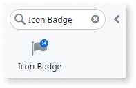
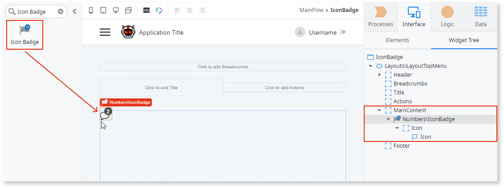
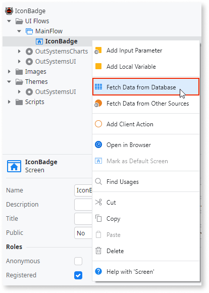
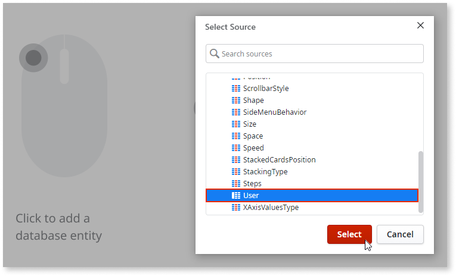
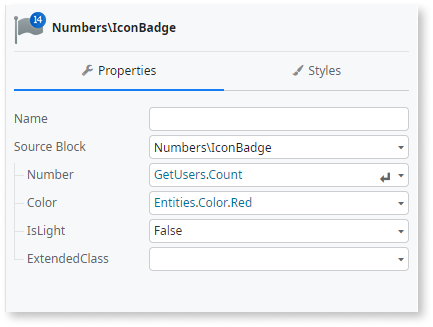

# Icon Badge

Applies to Mobile Apps and Reactive Web Apps only

You can use the Icon Badge UI Pattern to display numerical information as a notification. For example, the Icon Badge UI pattern is frequently used to notify users about the number of unread emails, unopened messages, or new tasks they may have.

**How to use the Icon Badge UI Pattern**

The following example demonstrates how you can display the number of registered users on your platform.

1. In Service Studio, in the Toolbox, search for `Icon Badge`.

    The Icon Badge widget is displayed.

    

    If the UI widget doesn't display, it's because the dependency isn't added. This happens because the Remove unused references setting is enabled. To make the widget available in your app:

    1. In the Toolbox, click **Search in other modules**.

    1. In **Search in other Modules**, remove any spaces between words in your search text.
    
    1. Select the widget you want to add from the **OutSystemsUI** module, and click **Add Dependency**. 
    
    1. In the Toolbox, search for the widget again.

1. From the Toolbox, drag the Icon Badge widget into the Main Content area of your application's screen.

    

    By default, the Icon Badge contains an Icon placeholder with a pre-existing icon.

1. To create an aggregate (in this example to retrieve all the users on the platform), right-click the screen name and select **Fetch Data from Database**.

    

1. To add a database entity, click the screen, and from the **Select Source** pop-up, select the relevant entity and click **OK**. In this example, we select the **User** entity.

    

    The aggregate **GetUsers** is created.

    

1. To reopen your screen, select the **Interface** tab, and double-click on your screen name.

1. Select the Icon Badge widget, and on the **Properties** tab, from the **Number** drop-down, select **Expression Editor**, and in the Expression Editor enter the following expression and click **Done**.

    `GetUsers.Count`

    

    The **Number** property is now set to display the Count property of the Aggregate you created earlier, which gets and displays the number of users on your platform.

1. On the **Properties** tab, you can customize the Icon Badge's look and feel by setting any of the optional properties, for example, the color.

    

After following these steps and publishing the module, you can test the pattern in your app.

## Properties

| Property| Description|
|---|---|
| Number (Integer): Mandatory | The number that appears inside the badge. Set this to a data source that contains the value you want to display. 
Examples <ul><li>_VariableName_ - Displays the value that the variable "VariableName" holds at that time.</li><li>_ExampleAggregate.Name_ - Displays the names contained in the records returned by the "ExampleAggregate" aggregate execution.</li></ul>
|
| Color (Color Identifier): Optional | Set the icon badge's background color. Red, orange, yellow, lime, green, blue, violet, and pink are just some of predefined colors available for the icon badge. 
Examples <ul><li>Blank - Displays the icon badge in the color you chose when creating the app. This is the default.</li><li>Entities.Color.Red - Displays a red icon badge.</li></ul>
 |
| IsLight (Boolean): Optional | Specify the badge's background and text color. 
Examples <ul><li>True - A brighter hue of the color is applied to the badge and a darker color to the text.</li><li>False - A darker hue of the color is applied to the badge and a lighter color to the text. This is the default.</li></ul>
 |
| ExtendedClass (Text):Optional | Adds custom style classes to the Pattern.You define your [custom style classes](../../../look-feel/css.md) in your application using CSS. 
Examples <ul><li>Blank - No custom styles are added (default value).</li><li>"myclass" - Adds the ``myclass`` style to the UI styles being applied.</li><li>"myclass1 myclass2" - Adds the ``myclass1`` and ``myclass2`` styles to the UI styles being applied.</li></ul>
You can also use the classes available on the OutSystems UI. For more information, see the [OutSystems UI Cheat Sheet](https://outsystemsui.outsystems.com/OutSystemsUIWebsite/CheatSheet). |
