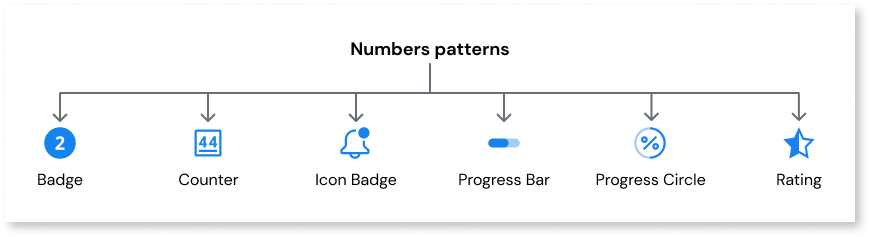

# Numbers

Applies to Mobile Apps and Reactive Web Apps only

Number patterns allow you to highlight and display numerical information to users in different ways, such as counters, percentages, ratings, and progress bars.
Content patterns are frequently used to notify users about, for example, the number of unread emails or to show the current progress of a task flow.

The available content patterns include the following:

* [Badge](badge.md)
* [Counter](counter.md)
* [Icon Badge](iconbadge.md)
* [Progress Bar](progressbar.md)
* [Progress Circle](progresscircle.md)
* [Rating](rating.md)
