# Progress Circle

Applies to Mobile Apps and Reactive Web Apps only

**This documentation is not valid for deprecated components.** To check if your component is deprecated and how to migrate old versions, see the [Patterns and Versions Overview](https://outsystemsui.outsystems.com/OutsystemsUiWebsite/MigrationOverview).

To find out what version of OutSystems UI you are using, see [OutSystems UI version](../../intro.md#outsystems-ui-version).

You can use the Progress Circle UI Pattern to show the current progress of an operation flow. The progress is incremented in fractions of the circular badge.

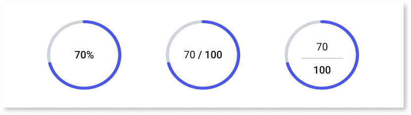

**How to use the Progress Circle UI Pattern**

In this example, we create a button that increments the progress circle each time it's clicked and displays the progress as a fraction.

1. In Service Studio, in the Toolbox, search for `Progress Circle`.

    The Progress Circle widget is displayed.

    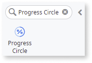

    If the UI widget doesn't display, it's because the dependency isn't added. This happens because the Remove unused references setting is enabled. To make the widget available in your app:

    1. In the Toolbox, click **Search in other modules**.

    1. In **Search in other Modules**, remove any spaces between words in your search text.

    1. Select the widget you want to add from the **OutSystemsUI** module, and click **Add Dependency**.

    1. In the Toolbox, search for the widget again.

1. From the Toolbox, drag the Progress Circle widget into the Main Content area of your application's screen.

    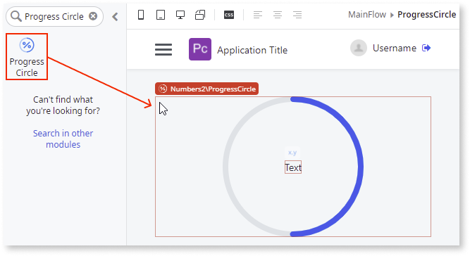

1. Right-click your screen name, select **Add Local Variable**, and enter a name. for example, `Count`.

    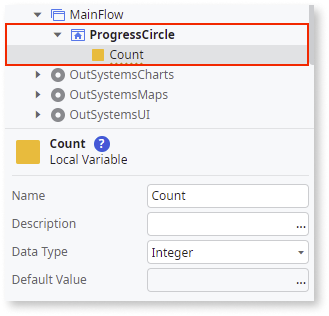

1. Select the Progress Circle widget, and on the **Properties** tab, in the **Progress** property, enter the **Count** variable.

    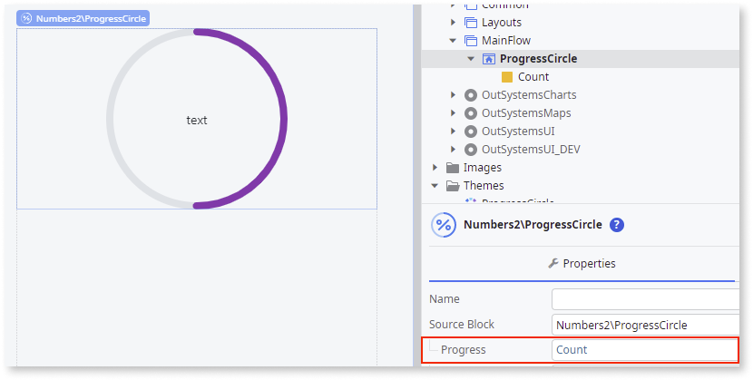

1. Select the **Expression** widget inside the Progress Circle, and on the **Properties** tab, in the **Value** property, enter the relevant logic for the progress. In this example, enter the local variable **Count**.

    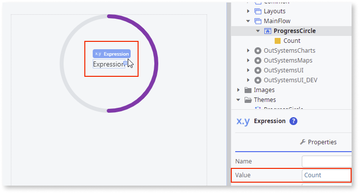

1. From the Toolbox, drag the **Separator** widget into the Progress Circle.

    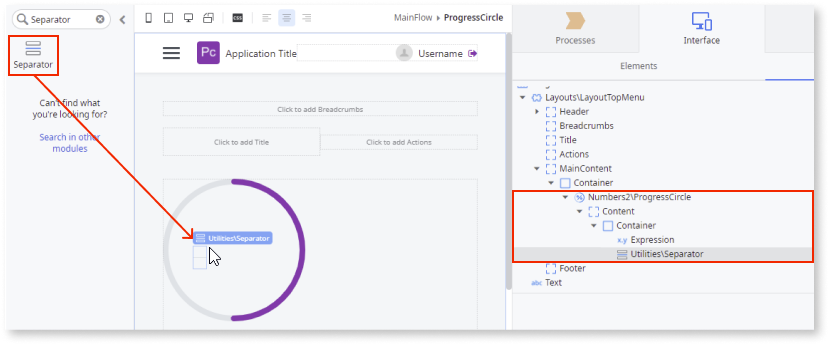

1. From the Toolbox, drag an **Expression** widget under the **Separator** widget and enter the relevant logic for the denominator. In this example, enter ``"100"``.

    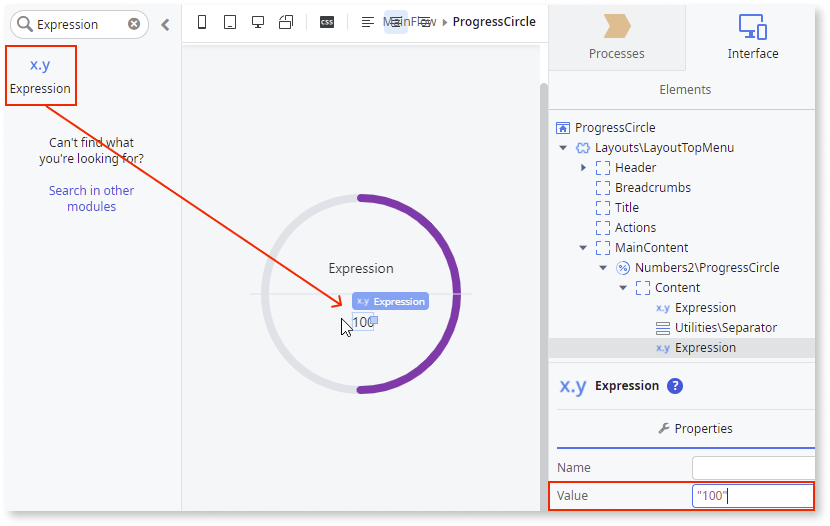

1. From the Toolbox, drag the Button widget into the Main Content area of your application's screen.

    In this example, we call the button **Increment** and set the **On Click** event to a  **New Client Action** that assigns the **Count** variable to `Count + 1`.

    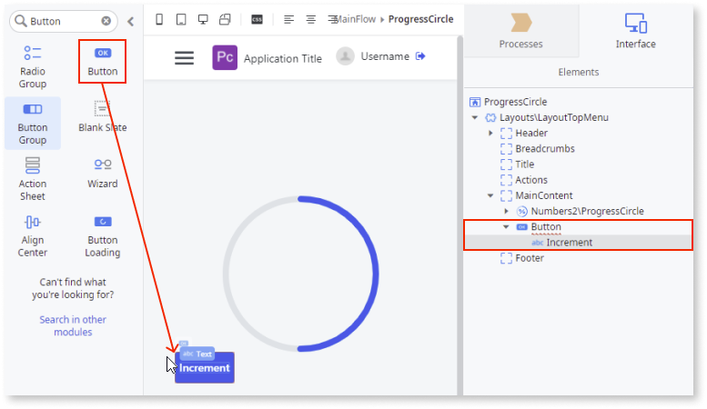

    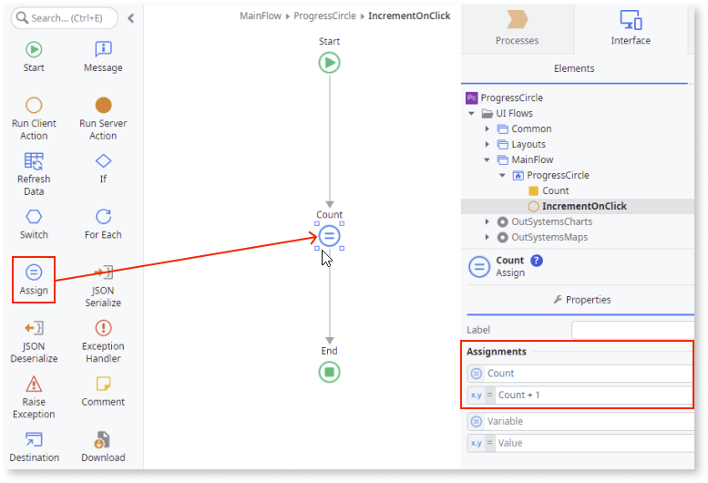

1. Select the Progress Circle widget, and on the **Properties** tab, you can change the Progress Circle's look and feel by setting the (optional) properties, for example, the color settings.

    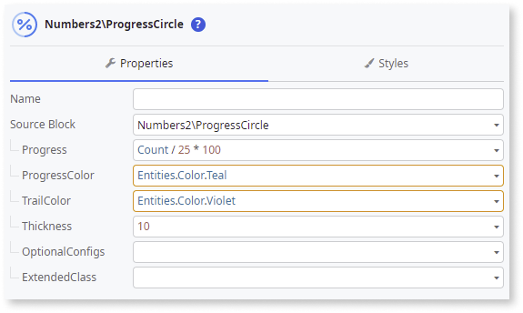

After following these steps and publishing the module, you can test the pattern in your app. The result of this example should look something like the following:

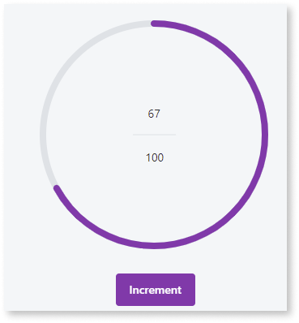

## Properties

| Property| Description|
|---|---|
|Progress (Integer): Mandatory |Defines the progress percentage. Usually a number between 0 and 100. You can also use functions or local variables. |
|ProgressColor (Color Identifier): Optional|Defines the color that fills the circle as progress increases. By default, the progress color is the primary color you choose when creating the app.  To use an RGB color, use: TextToIdentifier("rgb(0,0,0)") To use a HEX color, use: TextToIdentifier("#000000").|
|Size (Text): Optional | Defines the Progress Circle diameter (height and width). Accepts any kind of unit (px, %, vw). By default, "auto". |
|TrailColor (Color Identifier): Optional | Defines the color of the empty part of the circle. By default, the trail color is Neutral 4 (#DEE2E6).  To use an RGB color, use: TextToIdentifier("rgb(0,0,0)") To use a HEX color, use: TextToIdentifier("#000000") |
|Thickness (Integer): Optional| Defines the thickness of the circle that marks the progress, in pixels. By default, the thickness is 8 pixels. |
|OptionalConfigs (ProgressCircleOptionalConfigs): Optional|Defines additional parameters to customize the Progress Circle behavior and functionality. |
|OptionalConfigs.Shape (Shape Identifier): Optional|Defines the progress shape.  The predefined options are:<ul><li>SoftRounded</li><li>Rounded</li><li>Sharp</li></ul>Example:<ul><li>Entities.Shape.Rounded - The inherit style is rounded. This is the default.</li></ul> |
|OptionalConfigs.AnimateInitialProgress (Boolean): Optional| If True, the Progress Circle shows an animation going from zero to its initial progress. This is the default. |
|ExtendedClass (Text): Optional | Adds custom style classes to the Pattern. You define your [custom style classes](../../../look-feel/css.md) in your application using CSS.  Examples <ul><li>Blank - No custom styles are added (default value).</li><li>"myclass" - Adds the ``myclass`` style to the UI styles being applied.</li><li>"myclass1 myclass2" - Adds the ``myclass1`` and ``myclass2`` styles to the UI styles being applied.</li></ul>You can also use the classes available on the OutSystems UI. For more information, see the [OutSystems UI Cheat Sheet](https://outsystemsui.outsystems.com/OutSystemsUIWebsite/CheatSheet). |
