# Provider client actions

The following extensibility client actions are available for UI Patterns:

* [Provider events](#provider-events)

* [Provider configuration](#provider-configuration)

### Provider events

To add further events beyond the ones the Patterns have by default, there’s a set of two client actions per provider that can be used to add or remove a new event and an associated callback.

The following table shows each provider based UI Pattern with its associated event client actions and parameters as well as the provider events.

|UI Pattern | Client action | Parameters | Provider events|
|---|---|---|---|
|Carousel |SetSplideEvent | <ul><li>WidgetId (string)</li><li>EventName (string)</li><li>Handler (object)</li><li>SplideEventId (string)</li><li>Success (boolean)</li><li>ErrorMessage (structure)</li></ul>| [Splide events](https://splidejs.com/guides/events/)|
|Carousel |UnsetSplideEvent | <ul><li>WidgetId (string)</li><li>SplideEventId (string)</li><li>Success (boolean)</li><li>ErrorMessage (structure)</li></ul>| [Splide events](https://splidejs.com/guides/events/)|
|<ul><li>Date Picker</li><li>Date Picker Range</li></ul>|SetFlatpickrEvent | <ul><li>WidgetId (string)</li><li>EventName (string)</li><li>Handler (object)</li><li>FlatpickrEventId (string)</li><li>Success (boolean)</li><li>ErrorMessage (structure)</li></ul>|[Flatpickr events](https://flatpickr.js.org/events/)|
|<ul><li>Date Picker</li><li>Date Picker Range </li></ul>|UnsetFlatpickrEvent | <ul><li>WidgetId (string)</li><li>FlatpickrEventId (string)</li><li>Success (boolean)</li><li>ErrorMessage (structure)</li></ul> | [Flatpickr events](https://flatpickr.js.org/events/)|
|<ul><li>Dropdown Search</li><li>Dropdown Tags</li></ul>|SetVirtualSelectEvent | <ul><li>WidgetId (string)</li><li>EventName (string)</li><li>Handler (object)</li><li>VirtualSelectEventId (string)</li>Success (boolean)<li>ErrorMessage (structure)</li></ul> | [VirtualSelect events](https://sa-si-dev.github.io/virtual-select/#/events)|
|<ul><li>Dropdown Search</li><li>Dropdown Tags</li></ul> |UnsetVirtualSelectEvent | <ul><li>WidgetId (string)</li><li>EventName (string)</li><li>VirtualSelectEventId (string)</li>Success (boolean)<li>ErrorMessage (structure)</li></ul> | [VirtualSelect events](https://sa-si-dev.github.io/virtual-select/#/events)|
|<ul><li>Range Slider</li><li>Range Slider Interval</li></ul>|SetNoUISliderEvent|<ul><li>WidgetId (string)</li><li>EventName (string)</li><li>Handler (object)</li><li>NoUiSliderEventId (string)</li><li>Success (boolean)</li><li>ErrorMessage (structure)</li></ul>|[noUiSlider events](https://refreshless.com/nouislider/events-callbacks/)|
|<ul><li>Range Slider</li><li>Range Slider Interval</li></ul>|UnsetNoUISliderEvent|<ul><li>WidgetId (string)</li><li>NoUiSliderEventId (string)</li><li>Success (boolean)</li><li>ErrorMessage (structure)</li></ul>|[noUiSlider events](https://refreshless.com/nouislider/events-callbacks/)|

## How to set a provider event
 
In the following example, the **noUiSlider** provider event is added to the Range Slider Pattern.

1. In Service Studio, in the Toolbox, search for the **Range Slider** Pattern.

    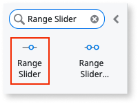

1. Drag the Pattern to the screen and on the **Properties** tab, set the following mandatory properties:

    * **MinValue**: 0

    * **MaxValue:** 100

    * **StartingValue**: 50 

    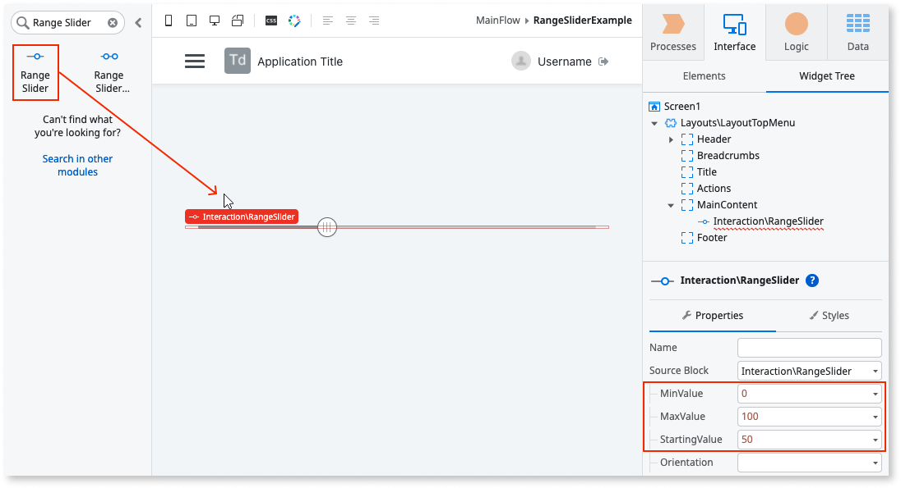

1. Staying on the **Properties** tab, in the **Events** section, select **New Client Action** for both the **Initialized** and **OnValueChange** events.

    

1. Create a new **OnSlide** client action and add the relevant logic. 

    **Note**: The client action acts as a callback for the event.

    In this example, logic that triggers an ``"Is sliding"`` feedback message is added.

    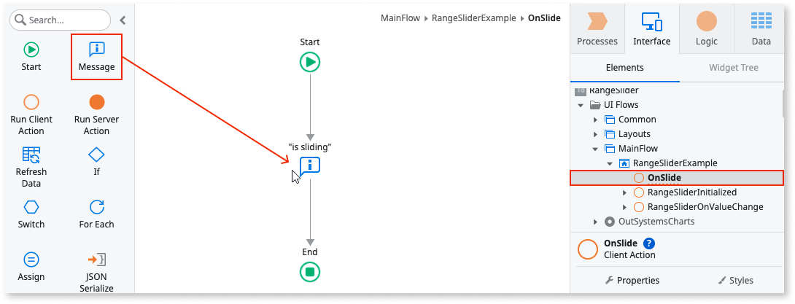

1. To set the **OnSlide** client action to an **Object** variable:

    1. Drag a JavaScript node to the **Initialized** event flow.

        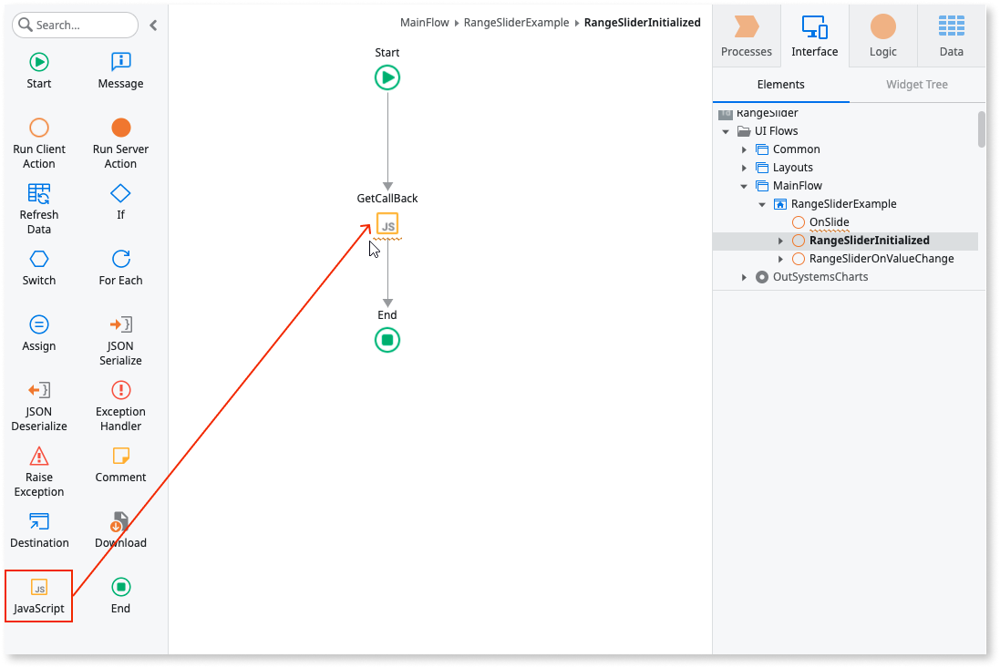

    1. Create an output parameter of type **Object** (Callback) inside the JavaScript node and assign the output parameter to the **OnSlide** client action. (The platform may automatically add brackets () to the end of the assign, for example, ``$actions.OnSlide().`` If so, remove them.)

        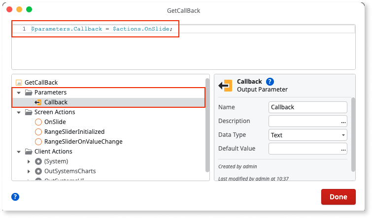

    **Note**: By default, the **SetNoUiSliderEvent** client action has a **Handler** input parameter of type **Object**. As you can’t directly pass client actions using parameters, you must change the **OnSlide** client action to an Object variable that can be passed to the **Handler** input parameter. 

1. On the **Logic** tab, go to **Client Actions** -> **OutSystemsUI**, expand the **Range Slider** folder and drag the **SetNoUiSliderEvent** client action to the action flow.

    

1. Set the following parameter values:

    * **WidgetId** to the **RangeSliderId** returned by the **Initialized** event.

    * **EventName** to the name of the event you want to add from the provider. In this example, the **Slide** event. (Note that this is case-sensitive).

    * **Handler** to the callback of type **Object** created in the JavaScript node.

        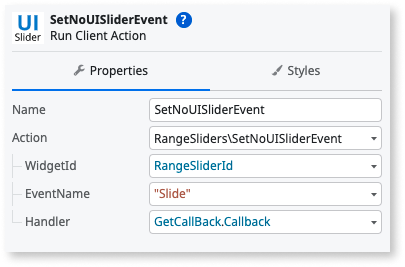

1. Click **1-Click Publish**.

    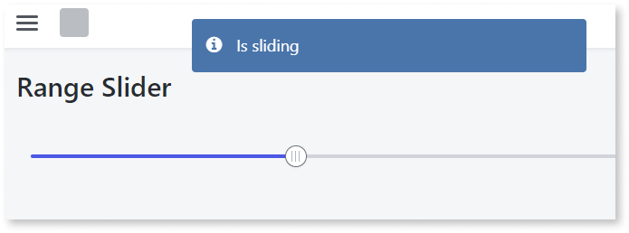

## Provider configuration

To add further configuration beyond the ones the Patterns have by default, there is  a specific client action per provider.

Not all of the extended configuration options are available through the **ProviderConfigs** parameter structure. This is due to some incompatibility of the default input parameters or client actions already available for those patterns. For full access to the provider options, see  the [Provider instance and JavaScript](ext-provider-instance-java.md) section.

The following table shows each provider based UI Pattern with its associated configuration client actions and parameters.

|UI Pattern | Client action | Parameters | Provider events|
|---|---|---|---|
|Carousel |SetSplideConfigs | <ul><li> WidgetId (string)</li><li>ProviderConfigs </li>(structure)<li>Success (boolean)</li><li>ErrorMessage (structure)</li></ul> | [Splide options](https://splidejs.com/guides/options/) |
|<ul><li>Date Picker</li><li>Date Picker Range</li></ul> |SetFlatpickrConfigs| <ul><li>WidgetId (string)</li><li>ProviderConfigs (structure)</li><li>Success (boolean)</li><li>ErrorMessage (structure)</li></ul>|[Flatpickr options](https://flatpickr.js.org/options/)|
|<ul><li>Dropdown Search</li><li>Dropdown Tags</li></ul> |SetVirtualSelectConfigs | <ul><li>WidgetId (string)</li><li>ProviderConfigs (structure)</li><li>Success (boolean)</li><li>ErrorMessage (structure)</li></ul> | [VirtualSelect options](https://sa-si-dev.github.io/virtual-select/#/properties) |
|<ul><li>Range Slider</li><li>Range Slider Interval</li></ul> |SetNoUISliderConfigs|<ul><li>WidgetId (string)</li><li>ProviderConfigs (structure)</li><li>Success (boolean)</li><li>ErrorMessage (structure)</li></ul> | [noUiSlider options](https://refreshless.com/nouislider/slider-options/) |

### How to set a provider configuration

In the following example, the Date Picker Pattern is set to appear flat on the screen by using the **SetFlatpickrConfig** client action. 

1. In Service Studio, in the Toolbox, search for the **Date Picker** Pattern.

    

1. Drag the Pattern to the screen.

    

1. On the **Properties** tab,  in the **Events** section, select **New Client Action** for the **Initialized** event.
    
    

1. On the **Logic** tab, go to **Client Actions** -> **OutSystems UI**, expand the **Date Pickers** folder, and drag the **SetFlatpickerConfigs** client action inside the **Initialized** action flow.

    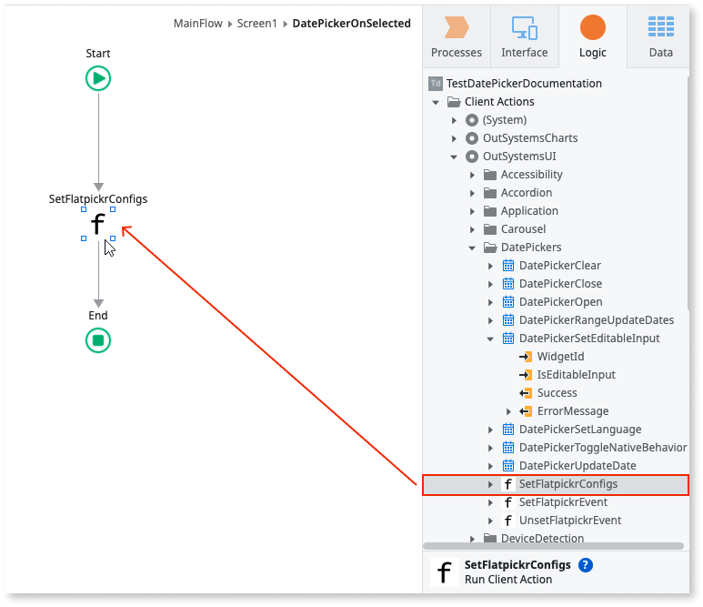

1. Set the **WidgetId** parameter to the **DatePickerWidgetId** parameter (returned by the Initialized action).

    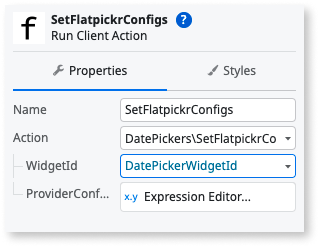

1. Expand the **ProviderConfigs** parameter and set the **Inline** option to **True**.

    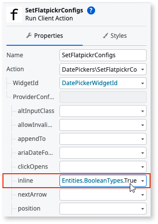

1. Click **1-Click Publish**.

    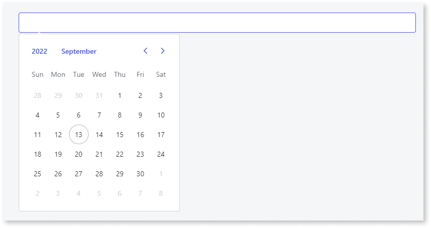

Everytime the **SetFlatpickerConfigs** client action is called, a destroy/init cycle of the provider is triggered, to update the Pattern in runtime. To mitigate a possible impact on performance, OutSystems recommend you only call this client action once.

