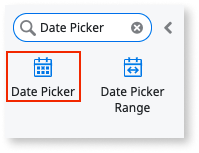
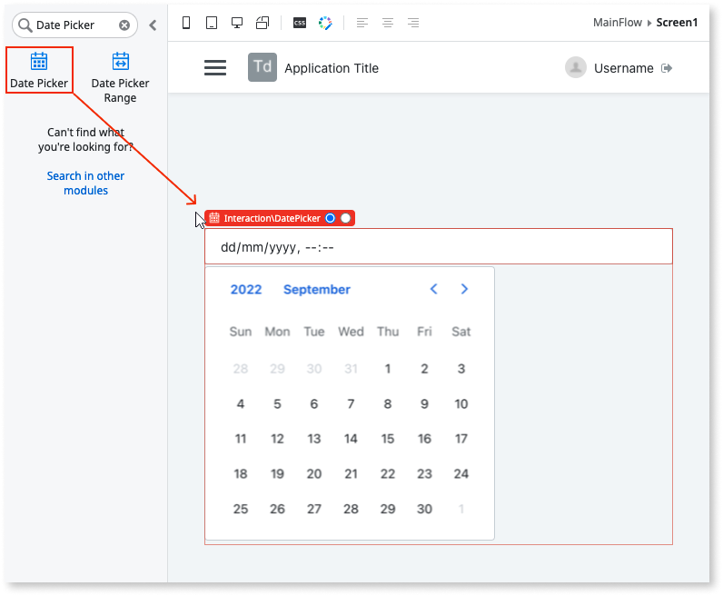
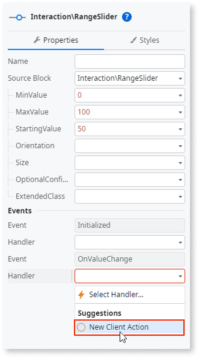
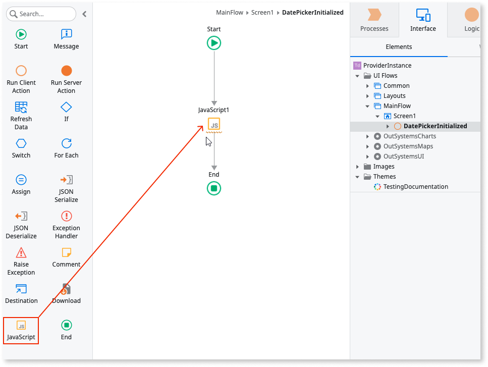
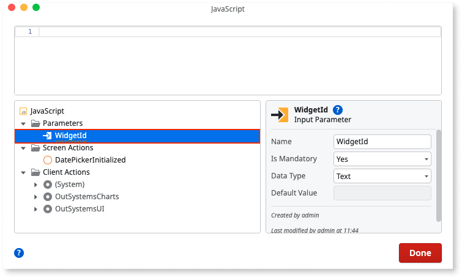
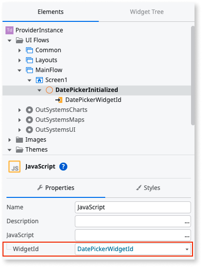
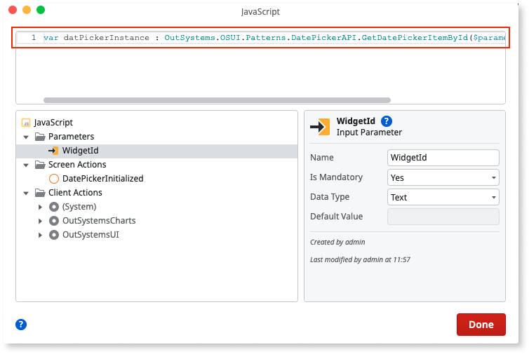

# Provider instance and JavaScript

## Initialized event

All provider dependent UI Patterns have an **Initialized** event. This can be used to retrieve the WidgetId and access the OutSystems API and  provider instance.

### How to access a provider instance through an initialized event

The following example demonstrates how to use the Date Picker Pattern to access an  instance and use the APIs available from that provider.

1. In Service Studio, in the Toolbox, search for the **Date Picker** Pattern.

    

1. Drag the Pattern to the screen.

    

1. On the **Properties** tab,  in the **Events** section, select **New Client Action** for the **Initialized** event.
    
    

1. Drag a JavaScript node to the **Initialized** event flow.

    

1. Inside the JavaScript node, create an input parameter, of type **Text** and set the **Name** to **WidgetId**.

    

1. Assign the **WidgetId** to the Id returned by the **Initialized** event.

    

1. Use the OutSystems UI API (``OutSystems.OSUI.Patterns.DatePickerAPI.GetDatePickerItemById($parameters.WidgetId).provider``) to get the provider instance.

    

1. Add your JavaScript code using the provider instance.

1. Click **1-Click Publish**.

This is a direct communication between the developer and the provider, so from this step on, OutSystems does not support any issues or features and the developer should be conscious of the code it produces.

## SetProviderConfigs Javascript API

If there’s some configuration  not represented in the ``Set[ProviderName]Configs`` client actions, or you just prefer to set the options using JavaScript, you can do so using the OutSystems API method. 

The API method receives the configuration and passes them to the provider which updates the Pattern in runtime. 

**Note:** This may result in a destroy/init cycle every time this API is called.

### How to set an extended option on the Date Picker using the OutSystems UI JavaScript API

1. Repeat the steps 1-5 from the [How to access a provider instance through an initialized event](#how-to-access-a-provider-instance-through-an-initialized-event).

1. Call the **SetProviderConfigsAPI** and pass the **WidgetId** and the ``OutSystems.OSUI.Patterns.DatePickerAPI.SetProviderConfigs($parameters.WidgetId, options = {inline: true})`` options object to the API.

1. Add your JavaScript code using the provider instance.

1. Click **1-Click Publish**.

This is a direct communication between the developer and the provider, so from this step on, OutSystems does not support any issues or features and the developer should be conscious of the code it produces.

