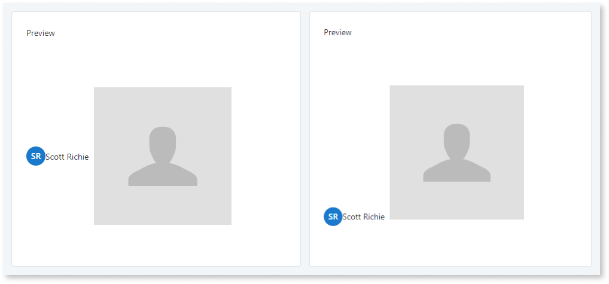
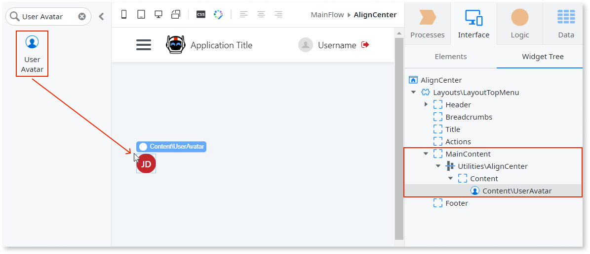
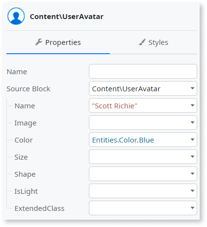
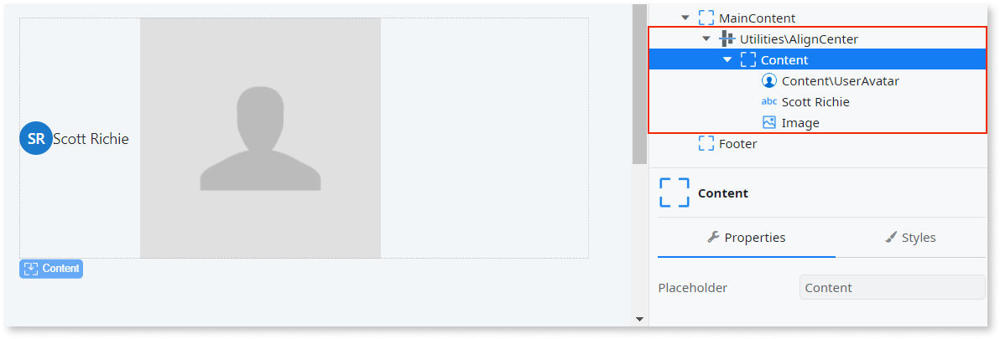
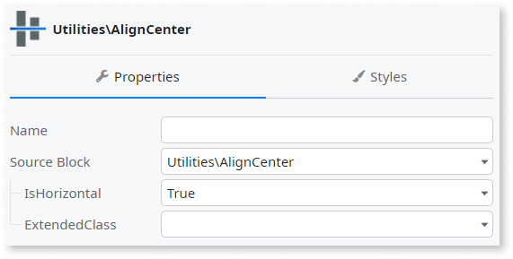
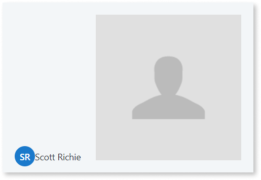
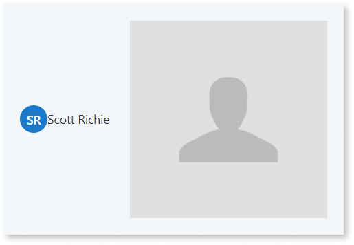

# Align Center

Applies to Mobile Apps and Reactive Web Apps only

You can use Align Center UI Pattern to center content horizontally or vertically on the screen.

**How to use the Align Center UI Pattern**

This example shows you how to center align a user's name and initials.

1. In Service Studio, in the Toolbox, search for `Align Center`.

    The Align Center widget is displayed.

    

    If the UI widget doesn't display, it's because the dependency isn't added. This happens because the Remove unused references setting is enabled. To make the widget available in your app:

    1. In the Toolbox, click **Search in other modules**.

    1. In **Search in other Modules**, remove any spaces between words in your search text.
    
    1. Select the widget you want to add from the **OutSystemsUI** module, and click **Add Dependency**. 
    
    1. In the Toolbox, search for the widget again.

1. From the Toolbox, drag the Align Center widget into the Main Content area of your application's screen.

    

    By default, the Align Center widget contains a Content placeholder.

1. From the Toolbox, drag the User Avatar pattern into Content placeholder.

    

1. On the **Properties** tab, in the **Name** property, enter a name. In this example, we enter `Scott Richie`.

    

1. Add any other relevant content to the Content placeholder. In this example we add some text (Scott Richie) and an image.

    

1. On the Align Center **Properties** tab, you can set the content's orientation (either vertical or horizontal).

    

After following these steps and publishing the module, you can test the pattern in your app.

**Without Align Center UI Pattern** 

**With Align Center UI Pattern**

## Properties

| Property | Description |
|---|---|
| IsHorizontal (Boolean): Optional | If True, content is displayed horizontally. This is the default. If False, the content is displayed vertically. |
| ExtendedClass (Text): Optional | 
Adds custom style classes to the Pattern. You define your [custom style classes](../../../look-feel/css.md) in your application using CSS.
 
Examples <ul><li>Blank - No custom styles are added (default value).</li><li>"myclass" - Adds the ``myclass`` style to the UI styles being applied.</li><li>"myclass1 myclass2" - Adds the ``myclass1`` and ``myclass2`` styles to the UI styles being applied.</li></ul>
You can also use the classes available on the OutSystems UI. For more information, see the [OutSystems UI Cheat Sheet](https://outsystemsui.outsystems.com/OutSystemsUIWebsite/CheatSheet). |
