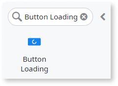
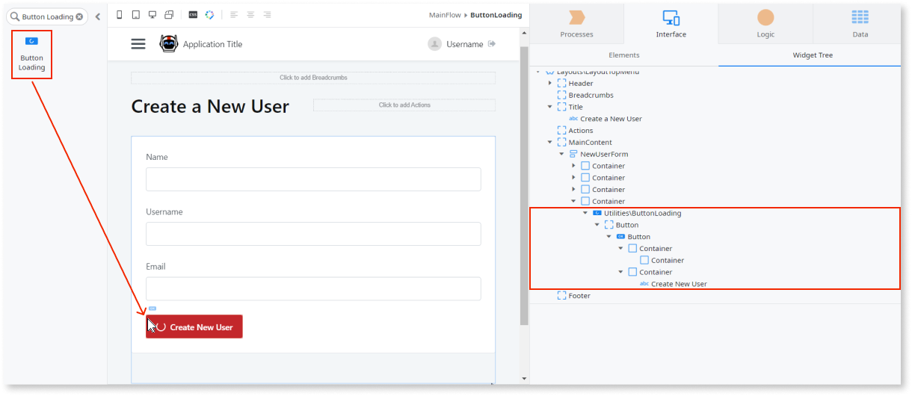
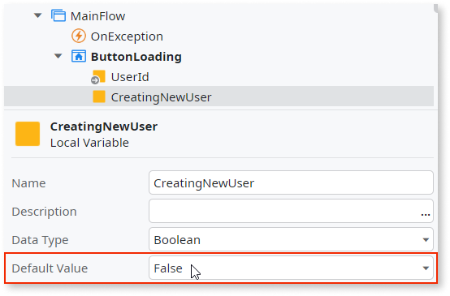
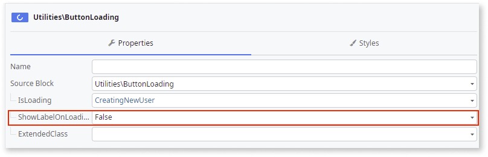
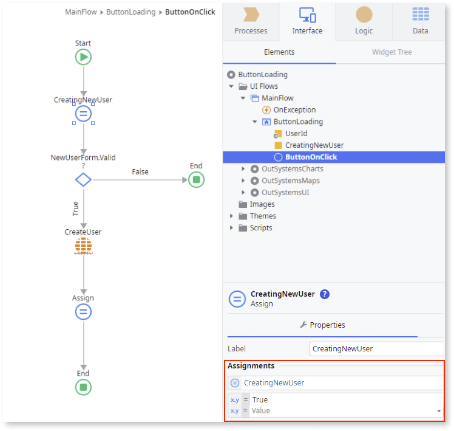
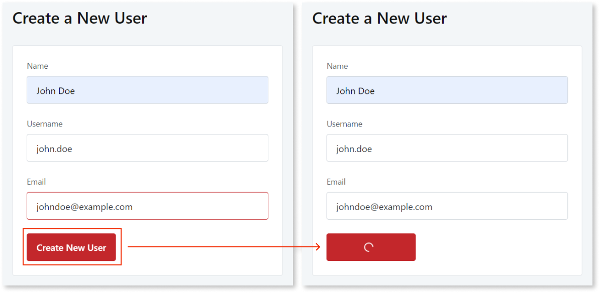

# Button Loading

Applies to Mobile Apps and Reactive Web Apps only

**This documentation is not valid for deprecated components.** To check if your component is deprecated and how to migrate old versions, see the [Patterns and Versions Overview](https://outsystemsui.outsystems.com/OutsystemsUiWebsite/MigrationOverview).

To find out what version of OutSystems UI you are using, see [OutSystems UI version](../../intro.md#outsystems-ui-version).

You can use the Button Loading UI Pattern to call actions that don't run immediately, provide a visual hint, and disable the button from being clicked until it becomes available again.

**How to use the Button Loading UI Pattern**

1. In Service Studio, in the Toolbox, search for `Button Loading`.

    The Button Loading widget is displayed.

    

    If the UI widget doesn't display, it's because the dependency isn't added. This happens because the Remove unused references setting is enabled. To make the widget available in your app:

    1. In the Toolbox, click **Search in other modules**.

    1. In **Search in other Modules**, remove any spaces between words in your search text.
    
    1. Select the widget you want to add from the **OutSystemsUI** module, and click **Add Dependency**. 
    
    1. In the Toolbox, search for the widget again.
    
1. From the Toolbox, drag the Button Loading widget into the Main Content area of your application's screen.

    In this example, we drag the widget onto a form that is already in the Main Content area.

    By default the **Button Loading** widget contains a **Button** widget. We change the text of the button to **Create New User**.

    

1. Create a new local variable (of Boolean type) to control the state of the **Button Loading** widget. In this example, we call it **CreatingNewUser** and set the default value to **False**.

    

1. In this example, we also set the **ShowLabelOnLoading** property to **False**. 

    This displays the loading spinner only (not the Button label) while the button logic is being executed.

    

1. Double-click the **Button** widget and add the necessary logic. 

    In this example, the **ButtonOnClick** action creates a new user. We also add **Assign** logic for the **Button Loading** widget. The first Assign has the **CreatingNewUser** set to **True**. (This is so the spinner shows the loading state.) The second Assign has the **CreatingNewUser** set       to **False**. (The logic is added between the two Assigns.)

    

After following these steps and publishing the module, you can test the pattern in your app.

### Result

## Properties

| Property | Description |
|---|---|
|IsLoading (Boolean): Mandatory| If True, the button shows the loading spinner. If False, the button doesn't show the loading spinner.|
|ShowLabelOnLoading (Boolean): Optional | If True, the loading spinner displays beside the label. If False, only the loading spinner is displayed. This is the default.|
|ExtendedClass (Text): Optional| Adds custom style classes to the Pattern. You define your [custom style classes](../../../look-feel/css.md) in your application using CSS.  Examples <ul><li>Blank - No custom styles are added (default value).</li><li>"myclass" - Adds the ``myclass`` style to the UI styles being applied.</li><li>"myclass1 myclass2" - Adds the ``myclass1`` and ``myclass2`` styles to the UI styles being applied.</li></ul>You can also use the classes available on the OutSystems UI. For more information, see the [OutSystems UI Cheat Sheet](https://outsystemsui.outsystems.com/OutSystemsUIWebsite/CheatSheet). |
