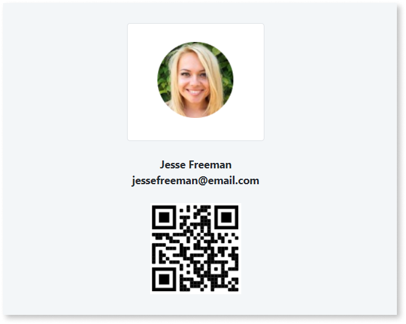
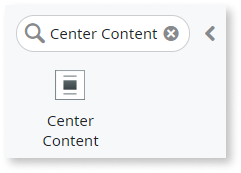
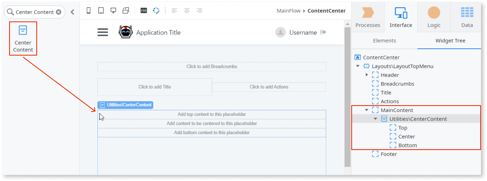
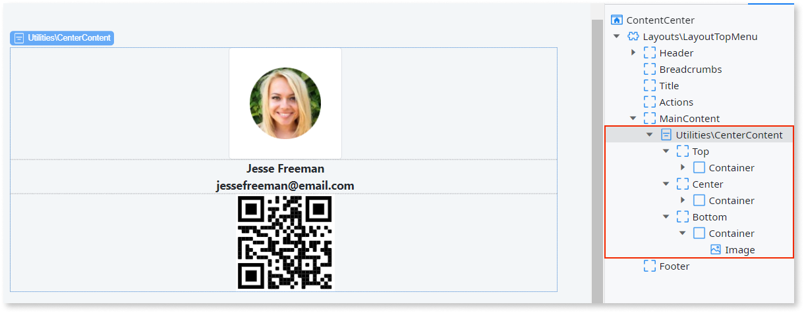

# Center Content

Applies to Mobile Apps and Reactive Web Apps only

You can use the Center Content UI Pattern to vertically align content to the center of its container.

**How to use the Center Content UI Pattern**

1. In Service Studio, in the Toolbox, search for `Center Content`.

    The Center Content widget is displayed.

    

    If the UI widget doesn't display, it's because the dependency isn't added. This happens because the Remove unused references setting is enabled. To make the widget available in your app:

    1. In the Toolbox, click **Search in other modules**.

    1. In **Search in other Modules**, remove any spaces between words in your search text.
    
    1. Select the widget you want to add from the **OutSystemsUI** module, and click **Add Dependency**. 
    
    1. In the Toolbox, search for the widget again.

1. From the Toolbox, drag the Center Content widget into the Main Content area of your application's screen.

    

    By default, the Center Content widget contains Top, Center, and Bottom placeholders.

1. Add the relevant content to each of the placeholders. In this example we add some images and text.

    

After following these steps and publishing the module, you can test the pattern in your app.

## Properties

| Property | Description |
|---|---|
| ExtendedClass (Text): Optional | 
Adds custom style classes to the Pattern. You define your [custom style classes](../../../look-feel/css.md) in your application using CSS.
 
Examples <ul><li>Blank - No custom styles are added (default value).</li><li>"myclass" - Adds the ``myclass`` style to the UI styles being applied.</li><li>"myclass1 myclass2" - Adds the ``myclass1`` and ``myclass2`` styles to the UI styles being applied.</li></ul>
You can also use the classes available on the OutSystems UI. For more information, see the [OutSystems UI Cheat Sheet](https://outsystemsui.outsystems.com/OutSystemsUIWebsite/CheatSheet). |
