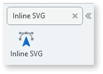
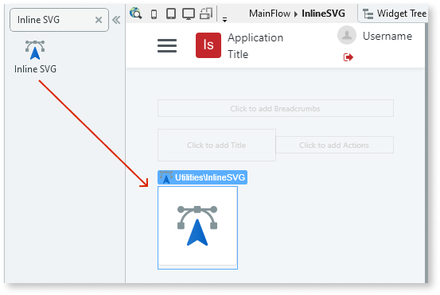
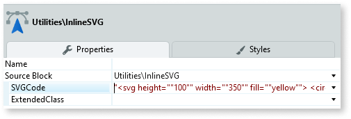
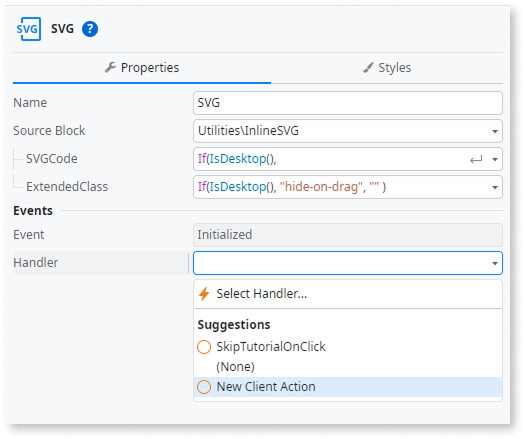
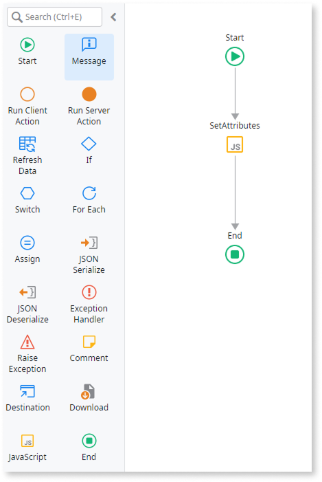
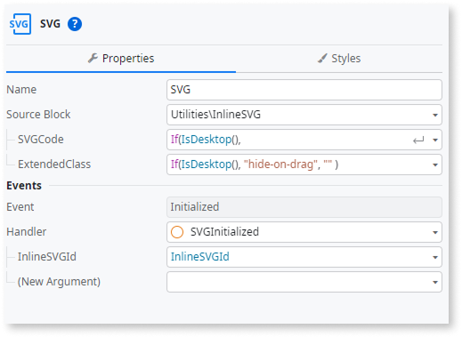
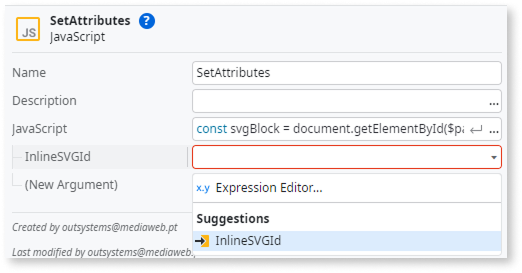

# Inline SVG

<div class="info" markdown="1">

Applies to Mobile Apps and Reactive Web Apps only

</div>

You can use the Inline SVG UI Pattern to change fill and stroke properties or animate the SVG paths.

## How to use the Inline SVG UI Pattern

1. In Service Studio, in the Toolbox, search for `Inline SVG`.

    The Inline SVG widget is displayed.

    

    If the UI widget doesn't display, it's because the dependency isn't added. This happens because the Remove unused references setting is enabled. To make the widget available in your app:

    1. In the Toolbox, click **Search in other modules**.

    1. In **Search in other Modules**, remove any spaces between words in your search text.

    1. Select the widget you want to add from the **OutSystemsUI** module, and click **Add Dependency**.

    1. In the Toolbox, search for the widget again.

1. From the Toolbox, drag the Inline SVG widget into the Main Content area of your application's screen.

    

1. On the **Properties** tab, in the **SVGCode** property, set your SVG code.

    In this example, we enter the following:

    ```html
    "<svg height=""100"" width=""350"" fill=""yellow"">
    <circle cx=""50"" cy=""50"" r=""30"" stroke=""red"" stroke-width=""25"" fill=""white"" />
    <text x=""110"" y=""60"" fill=""black"" font-size=""40"" font-weight=""bold"" font-family=""open sans"">outsystems</text>
    Sorry, your browser does not support inline SVG.  
    </svg>"
    ```

    

After following these steps and publishing the module, you can test the pattern in your app.

Using the example above, the results are as follows:


## Properties

| Property | Description |
| --- | --- |
| SVGCode (Text): Optional | SVG markup code that is appended onto the HTML. |
| ExtendedClass (Text): Optional | Adds custom style classes to the Pattern. You define your [custom style classes](../../../look-feel/css.md) in your application using CSS.<br/><br/>Examples:<br/>- Blank - No custom styles are added (default value).<br/>- "myclass" - Adds the ``myclass`` style to the UI styles being applied.<br/>- "myclass1 myclass2" - Adds the ``myclass1`` and ``myclass2`` styles to the UI styles being applied.<br/><br/>You can also use the classes available on the OutSystems UI. For more information, see the [OutSystems UI Cheat Sheet](https://outsystemsui.outsystems.com/OutSystemsUIWebsite/CheatSheet). |

## Accessibility – WCAG 2.2 AA compliance

By default, the **Inline SVG** UI Pattern might not expose the right accessibility attributes. This can cause screen readers to misinterpret or ignore the SVG content.
Use one of the following options to ensure assistive technologies announce the SVG correctly, depending on whether it conveys information or is purely decorative.

### Option 1: Add attributes for decorative SVG

Use this option when the SVG is purely visual and doesn’t convey information.

1. In **Service Studio**, go to the **Interface** tab.

1. Select the **Screen/Block** that uses the **Inline SVG**.

1. In the **Inline SVG** properties, under **Event Initialized**, select **New Client Action** to create a client action (E.g. 'OnSVGInit').

    

1. In **Initialized Action**, add a **JavaScript** node and add the following code:

    ```javascript
    const svgBlock = document.getElementById($parameters.WidgetId);
    if (!svgBlock) return;

    const svg = svgBlock.querySelector('svg');
    if (!svg) return;

    // Hide decorative SVGs from assistive technologies
    svg.setAttribute("aria-hidden", "true");
    svg.setAttribute("focusable", "false");
    ```

   

1. Publish the module.

### Option 2: Add attributes for informative SVG

Use this option when the SVG conveys meaning (for example, an icon, chart, or status indicator).

1. In **Service Studio**, go to the **Interface** tab.

1. Select the **Screen/Block** that uses the **Inline SVG**.

1. In the **Inline SVG** properties, under **Event Initialized**, select **New Client Action** to create a client action (E.g. 'OnSVGInit').

    

1. Add the following code, replacing the label text with something meaningful to your SVG content:

    ```javascript
    const svgBlock = document.getElementById($parameters.WidgetId);
    if (!svgBlock) return;

    const svg = svgBlock.querySelector('svg');
    if (!svg) return;

    // Expose as an image with an accessible name
    svg.setAttribute("role", "img");
    svg.setAttribute("aria-label", "Balance chart");
    ```

    <div class="info" markdown="1">

    When you create the client action, Service Studio automatically creates an input parameter.  
    This parameter passes the **InlineSVGId** value to the action flow.

    </div>

    

1. In the **JavaScript** node properties, set the **InlineSVGId** input parameter to the generated **InlineSVGId** value.

    

1. Publish the module.

### Option 3: Make the SVG interactive

If the SVG acts as a control (for example, a link, button, or toggle), treat it as interactive.
Give it the correct role (for example, `button`), a `tabindex="0"`, an accessible name (`aria-label`), and keyboard event handlers for **Enter** and **Space** keys.

### Result

After completing these steps, assistive technologies handle SVGs according to their purpose:

* **Decorative SVGs** are ignored by screen readers.

* **Informative SVGs** are announced with a clear accessible name.

* **Interactive SVGs** behave like standard controls, supporting focus and keyboard interaction.

Test your app to confirm that each SVG behaves as expected for users relying on assistive technologies.
