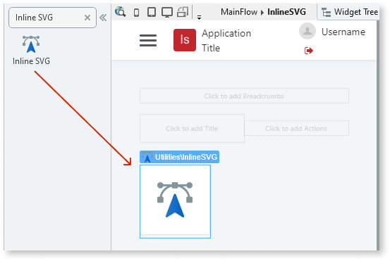
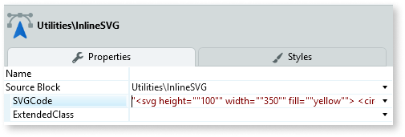
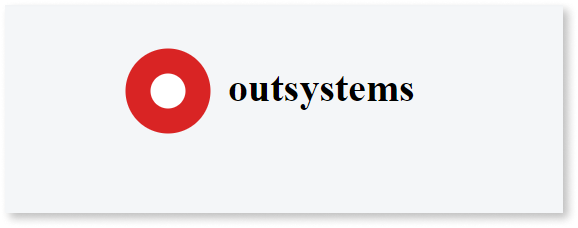

# Inline SVG

<div class="info" markdown="1">

Applies to Mobile Apps and Reactive Web Apps only

</div>

You can use the Inline SVG UI Pattern to change fill and stroke properties or animate the SVG paths.

**How to use the Inline SVG UI Pattern**

1. In Service Studio, in the Toolbox, search for `Inline SVG`.

    The Inline SVG widget is displayed.

    

    If the UI widget doesn't display, it's because the dependency isn't added. This happens because the Remove unused references setting is enabled. To make the widget available in your app:

    1. In the Toolbox, click **Search in other modules**.

    1. In **Search in other Modules**, remove any spaces between words in your search text.

    1. Select the widget you want to add from the **OutSystemsUI** module, and click **Add Dependency**.

    1. In the Toolbox, search for the widget again.

1. From the Toolbox, drag the Inline SVG widget into the Main Content area of your application's screen.

    

1. On the **Properties** tab, in the **SVGCode** property, set your SVG code.

    In this example, we enter the following:

    ```html
    "<svg height=""100"" width=""350"" fill=""yellow"">
    <circle cx=""50"" cy=""50"" r=""30"" stroke=""red"" stroke-width=""25"" fill=""white"" />
    <text x=""110"" y=""60"" fill=""black"" font-size=""40"" font-weight=""bold"" font-family=""open sans"">outsystems</text>
    Sorry, your browser does not support inline SVG.  
    </svg>"
    ```

    

After following these steps and publishing the module, you can test the pattern in your app.

Using the example above, the results are as follows:



**How to make your SVG code accessible**

The following are some guidelines to help ensure your SVG code is accessible:

1. Add **`` <title> ``** and **`` <desc> ``** tags to your code describing the SVG image. You must add the **`` <title> ``** and **`` <desc> ``** tags after the opening **`` <svg> ``** tag and before the **`` <path> ``** tag.

    ```html
    <svg>
        <title id="my-title">Descriptive title of the SVG</title>
        <desc id="my-description">More detailed description of the SVG content</desc>
         <!-- SVG content goes here -->
    </svg>
    ```

1. Add the **`` aria-describedby ``** attribute to the **`` <svg> ``** tag.

    ```html
    <svg aria-describedby="my-title my-description">
        <title id="my-title">Descriptive title of the SVG</title>
        <desc id="my-description">More detailed description of the SVG content</desc>
         <!-- SVG content goes here -->
    </svg>
    ```

1. To define the role of the SVG as an image within the accessibility context, add the **`` role=”img” ``** attribute to the **`` <svg> ``** tag.

   ```html
    <svg aria-describedby="my-title my-description" role="img">
        <title id="my-title">Descriptive title of the SVG</title>
        <desc id="my-description">More detailed description of the SVG content</desc>
         <!-- SVG content goes here -->
    </svg>
    ```

After completing these steps, set your SVG code to the SVGCode property on the InlineSVG pattern.

## Properties

| Property | Description |
|---|---|
| SVGCode (Text): Optional | SVG markup code that is appended onto the HTML. |
| ExtendedClass (Text): Optional | <p>Adds custom style classes to the Pattern. You define your [custom style classes](../../../look-feel/css.md) in your application using CSS.</p> <p>Examples <ul><li>Blank - No custom styles are added (default value).</li><li>"myclass" - Adds the ``myclass`` style to the UI styles being applied.</li><li>"myclass1 myclass2" - Adds the ``myclass1`` and ``myclass2`` styles to the UI styles being applied.</li></ul></p>You can also use the classes available on the OutSystems UI. For more information, see the [OutSystems UI Cheat Sheet](https://outsystemsui.outsystems.com/OutSystemsUIWebsite/CheatSheet). |
