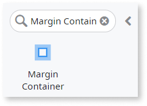
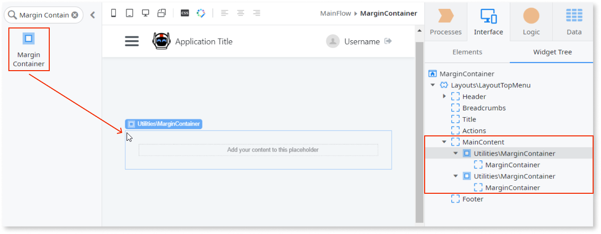
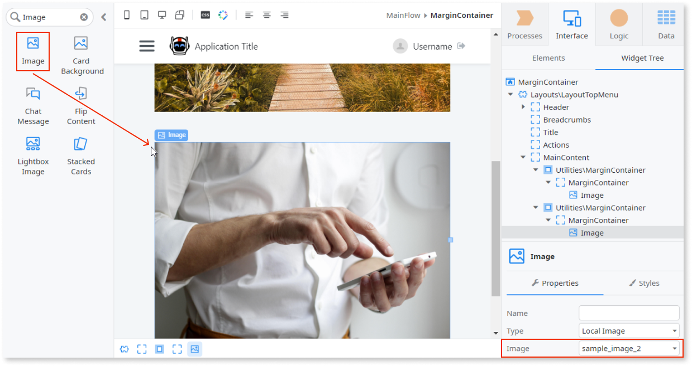

# Margin Container

Applies to Mobile Apps and Reactive Web Apps only

You can use the Margin Container UI Pattern to add symmetrical padding around a container.

**How to use the Margin Container UI Pattern**

1. In Service Studio, in the Toolbox, search for `Margin Container`.

    The Margin Container widget is displayed.

    

    If the UI widget doesn't display, it's because the dependency isn't added. This happens because the Remove unused references setting is enabled. To make the widget available in your app:

    1. In the Toolbox, click **Search in other modules**.

    1. In **Search in other Modules**, remove any spaces between words in your search text.

    1. Select the widget you want to add from the **OutSystemsUI** module, and click **Add Dependency**.

    1. In the Toolbox, search for the widget again.

1. From the Toolbox, drag the Margin Container widget into the Main Content area of your application's screen.

    

    You can add as many Margin Container widgets as you want. In this example, we add 2.

1. Add the relevant content to the Margin Container placeholder.

    In this example we add an image widget to each of the placeholders and on the **Properties** tab, import an image using the **Image** dropdown.

    

After following these steps and publishing the module, you can test the pattern in your app.

## Properties

| Property | Description |
|---|---|
| ExtendedClass (Text): Optional | 
Adds custom style classes to the Pattern. You define your [custom style classes](../../../look-feel/css.md) in your application using CSS.
 
Examples <ul><li>Blank - No custom styles are added (default value).</li><li>"myclass" - Adds the ``myclass`` style to the UI styles being applied.</li><li>"myclass1 myclass2" - Adds the ``myclass1`` and ``myclass2`` styles to the UI styles being applied.</li></ul>
You can also use the classes available on the OutSystems UI. For more information, see the [OutSystems UI Cheat Sheet](https://outsystemsui.outsystems.com/OutSystemsUIWebsite/CheatSheet). |

## Accessibility – WCAG 2.2 AA compliance

The default version of this pattern complies with WCAG 2.2 AA accessibility standards. No changes or manual work are required. If you customize the pattern, validate your implementation to confirm it still meets accessibility requirements.
