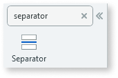
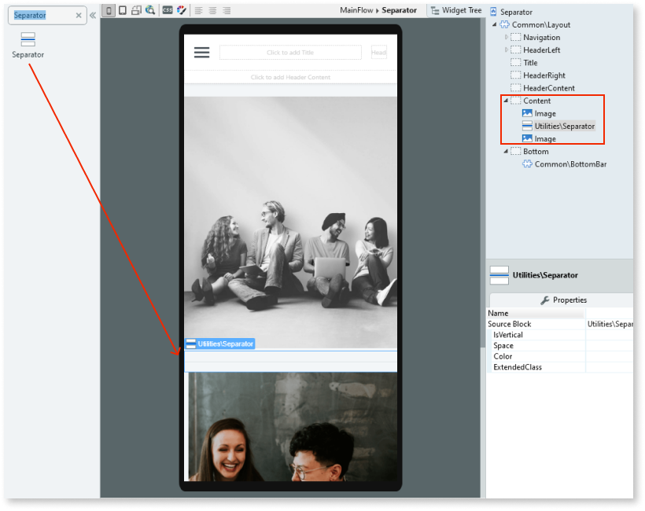

# Separator

Applies to Mobile Apps and Reactive Web Apps only

You can use the Separator UI Pattern to separate content clearly and ease visual organization.

  

**How to use the Separator UI Pattern**

1. In Service Studio, in the Toolbox, search for `Separator`.

    The Separator widget is displayed.

    

    If the UI widget doesn't display, it's because the dependency isn't added. This happens because the Remove unused references setting is enabled. To make the widget available in your app:

    1. In the Toolbox, click **Search in other modules**.

    1. In **Search in other Modules**, remove any spaces between words in your search text.
    
    1. Select the widget you want to add from the **OutSystemsUI** module, and click **Add Dependency**. 
    
    1. In the Toolbox, search for the widget again.

1. From the Toolbox, drag the Separator widget into the Main Content area of your application's screen, where you want to separate content. In this example, we drag the widget in between 2 images.

    

    By default, the pattern displays a horizontal line with the application’s primary color. 

1. On the **Properties** tab, you can customize the Separator's look and feel by setting any of the optional properties, for example, the color and the amount of space separating the content.

    

After following these steps and publishing the module, you can test the pattern in your app.

## Properties

| **Property** | **Description** |
|---|---|
| Color (Color Identifier): Optional | Set the color for the separator line. Red, orange, yellow, lime, green, blue, violet, and pink are just some of predefined colors available for the badge. 
Examples <ul><li>_Blank_ - Displays a gray (Neutral4) line (default value).</li><li>_Entities.Color.Red_ - Displays a red line.</li></ul>
 |
| Space (Space Identifier): Optional | Set the space around the separator line. The predefined vales are: 
 <ul><li>None</li><li>Extra small</li><li>Small</li><li>Base</li><li>Medium</li><li>Large</li><li>Extra large</li><li>Extra extra large</li></ul>

Examples <ul><li>_Blank_ - Displays a space of 16px (_Entities.Space.Base_) around the line separator. This is the default value.</li><li>_Entities.Space.Large_ - Displays a space of 32px around the line separator.</li></ul>
 |
| IsVertical (Boolean): Optional | If False, the separator line displays horizontally (default). If True, the separator line displays vertically. |
| ExtendedClass (Text): Optional | Adds custom style classes to the Pattern. You define your [custom style classes](../../../look-feel/css.md) in your application using CSS. 
Examples <ul><li>Blank - No custom styles are added (default value).</li><li>"myclass"- Adds the ``myclass`` style to the UI styles being applied.</li><li>"myclass1 myclass2" - Adds the ``myclass1`` and ``myclass2`` styles to the UI styles being applied.</li></ul>
You can also use the classes available on the OutSystems UI. For more information, see the [OutSystems UI Cheat Sheet](https://outsystemsui.outsystems.com/OutSystemsUIWebsite/CheatSheet). |
