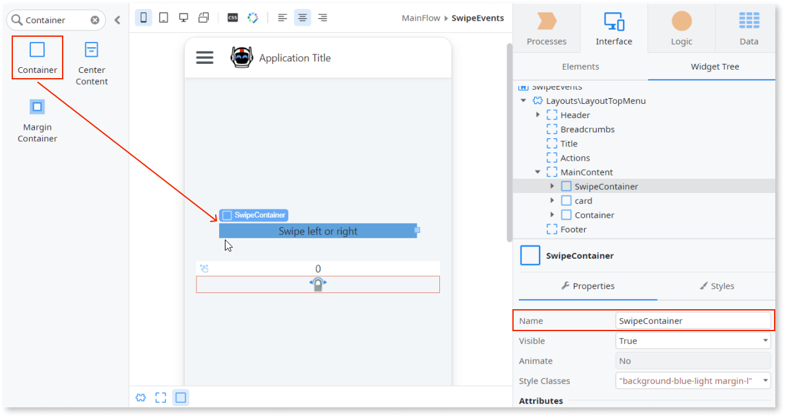

# Swipe Events

Applies to Mobile Apps and Reactive Web Apps only

You can use the Swipe Events UI Pattern to enable swiping on a specific widget.

## How to use the Swipe Events UI Pattern

The following example shows how you can use the Swipe Events UI pattern to increase (swipe right) and decrease (swipe left) a number.

1. In Service Studio, in the Toolbox, search for  `Swipe Events`.

    The Swipe Events widget is displayed.

    

    If the UI widget doesn't display, it's because the dependency isn't added. This happens because the Remove unused references setting is enabled. To make the widget available in your app:

    1. In the Toolbox, click **Search in other modules**.

    1. In **Search in other Modules**, remove any spaces between words in your search text.
    
    1. Select the widget you want to add from the **OutSystemsUI** module, and click **Add Dependency**. 
    
    1. In the Toolbox, search for the widget again.

1. From the Toolbox, drag the Swipe Events widget into the Main Content area of your application's screen.

    

1. Add a local variable by right-clicking on your screen name and selecting **Add Local Variable**.

    

1. Enter a name, a data type, and a default value for the new variable. In this example, we enter `Number`, `Integer`, and `0` repsectively.

    

1. Drag the new variable into the Main Content area of your application's screen.

    

1. From the Toolbox, drag the Container widget into the Main Content area of your application's screen and on the **Properties** tab, enter a name. In this example we enter `SwipeContainer`. We also add the text `Swipe left or right` inside the Container widget.

    

1. From the **Widget Tree**, select the Swipe Events widget, and on the **Properties** tab, from the **WidgetId** drop-down, select the Id of the container you just created. In this example, we select **SwipeContainer.Id**.

    

1. To set the action for when the user swipes left, remaining on the **Properties** tab, from the **SwipeLeft Handler** drop-down, select **New Client Action**.

    

1. Assign the relevant logic you want the swipe left action to perform. In this example, we want the number to decrease by 1 every time the user swipes left. To do this, we drag an Assign onto the client action, set the **Variable** to **Number**, and enter ``Number - 1`` for the **Value**.

    

1. Repeat steps 8 and 9 for the **SwipeRightHandler** and so that the number increases when the user swipes right, enter `Number + 1`.

After following these steps and publishing the module, you can test the pattern in your app.

## Properties

| **Property** | **Description** |
|---|---|
| WidgetId (Text): Mandatory | Element that's swipeable. |
