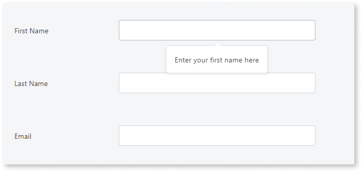
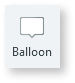
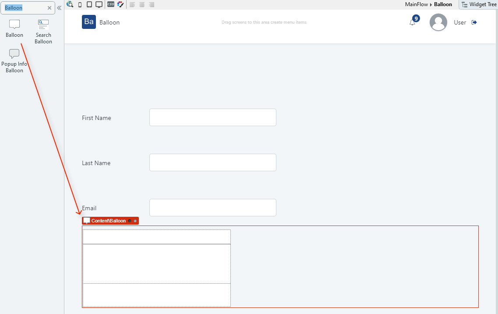
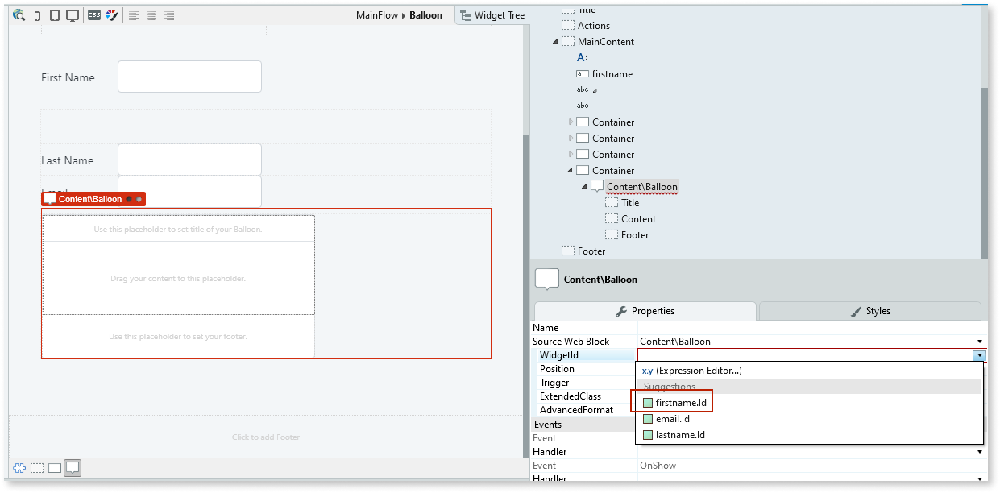
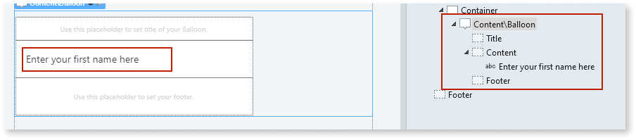
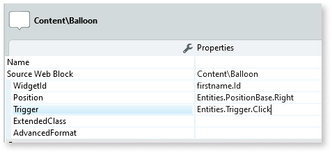

# Balloon

Applies only to Traditional Web Apps.

You can use the Balloon UI Pattern to display content in a pop-up on the UI. The Balloon UI Pattern is useful when you need to display additional information related to a small on-screen element.

**How to use the Balloon UI Pattern**

In this example, we use the Balloon as a tooltip on a screen with a form.

1. In Service Studio, in the Toolbox, search for `Balloon`.

    The Balloon widget is displayed.

    

    If the UI widget doesn't display, it's because the dependency isn't added. This happens because the Remove unused references setting is enabled. To make the widget available in your app:

    1. In the Toolbox, click **Search in other modules**.

    1. In **Search in other Modules**, remove any spaces between words in your search text.
    
    1. Select the widget you want to add from the **OutSystemsUIWeb** module, and click **Add Dependency**. 
    
    1. In the Toolbox, search for the widget again.

1. From the Toolbox, drag the Balloon widget into the Main Content area of your application's screen.

    

1. To bind the Balloon widget to the First Name input widget, on the **Properties** tab, from the **WidgetId** dropdown, select **firstname.Id**.

    

    **Note**: The **WidgetId** comes from the element **Name** you are binding the balloon with.

1. In the Content placeholder, enter the content you want to display. In this example we add text.

    

1. Repeat steps 2-4 for each of the elements that require a Balloon pop-up.

1. On the **Properties** tab, you can change the look and feel of the Balloon widget by setting the (optional) properties, for example, the position of the content on screen and what action triggers the content to display.

    

1. After following these steps and publishing the module, you can test the pattern in your app. 

## Demo

<iframe width="750" height="500" src="https://www.youtube.com/embed/FYTapAjZPj8" frameborder="0" allow="accelerometer; autoplay; encrypted-media; gyroscope; picture-in-picture" allowfullscreen="allowfullscreen"></iframe>

## Properties

| **Property**| **Description**|
|---|---|
| WidgetId (Text): Mandatory| Id that triggers the element so it is visible.|
| Position (PositionBase Identifier): Optional | Sets the position of where the Balloon content is displayed in relation to the widget. The predefined options are:  <ul><li>Bottom</li><li>Left</li><li>Right</li><li>Top</li></ul> Examples  <ul><li>_Entities.PositionBase.Bottom_ - The content displays below the element. This is the default value.</li><li>_Entities.PositionBase.Right_ - The content displays to the right of the element.</li></ul>|
| Trigger (Trigger Identifier): Optional| Sets the action that triggers the content to display. The predefined options are:  <ul><li>Click</li><li>Hover</li><li>Manual</li></ul> Examples  <ul><li>_Entities.Trigger.Click_ - Content displays when the user clicks the element.</li><li>_Entities.Trigger.Manual_ - Requires that the tooltip is triggered programmatically. </li><li>_Entities.Trigger.Hover_ - Content displays when the user hovers over the element. </li></ul>|
| ExtendedClass (Text): Optional| Adds custom style classes to the Pattern. You define your [custom style classes](../../../../look-feel/css.md) in your application using CSS.  Examples  <ul><li>Blank - No custom styles are added (default value).</li><li>"myclass" - Adds the ``myclass`` style to the UI styles being applied.</li><li>"myclass1 myclass2" - Adds the ``myclass1`` and ``myclass2`` styles to the UI styles being applied. </li></ul>You can also use the classes available on the OutSystems UI. For more information, see the [OutSystems UI Cheat Sheet](https://outsystemsui.outsystems.com/OutSystemsUIWebsite/CheatSheet). |
| AdvancedFormat (Text): Optional| Enables you to use more options than what is provided in the input parameters.   Example: `{ arrow: false,   showOnInit: true }`  For more information visit: <https://atomiks.github.io/tippyjs/>|
