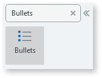
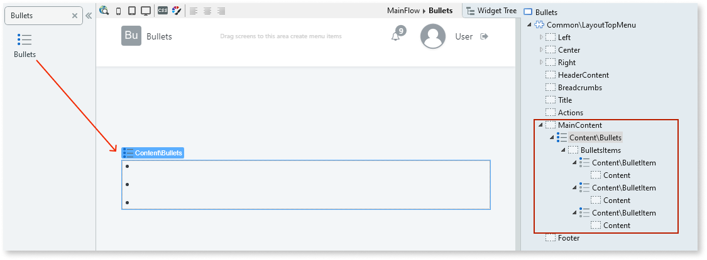
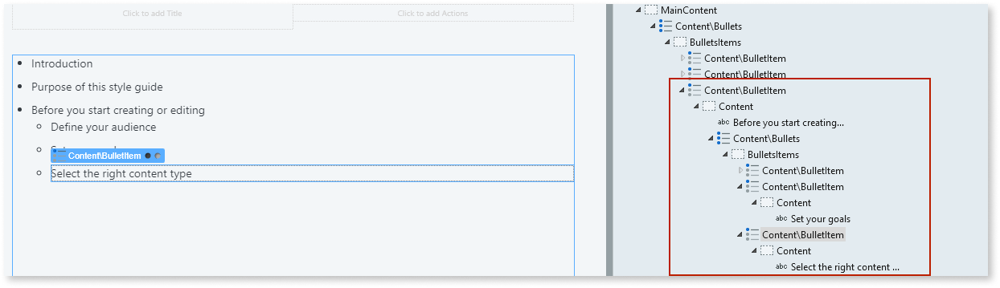

# Bullets

Applies only to Traditional Web Apps.

You can use the Bullets UI Pattern to organize topics into separate bullet points.

**How to use the Bullets UI Pattern**

1. In Service Studio, in the Toolbox, search for `Bullets`.

    The Bullets widget is displayed.

    

    If the UI widget doesn't display, it's because the dependency isn't added. This happens because the Remove unused references setting is enabled. To make the widget available in your app:

    1. In the Toolbox, click **Search in other modules**.

    1. In **Search in other Modules**, remove any spaces between words in your search text.
    
    1. Select the widget you want to add from the **OutSystemsUIWeb** module, and click **Add Dependency**.
    
    1. In the Toolbox, search for the widget again.

1. From the Toolbox, drag the Bullets widget into the Main Content area of your application's screen.

    

    By default, the Bullets widget contains 3 Bullet Items. You can add or delete Bullet Items as required. To create sub-bullets, you can drag the Bullets widget into the Bullet Item placeholder.

1. Add your content to the placeholders. In this example we add text to each of the placeholders.

    **Note**: If you leave any placeholder blank, it will not be displayed when the page is rendered.

    

After following these steps and publishing the module, you can test the pattern in your app.

## Properties

| **Property** | **Description** |
|---|---|
| ExtendedClass (Text): Optional | Adds custom style classes to the Pattern. You define your [custom style classes](../../../look-feel/css.md) in your application using CSS.
Examples
<ul><li>Blank - No custom styles are added (default value).</li><li>"myclass" Adds the ``myclass`` style to the UI styles being applied.</li><li>"myclass1 myclass2" - Adds the ``myclass1`` and ``myclass2`` styles to the UI styles being applied. </li></ul>You can also use the classes available on the OutSystems UI. For more information, see the [OutSystems UI Cheat Sheet](https://outsystemsui.outsystems.com/OutSystemsUIWebsite/CheatSheet). |
