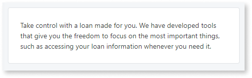
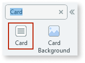
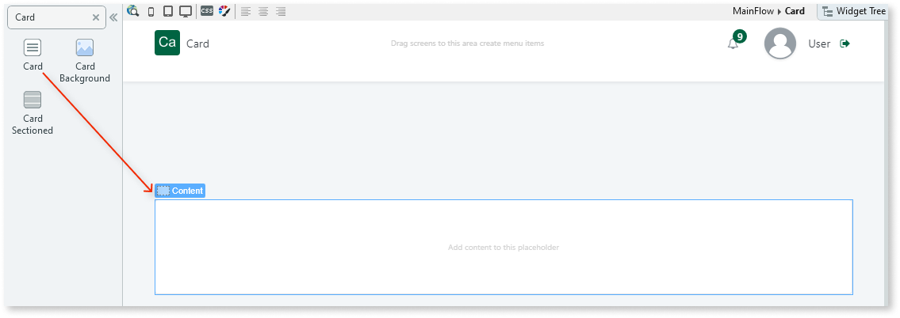
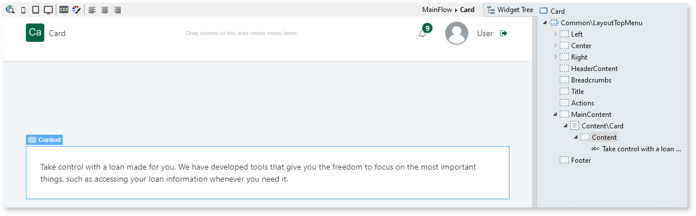

# Card

Applies only to Traditional Web Apps.

You can use the Cards UI Pattern to group small pieces of information and highlight them on the screen. The information is grouped into a small block that is easily noticeable on-screen.

**How to use the Card UI Pattern**

1. In Service Studio, in the Toolbox, search for `Card`.

    The Card widget is displayed.

    

    If the UI widget doesn't display, it's because the dependency isn't added. This happens because the Remove unused references setting is enabled. To make the widget available in your app:

    1. In the Toolbox, click **Search in other modules**.

    1. In **Search in other Modules**, remove any spaces between words in your search text.
    
    1. Select the widget you want to add from the **OutSystemsUIWeb** module, and click **Add Dependency**.
    
    1. In the Toolbox, search for the widget again.

1. From the Toolbox, drag the Card widget into the Main Content area of your application's screen.

    

1. Add your content to the placeholder. In this example we add some text.

    

After following these steps and publishing the module, you can test the pattern in your app.

## Properties

| **Property** | **Description** |
|---|---|
| ExtendedClass (Text): Optional | Adds custom style classes to the Pattern. You define your [custom style classes](../../../look-feel/css.md) in your application using CSS.
Examples
<ul><li>Blank - No custom styles are added (default value).</li><li>"myclass" - Adds the ``myclass`` style to the UI styles being applied.</li><li>"myclass1 myclass2" - Adds the ``myclass1`` and ``myclass2`` styles to the UI styles being applied. </li></ul>You can also use the classes available on the OutSystems UI. For more information, see the [OutSystems UI Cheat Sheet](https://outsystemsui.outsystems.com/OutSystemsUIWebsite/CheatSheet). |
