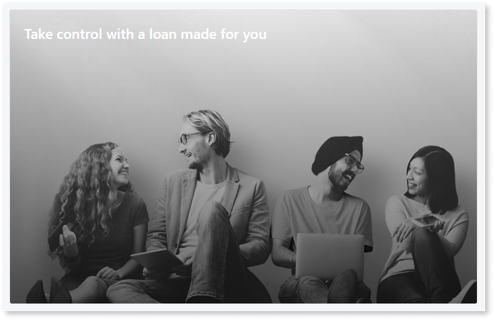
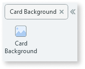
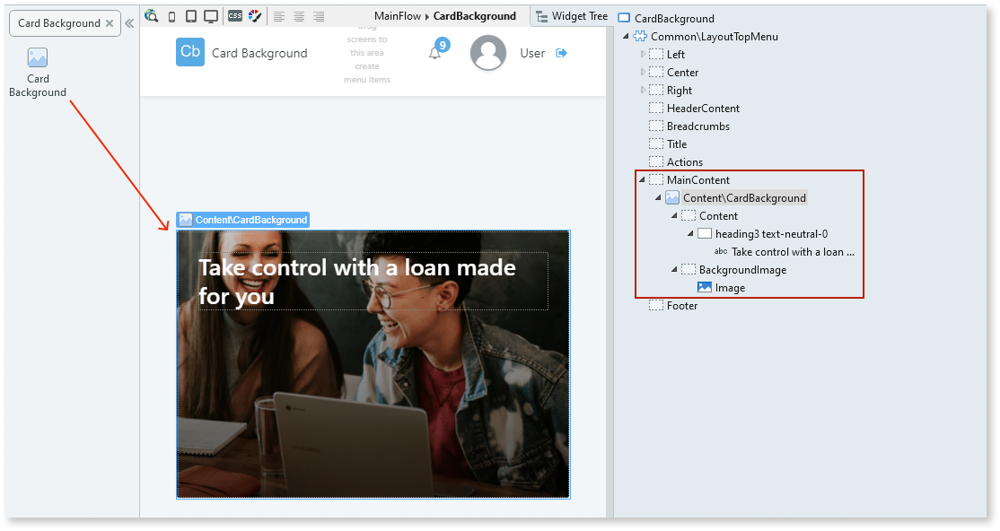
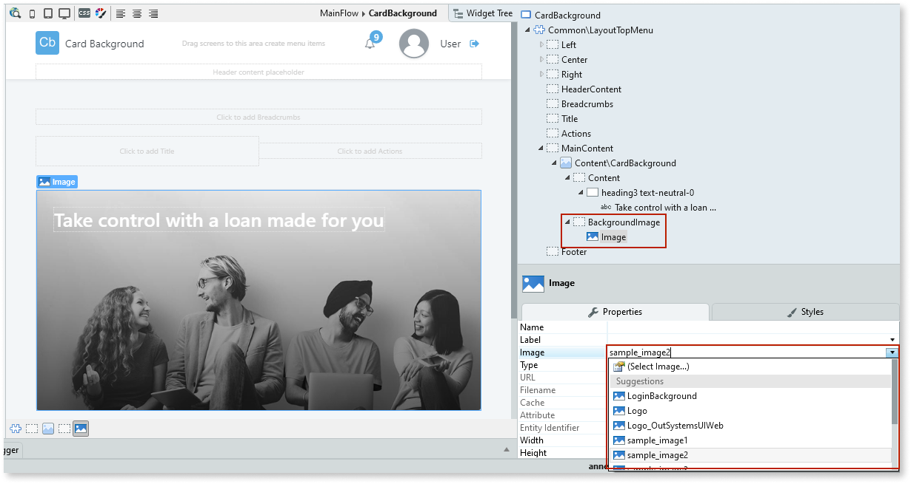
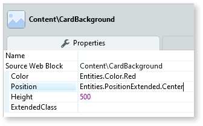

# Card Background

Applies only to Traditional Web Apps.

You can use the Card Background UI Pattern to group small pieces of information and highlight them on the screen using a background image. The information is grouped into a small block that is easily noticeable on-screen. 

**How to use the Card Background UI Pattern**

1. In Service Studio, in the Toolbox, search for `Card Background`.

    The Card Background widget is displayed.

    

    If the UI widget doesn't display, it's because the dependency isn't added. This happens because the Remove unused references setting is enabled. To make the widget available in your app:

    1. In the Toolbox, click **Search in other modules**.

    1. In **Search in other Modules**, remove any spaces between words in your search text.
    
    1. Select the widget you want to add from the **OutSystemsUIWeb** module, and click **Add Dependency**. 
    
    1. In the Toolbox, search for the widget again.

1. From the Toolbox, drag the Card Background widget into the Main Content area of your application's screen.

    

    By default, the Card Background widget contains a Content placeholder with some text and a Background Image placeholder with an image.

1. Add your content to the placeholder. In this example we change the image. To do this, from the Widget Tree, select the Image, and on the **Properties** tab, from the **Image** drop-down, select the image you want to display.

    

1. On the **Properties** tab, you can change the look and feel of the Card Background widget, by setting the (optional) properties, for example, the background color that overlays the image, the content's position and a minimum height for the card.

    

After following these steps and publishing the module, you can test the pattern in your app.

## Properties

| **Property** | **Description** |
|---|---|
| Color (Color Identifier): Optional | Set the background color. Red, orange, yellow, lime, green, blue, violet, and pink are just some of predefined colors available for the badge. 
Examples <ul><li>Blank - No background color is applied. This is the default (Entities.Color.Transparent).</li><li>Entities.Color.Red - Applies a red background color to the card.</li></ul>
 |
| Position (PositionExtended Identifier): Optional | Sets the widget position. 
Examples
<ul><li>Entities.PositionExtended.BottomRight - The widget displays on the bottom right of the screen. </li><li>Entities.PositionExtended.Center - The widget displays in the center of the screen. </li></ul> |
| Height (Integer): Optional | Set the height of the Card (in pixels). By default, the content is vertically aligned. 
Examples
<ul><li>Blank - The Card height is 300 pixels. </li><li>500 - The Card height is 500 pixels. </li></ul> |
| ExtendedClass (Text): Optional | Adds custom style classes to the Pattern. You define your [custom style classes](../../../look-feel/css.md) in your application using CSS.
Examples
<ul><li>Blank - No custom styles are added (default value).</li><li>"myclass" - Adds the ``myclass`` style to the UI styles being applied.</li><li>"myclass1 myclass2" - Adds the ``myclass1`` and ``myclass2`` styles to the UI styles being applied. </li></ul>You can also use the classes available on the OutSystems UI. For more information, see the [OutSystems UI Cheat Sheet](https://outsystemsui.outsystems.com/OutSystemsUIWebsite/CheatSheet). |
