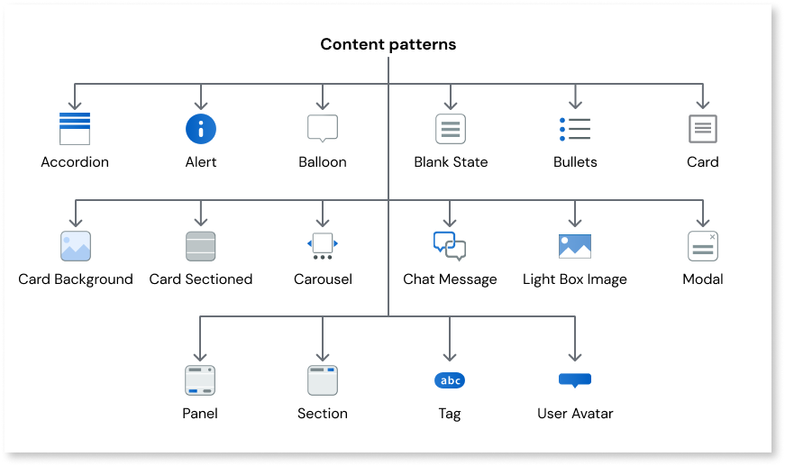

# Content

Content patterns allow you to highlight and display important information to users in different ways, such as warnings, errors, and tooltips. Content patterns also allow you to organize information into sections and lists, making the on-screen content more easily readable for users.

The available content patterns include the following:

* [Accordion](../content/accordion/accordion.md)
* [Alert](../content/alert/alert.md)
* [Balloon](../content/balloon/balloon.md)
* [Blank Slate](blankslate.md)
* [Bullets](bullets.md)
* [Card](card.md)
* [Card Background](cardbackground.md)
* [Card Sectioned](cardsectioned.md)
* [Carousel](carousel.md)
* [Light Box Image](lightboximage.md)
* [Modal](modal.md)
* [Panel](panel.md)
* [Section](section.md)
* [Tag](tag.md)
* [Tooltip](tooltip.md)
