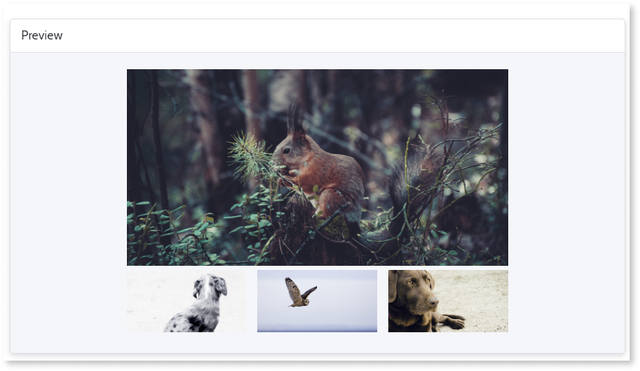
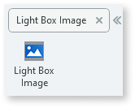
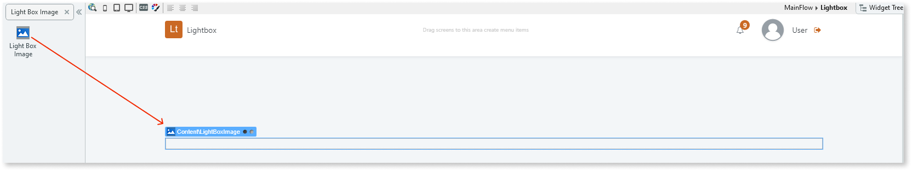
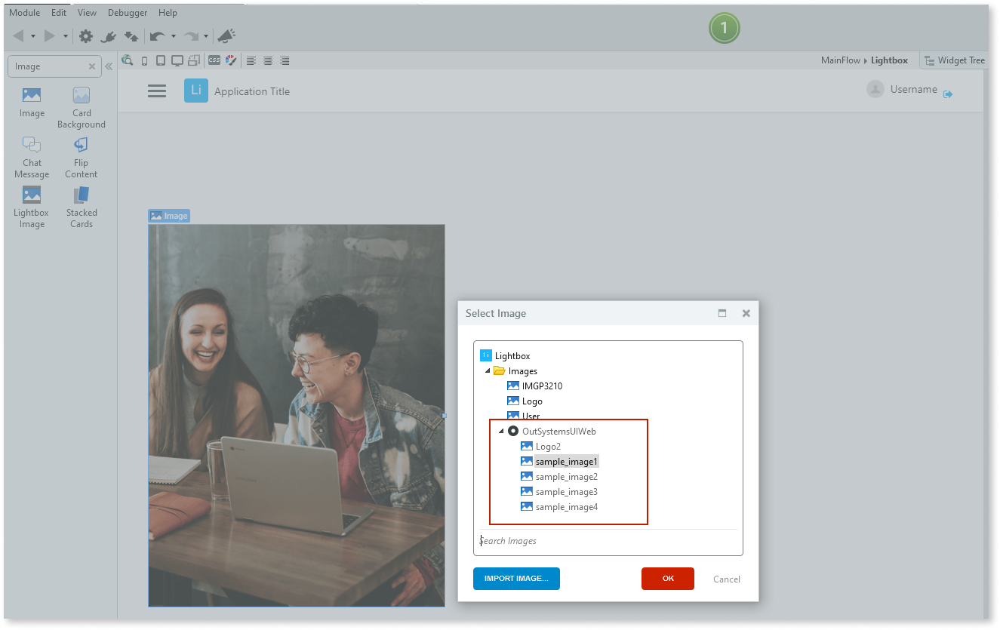
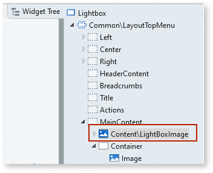

# Light Box Image

Applies only to Traditional Web Apps.

You can use the Light Box Image UI Pattern to open smaller thumbnail images in full screen mode. This UI pattern is often used when creating an image gallery, allowing you to navigate through each of the images and view them in more detail.  

**How to use the Light Box Image UI Pattern**

1. In Service Studio, in the Toolbox, search for `Light Box Image`.

    The Light Box Image widget is displayed.

    

    If the UI widget doesn't display, it's because the dependency isn't added. This happens because the Remove unused references setting is enabled. To make the widget available in your app:

    1. In the Toolbox, click **Search in other modules**.

    1. In **Search in other Modules**, remove any spaces between words in your search text.

    1. Select the widget you want to add from the **OutSystemsUIWeb** module, and click **Add Dependency**.

    1. In the Toolbox, search for the widget again.

1. From the Toolbox, drag the Light Box Image widget into the Main Content area of your application's screen.

    

1. From the Toolbox, drag the [Image widget](<../../../../../ref/lang/auto/class-image-widget.md>) into the Light Box Image widget. This is a thumbnail image.

    The **Select Image** pop-up is displayed.

1. Select or import the image you want to display. In this example, we use the sample OutSystems UI images.

    

    Note: In this example, the image property Type is set to **Static**. You can also choose [External URL or Database](../../../../../building-apps/ui/image/display-image.md).

1. From the Widget tree, select the Light Box Image widget.

    

1. On the **Properties** tab, set the relevant Light Box Image properties, for example, the title of the image that is displayed, the group the image belongs to, and the size that the image will display in full screen mode.

     

1. Repeat steps 2-6 for each of the images you want in your Light Box Pattern.

After following these steps and publishing the module, you can test the pattern in your app.

## Properties

| Property | Description |
|---|---|
| Title (Text): Optional | Image title that is displayed when previewing the image in full screen mode. 
Examples<ul><li>"Image 1" - Displays **Image 1** as the image title. </li></ul>
 |
| Group (Text): Optional | Name of the group of images. Similar to the concept of a picture album. You can navigate through pictures with the same group name when viewing them in full screen mode.
Examples<ul><li>Gallery 1 - Adds this image to the Gallery 1 group</li></ul>
 |
| ImageURL (Text): Optional | URL for the image you want to show in full screen mode. If empty, a zoomed version of the thumbnail is displayed. Use this if you want to load a lower quality image as a thumbnail and display a higher quality version in full screen mode. |
| ImageZoom (Decimal): Optional | Defines the size of the image that opens in full screen mode (based on the thumbnail size).
To avoid rendering problems, try to use images with the same ratio.
Examples
<ul><li>2 - A thumbnail with 100x100, and zoom 2 opens with 200x200.</li><li> 0.5 - A thumbnail with 500x500, and zoom 0.5 opens with 250x250.</li></ul>
 |
| ExtendedClass (Text): Optional | Adds custom style classes to the Pattern. You define your [custom style classes](../../../look-feel/css.md) in your application using CSS. 
Examples <ul><li>Blank - No custom styles are added (default value).</li><li>"myclass" - Adds the ``myclass`` style to the UI styles being applied.</li><li>"myclass1 myclass2" - Adds the ``myclass1`` and ``myclass2`` styles to the UI styles being applied.</li></ul>
You can also use the classes available on the OutSystems UI. For more information, see the [OutSystems UI Cheat Sheet](https://outsystemsui.outsystems.com/OutSystemsUIWebsite/CheatSheet). |

To disable the URL feature, use the class ``disable-url`` on the ExtendedClass parameter.

