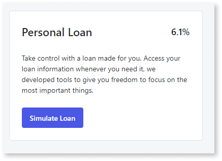
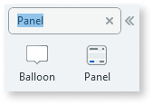
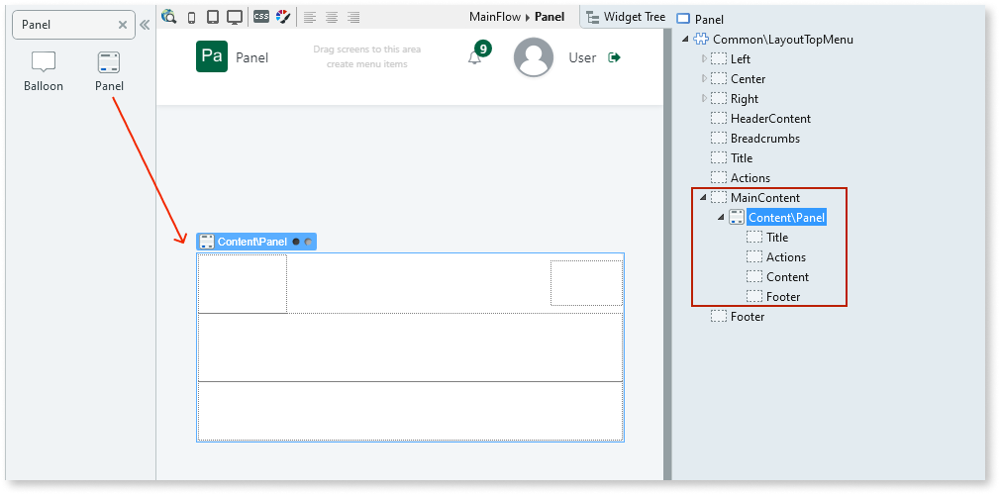
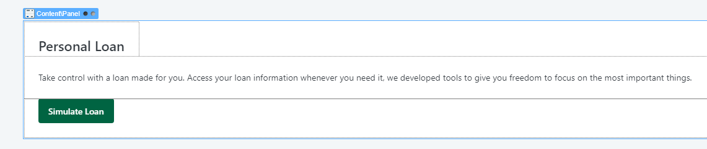
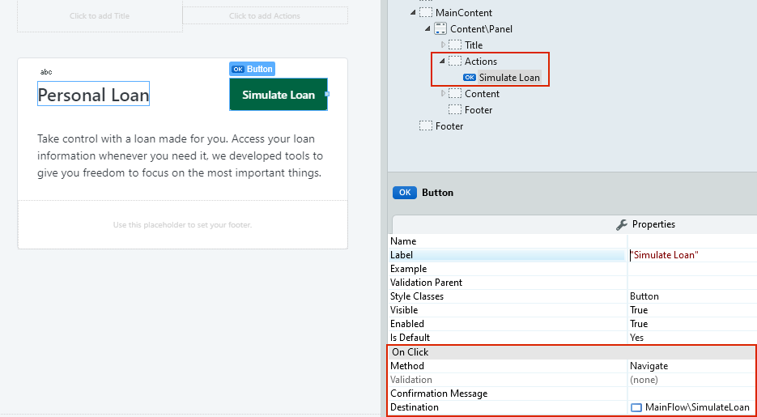

# Panel

Applies only to Traditional Web Apps.

You can use the Panel UI Pattern to group information in a small block, organized in different sections for title, actions, content, and a small footer that is easily noticeable.

Use a panel to group short pieces of information and highlight them on the screen with a specific structure.

**How to use the Panel UI Pattern**

1. In Service Studio, in the Toolbox, search for `Panel`.
  
    The Panel widget is displayed.

    

    If the UI widget doesn't display, it's because the dependency isn't added. This happens because the Remove unused references setting is enabled. To make the widget available in your app:

    1. In the Toolbox, click **Search in other modules**.

    1. In **Search in other Modules**, remove any spaces between words in your search text.

    1. Select the widget you want to add from the **OutSystemsUIWeb** module, and click **Add Dependency**.

    1. In the Toolbox, search for the widget again.

1. To From the Toolbox, drag the Panel widget into the Main Content area of your application's screen.

    

    By default, the Panel widget contains Title, Actions, Content, and Footer placeholders.

1. Add your content to the placeholders. In this example, we add a title to the Title placeholder, text to the Content placeholder, and a button to the Actions placeholder.

    

1. Add the desired action to the content you have added to the Actions placeholder. In this example, the button we added redirects the user to a new page.

    

After following these steps and publishing the module, you can test the pattern in your app.

## Properties

| **Properties** | **Description** |
|---|---|
| ExtendedClass (Text): Optional | Adds custom style classes to the Pattern. You define your [custom style classes](../../../look-feel/css.md) in your application using CSS. 
Examples <ul><li>Blank - No custom styles are added (default value).</li><li>"myclass" - Adds the ``myclass`` style to the UI styles being applied.</li><li>"myclass1 myclass2" - Adds the ``myclass1`` and ``myclass2`` styles to the UI styles being applied.</li></ul>
You can also use the classes available on the OutSystems UI. For more information, see the [OutSystems UI Cheat Sheet](https://outsystemsui.outsystems.com/OutSystemsUIWebsite/CheatSheet). |
