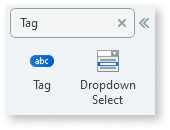
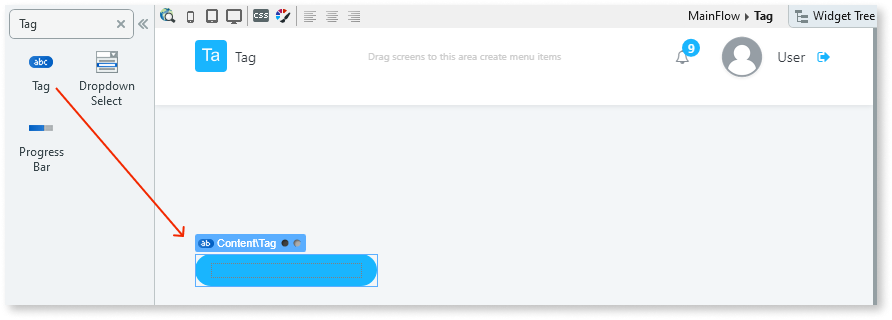
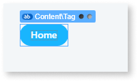
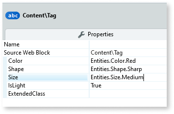

# Tag

Applies only to Traditional Web Apps.

You can use the Tag UI Pattern to style small texts in a colored tag format. Use the Tags UI Pattern to display statuses, labels, or categories thus providing great user experience.

**How to use the Tag UI Pattern**

1. In Service Studio, in the Toolbox, search for `Tag`.
  
    The Tag widget is displayed.

    

    If the UI widget doesn't display, it's because the dependency isn't added. This happens because the Remove unused references setting is enabled. To make the widget available in your app:

    1. In the Toolbox, click **Search in other modules**.

    1. In **Search in other Modules**, remove any spaces between words in your search text.

    1. Select the widget you want to add from the **OutSystemsUIWeb** module, and click **Add Dependency**.

    1. In the Toolbox, search for the widget again.

1. To From the Toolbox, drag the Tag widget into the Main Content area of your application's screen.

    

1. Add your content to the placeholders. In this example, we add some text.

    

1. On the properties tab, you can change the Tag's look and feel by setting the (optional) properties, for example, size and color.

    

After following these steps and publishing the module, you can test the pattern in your app.

## Properties

| **Property** | **Description** |
|---|---|
| Color (Color Identifier): Optional | Set the Tag's background color. Red, orange, yellow, lime, green, blue, violet, and pink are just some of predefined colors available. 
Examples <ul><li>Blank - Displays the badge in the color you chose when creating the app (default value).</li><li>Entities.Color.Red - The Tag's background is red.</li></ul>
 |
| Shape (Shape Identifier): Optional | Set the Tag's shape. Rounded, soft rounded, and sharp are the predefined shapes available. 
Examples <ul><li>Blank - Displays a rounded shaped Tag (default value).</li><li>Entities.Shape.Sharp - Displays a square shaped Tag.</li></ul>
 |
| Size (Size Identifier): Optional | Set the Tag's size. Small and medium are the predefined sizes available. 
Examples <ul><li>Entities.Size.Medium - Displays a medium-sized badge.</li><li>Entities.Size.Small - Displays a small sized Tag.</li></ul>
 |
| IsLight (Boolean): Optional | Specify the Tag's background color. 
Examples <ul><li>_Blank_ - A darker hue of the color is applied to the Tag and a lighter color to the text (default value).</li><li>True - A brighter hue of the color is applied to the Tag and a darker color to the text.</li><li>False - A darker hue of the color is applied to the Tag and a lighter color to the text.</li></ul>
 |
| ExtendedClass (Text): Optional | Adds custom style classes to the Pattern. You define your [custom style classes](../../../look-feel/css.md) in your application using CSS. 
Examples <ul><li>Blank - No custom styles are added (default value).</li><li>"myclass" - Adds the ``myclass`` style to the UI styles being applied.</li><li>"myclass1 myclass2" - Adds the ``myclass1`` and ``myclass2`` styles to the UI styles being applied.</li></ul>
You can also use the classes available on the OutSystems UI. For more information, see the [OutSystems UI Cheat Sheet](https://outsystemsui.outsystems.com/OutSystemsUIWebsite/CheatSheet). |
