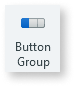
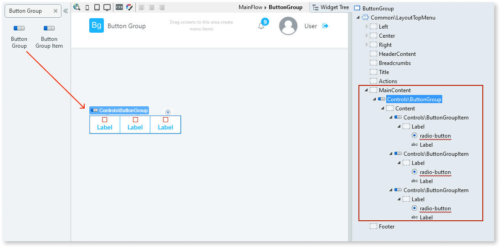
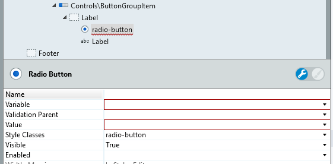

# Button Group

Applies only to Traditional Web Apps.

You can use the Button Group UI Pattern to display radio button choices to the user. This pattern is ideal when you have between two to four options. To show a larger number of options, consider using a the Dropdown UI Pattern.

**How to use the Button Group UI Pattern**

1. In Service Studio, in the Toolbox, search for `Button Group`.

    The Button Group widget is displayed.

    

    If the UI widget doesn't display, it's because the dependency isn't added. This happens because the Remove unused references setting is enabled. To make the widget available in your app:

    1. In the Toolbox, click **Search in other modules**.

    1. In **Search in other Modules**, remove any spaces between words in your search text.

    1. Select the widget you want to add from the **OutSystemsUIWeb** module, and click **Add Dependency**.

    1. In the Toolbox, search for the widget again.

1. From the Toolbox, drag the Button Group widget into the Main Content area of your application's screen.

     

    By default, the pattern contains 3 Button Group Items. You can add or delete as many Button Group Items as required.

1. From the Widget Tree, select the **radio-button** element, and on the **Properties** tab, set the **Variable** and **Value** properties.

    

1. Repeat step 3 for each of the **radio-button** elements.

1. Change the **Label** text for each of the Button Group Items.

See [Variables](../../../../../ref/data/handling-data/variables/intro.md) for more infomation on variables.

## Properties

| **Property** | **Description** |
|---|---|
| IsJustified (Boolean): Optional | If True, the Button Group items are evenly distributed in the space available. If False, the Button Group items are left aligned. This is the default. |
