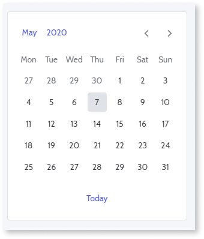
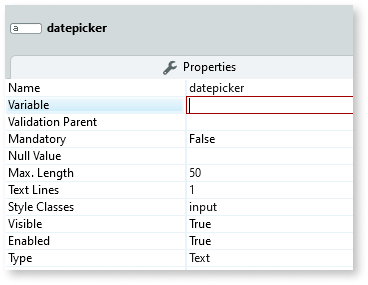
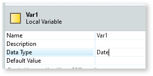
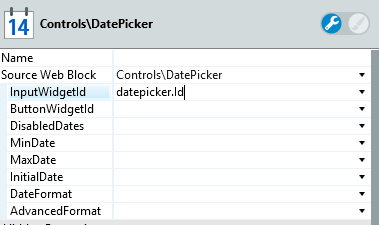
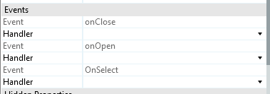

# Date Picker

Applies only to Traditional Web Apps.

You can use the Date Picker UI Pattern to allow the user to select a single or a range of dates using a calendar.

**How to use the Date Picker UI Pattern**

<!-- Drag an input and the DatePicker to the screen and set up the parameters. Only the InputWidgetId parameter is mandatory and must reference an input widget that will show the date picked on the page. -->

1. In Service Studio, from the Toolbox, drag an Input widget into the Main Content area of your application's screen.

    If the UI widget doesn't display, it's because the dependency isn't added. This happens because the Remove unused references setting is enabled. To make the widget available in your app:

    1. In the Toolbox, click **Search in other modules**.

    1. In **Search in other Modules**, remove any spaces between words in your search text.

    1. Select the widget you want to add from the **OutSystemsUIWeb** module, and click **Add Dependency**.

    1. In the Toolbox, search for the widget again.

1. On the **Properties** tab, enter the Input **Name**. In this example we call it **datepicker**.

    

1. From the **Variable** drop-down, select **New Local Variable**.

1. On the properties tab, set the Variable **Data Type** to **Date**.

    

1. From the Toolbox, drag the Date Picker widget into the Main Content area of your application's screen.

1. Set the **InputWidgetId** to the input Id.

    

1. In the Events, create the OnClose and OnSelect events.

    

1. Use the date in the input parameter in your logic.

    

1. Publish and test.

For advanced options, you can check the official documentation of the [Pikaday library](https://github.com/dbushell/Pikaday).

## Properties

| **Property** | **Description** |
|---|---|
| InputWidgetId (Text): Mandatory | Input element Id that triggers the element so it is visible. |
| ButtonWidgetId (Text): Optional | Element name (example: button) that  triggers the element so it is visible. |
| DisabledDates (Date List):Optional | List of dates for the disabled days. |
| MinDate (Date): Optional | Dates from this date onwards are enabled and  dates before this date are disabled. |
| MaxDate (Date): Optional | Dates before this date are enabled and dates after this date are disabled. |
| InitialDate (Date Time): Optional | If set, the calendar will initially display the set date, otherwise it will display the current Date (default). |
| DateFormat (Text): Optional | Defaults to the date format defined in the server configuration. The default is the server date format. |
| SelectInterval (Boolean): Optional | Allows the selection between two dates. If set to True, the Block Event "On Select" has the values for both parameters. |
| AdvancedFormat (DatePickerAdvancedFormat): Optional | Allows for more options than the ones given in the input parameters.                                                    |

### Date Picker advanced format information

| **Property** | **Description** |
|---|--- |
| EventsList (DateTime List): Optional | A list of events (type Date Time) |
| AdvancedFormatJSON (DateTime List): Optional | A string with options such as: `{ disableWeekends: true,  BeginEmpty: true }`. For more advanced options, read the official documentation: <https://github.com/dbushell/Pikaday> |

<iframe src="https://player.vimeo.com/video/977630375" width="750" height="460" frameborder="0" allow="autoplay; fullscreen" allowfullscreen="">Video demonstrating the interaction with the Date Picker UI in a Traditional Web App.</iframe>

## Device Compatibility

When used on mobile devices, it should be used horizontally to avoid issues related to the positioning of the DatePicker.
