# Dropdown

You can use the Dropdown UI Pattern to allow users make a choice from several options. Use the Dropdown UI Pattern to offer a choice of more than **four** options. The Dropdown UI Pattern is used when you want to display rich content, such as images. For a very large number of options, consider using the Dropdown Select UI Pattern to avoid loss of context.

**How to use the Dropdown UI Pattern**

In this example, we create a dropdown containing a list of employee names from an existing database. Once an employee is selected from the dropdown, a feedback message is displayed.

1. In Service Studio, in the Toolbox, search for `Dropdown`.

    The Dropdown widget is displayed.

    

    If the UI widget doesn't display, it's because the dependency isn't added. This happens because the Remove unused references setting is enabled. To make the widget available in your app:

    1. In the Toolbox, click **Search in other modules**.

    1. In **Search in other Modules**, remove any spaces between words in your search text.
    
    1. Select the widget you want to add from the **OutSystemsUIWeb** module, and click **Add Dependency**. 
    
    1. In the Toolbox, search for the widget again.

1. From the Toolbox, drag the Dropdown widget into the Main Content area of your application's screen.

    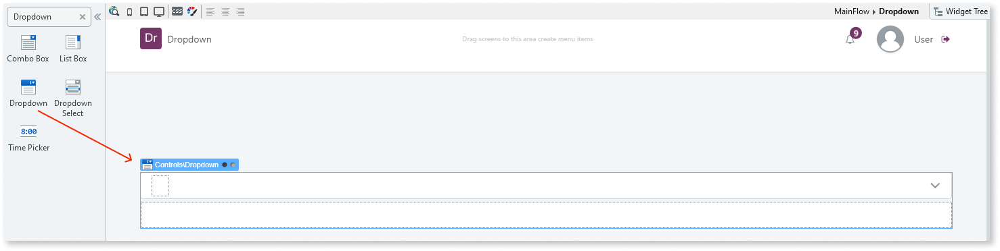

1. On the **Properties** tab, enter a name for the Dropdown widget.

    In this example, we enter `EmployeeDropdown`.

    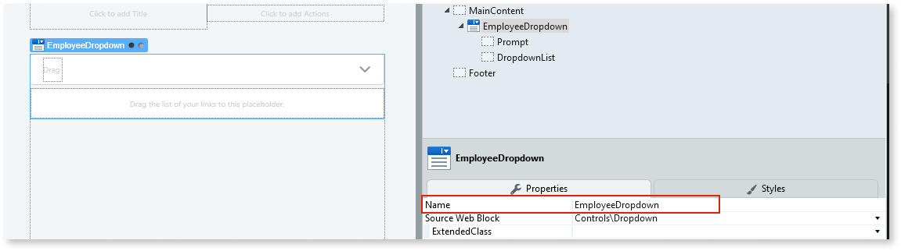

1. Right-click your screen name, and select **Add Preparation**.  

    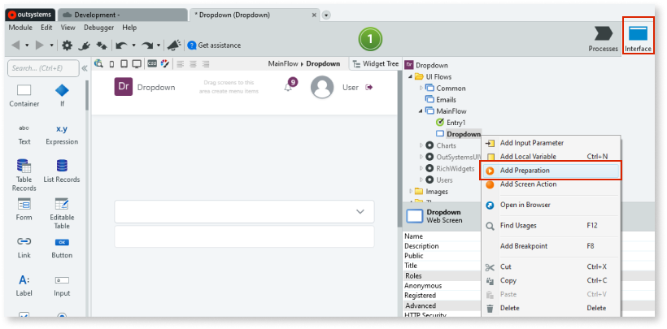

1. From the Toolbox, drag an Aggregate onto the Preparation.

    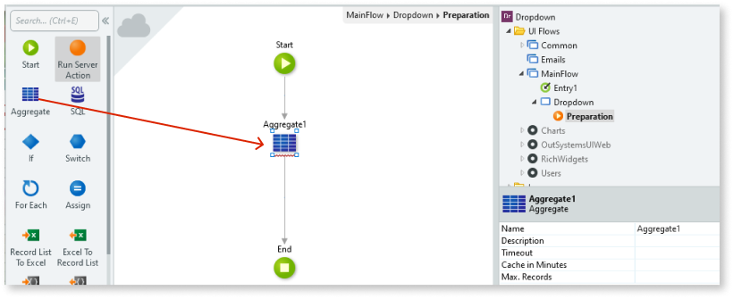

1. To add a database entity, double-click the Aggregate. Click the screen, and from the **Select Source** popup, select the database you want to use (in this example, the **Employee** database). Click **OK**.

    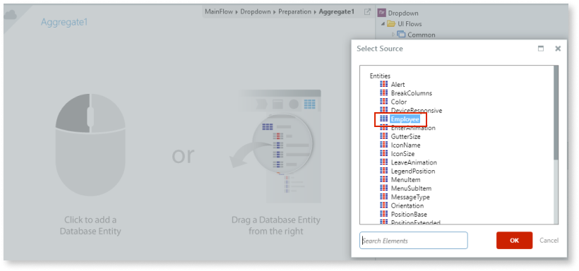

1. Return to your screen by double-clicking your screen name. From the Toolbox, drag the List Records widget into the **DropdownList** placeholder, and on the **Properties** tab, from the **Source Record List** dropdown, select the relevant record list.

    In this example, we select the **GetEmployees.List**.

    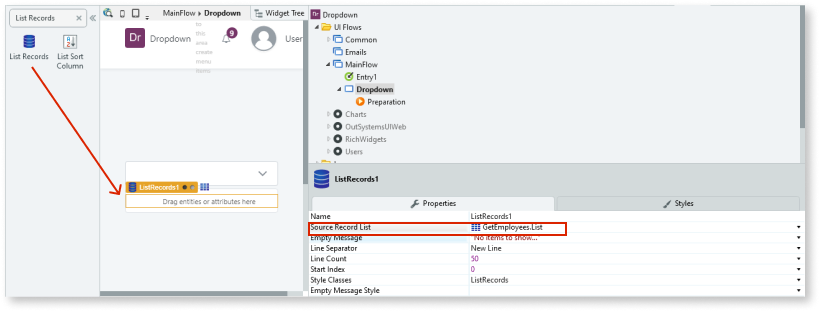

1. From the Toolbox, drag an Expression widget into the List Records widget, and on the **Properties** tab, set the **Value** property to the values you want to display in the dropdown.

    In this example, we set it to the employee names.

    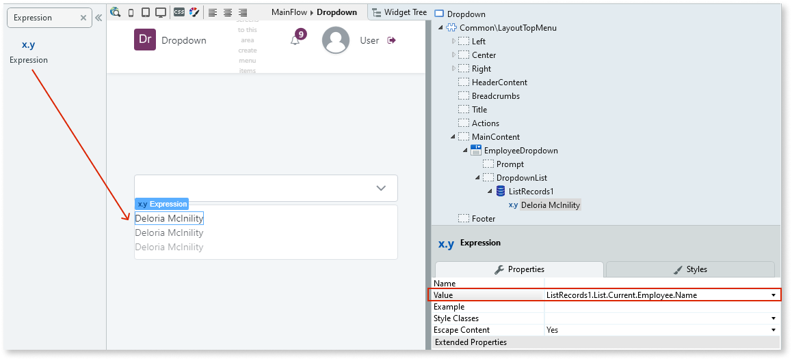

1. To make each of the values in the dropdown selectable, right-click the expression, and select **Link to** -> **New Screen Action**.

    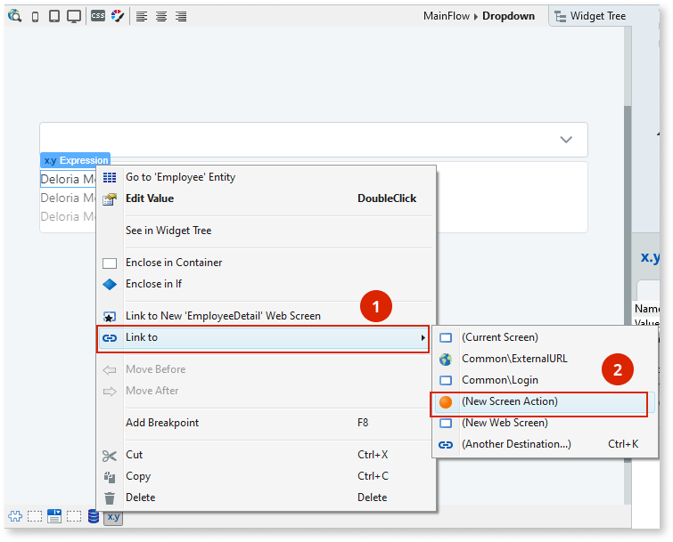

1. On the **Properties** tab, set the **Method** property to **Ajax Submit**.

    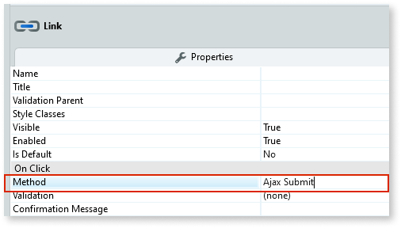

1. Double-click the new screen action, and enter a name in the **Name** property.

    In this example, we call it SelectedUser.

    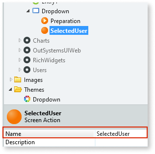

1. Double-click the new screen action, and from the Toolbox, drag the **Run Server Action** onto the screen action. In the **Select Action** popup, search for and select the **Feedback_Message** and click **OK**.

    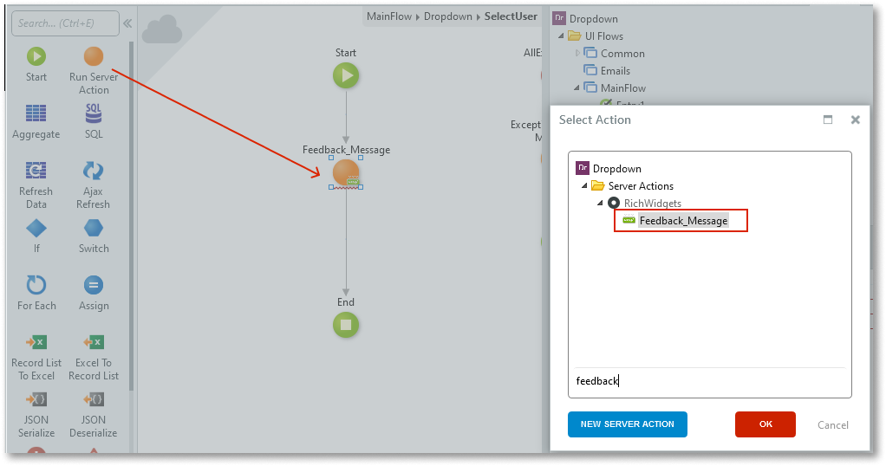

1. Set the message text and type.

    In this example, we set the message type to **Info** and set the message text to display the currently selected employee.

    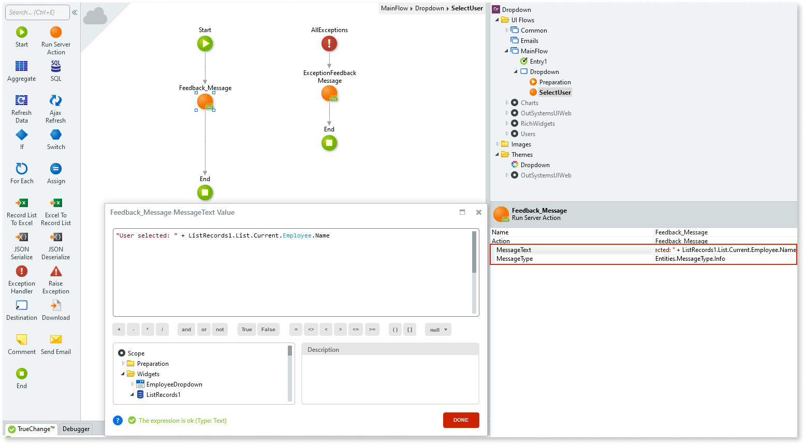

1. Return to your screen by double-clicking the screen name. Right-click your screen name and select **Add Local Variable**. Enter a name and a default value for the variable.

    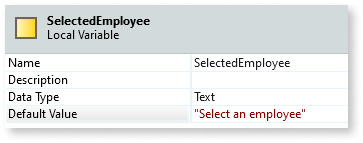

1. Drag the variable into the dropdown **Prompt** placeholder and enter a name and a value.  

    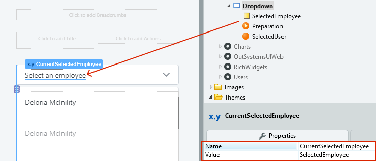

1. Double-click your screen action, add an **Assign**, and set the variable value. In this example, we set the variable to the currently selected employee.

    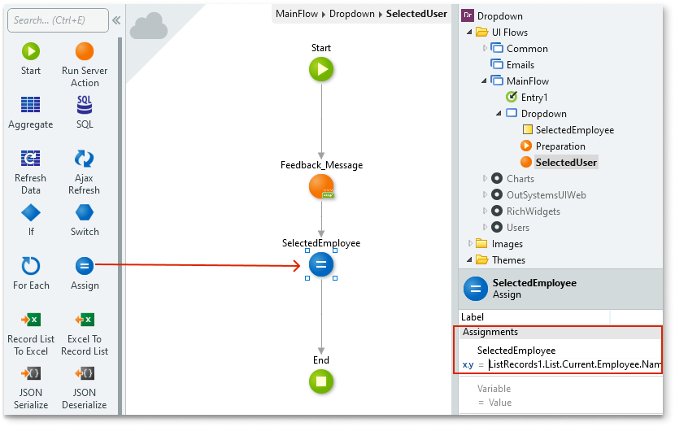

1. Add an **Ajax Refresh** to the screen action and in the **Select Widget** popup, select the widget you want to refresh.

    In this example, we select the expression that holds the currently selected employee.

    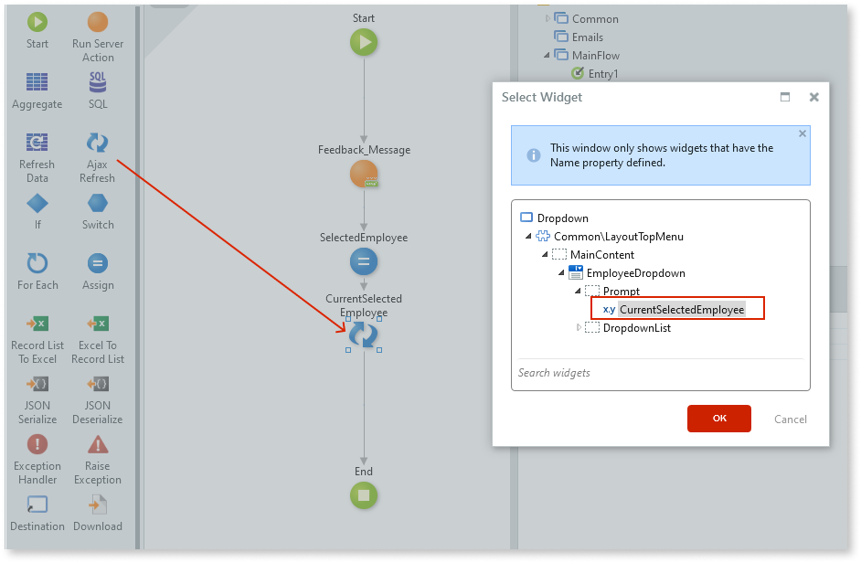

1. Select the **Logic** tab, navigate to **Interaction** -> **ToggleElement** and drag it onto the screen action. This closes the dropdown once a value is selected.

    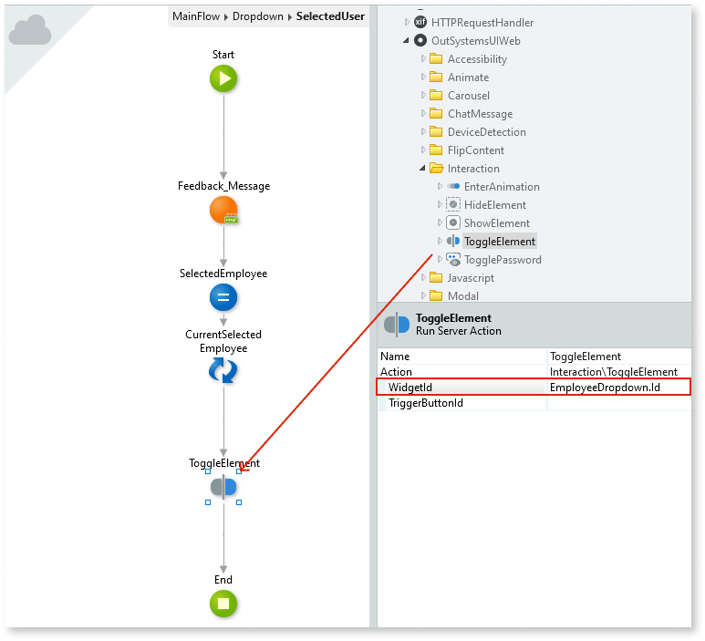

After following these steps and publishing the module, you can test the pattern in your app.

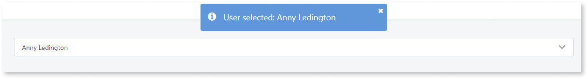

## Properties

| Property | Description |
|---|---|
| ExtendedClass (Text): Optional | Adds custom style classes to the Pattern. You define your [custom style classes](../../../look-feel/css.md) in your application using CSS.  Examples  <ul><li>Blank - No custom styles are added (default value).</li><li>"myclass" - Adds the ``myclass`` style to the UI styles being applied.</li><li>"myclass1 myclass2" - Adds the ``myclass1`` and ``myclass2`` styles to the UI styles being applied.</li></ul>You can also use the classes available on the OutSystems UI. For more information, see the [OutSystems UI Cheat Sheet](https://outsystemsui.outsystems.com/OutSystemsUIWebsite/CheatSheet). |
