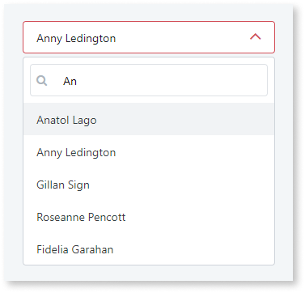
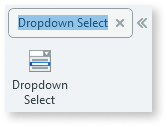
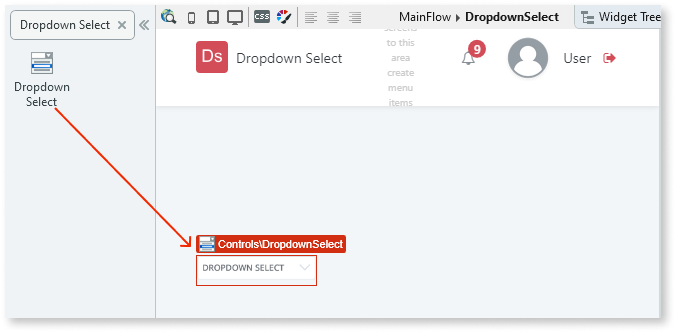
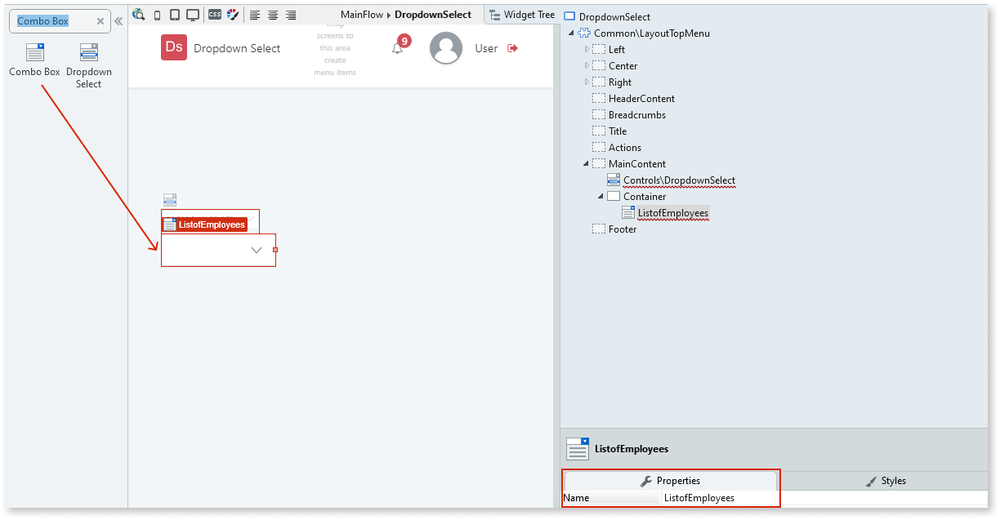
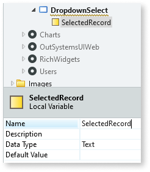
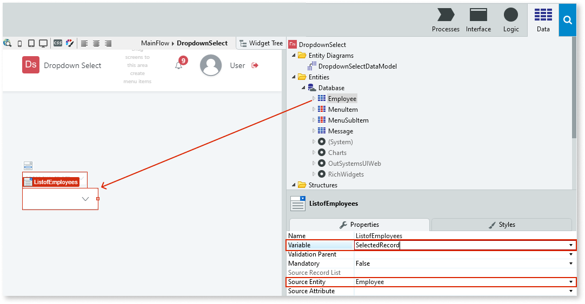
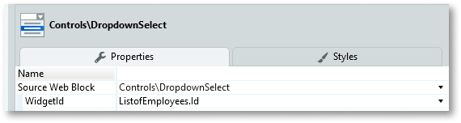
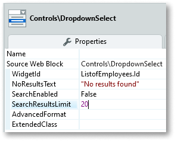

# Dropdown Select

Applies only to Traditional Web Apps.

The Dropdown Select is a pattern that you can apply to other patterns to implement a search functionality or multiple selection in lists. You can use the Dropdown Select UI Pattern when you need an enhanced combo box or list box in forms, as it offers a richer user experience than the list.

**How to use the Dropdown Select UI Pattern**

1. In Service Studio, in the Toolbox, search for `Dropdown Select`.

    The Dropdown Select widget is displayed.

    

    If the UI widget doesn't display, it's because the dependency isn't added. This happens because the Remove unused references setting is enabled. To make the widget available in your app:

    1. In the Toolbox, click **Search in other modules**.

    1. In **Search in other Modules**, remove any spaces between words in your search text.

    1. Select the widget you want to add from the **OutSystemsUIWeb** module, and click **Add Dependency**.

    1. In the Toolbox, search for the widget again.

1. From the Toolbox, drag the Dropdown Select widget into the Main Content area of your application's screen.

    

1. From the Toolbox, drag the Combo Box widget into the Main Content area of your application's screen, and on the Properties tab, enter a name for the widget. In this example, we enter `ListofEmployees`.

    

1. Right-click your screen name, select **Add Local Variable**, and enter a name for the new variable. In this example, we enter `SelectedRecord`.

    

1. Select the Combo Box widget, and on the **Properties** tab, enter the values for the **Variable** and **Source Entity** properties. In this example, we select **SelectedRecord** for the **Variable** property and drag the **Employees** entity into the Combo Box widget. This automatically becomes the **Source Entity** property value.

    

1. Select the Dropdown Select widget, and on the **Properties** tab, from the **WidgetId** drop-down, select the Combo Box widget Id. In this example, we select **ListofEmployees.Id**.

    

1. You can change the Dropdown Select's look and feel by setting the (Optional) properties on the Properties tab.

    

After following these steps and publishing the module, you can test the pattern in your app.

How this pattern behaves depends on the way it is bound.

* If you bind it to a Combo Box widget, Dropdown Select works as a selectable dropdown.
* If you bind it to a List Box, Dropdown Select works as a multi-select dropdown with removable tags.

## Properties

| **Property** | **Description** |
|---|---|
| WidgetId (Text): Mandatory | Element name (Combo Box and List Box) that triggers the element. |
| NoResultsText (Text): Optional | Text to display when there are no results. The default value is "No results found." |
| SearchEnabled (Boolean): Optional | If False, the search functionality is removed. This property does not work with the List Box. If True, the search functionality is enabled. This is the default value. |
| SearchResultsLimit (Long Integer): Optional | Limits the number of results shown. |
| AdvancedFormat (Text): Optional | Enables more options beyond what's provided through the inputs. For more options, go to [Choices library](https://github.com/jshjohnson/Choices). Default value is `{}`
Example
 <li>`{ searchPlaceholderValue: 'Search' }`</li> |
| ExtendedClass (Text): Optional | Adds custom style classes to the Pattern. You define your [custom style classes](../../../look-feel/css.md) in your application using CSS.  Examples   <ul><li>Blank - No custom styles are added (default value).</li><li>"myclass" - Adds the ``myclass`` style to the UI styles being applied.</li><li>"myclass1 myclass2" - Adds the ``myclass1`` and ``myclass2`` styles to the UI styles being applied.</li></ul>You can also use the classes available on the OutSystems UI. For more information, see the [OutSystems UI Cheat Sheet](https://outsystemsui.outsystems.com/OutSystemsUIWebsite/CheatSheet). |
  