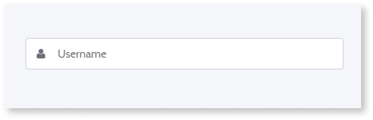
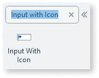
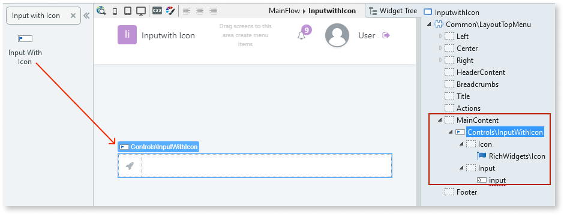
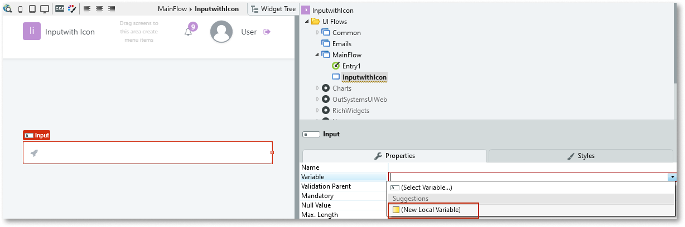
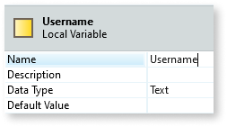
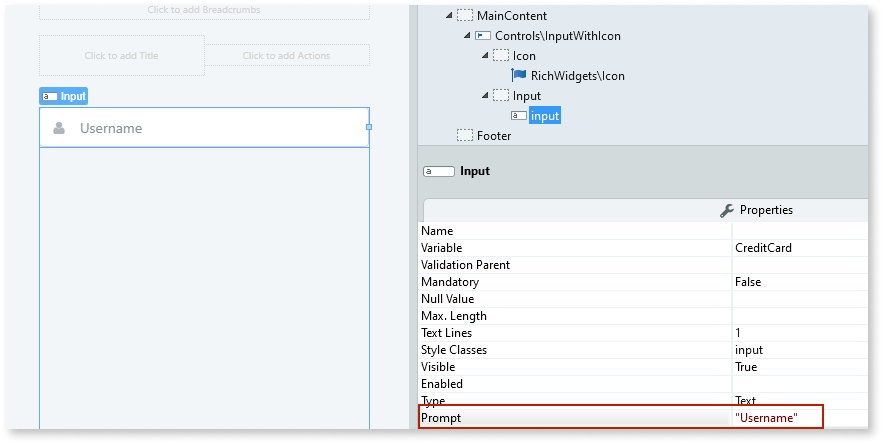
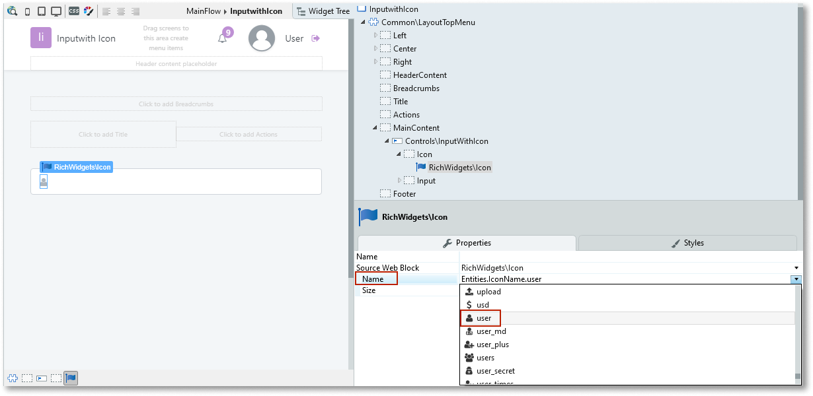
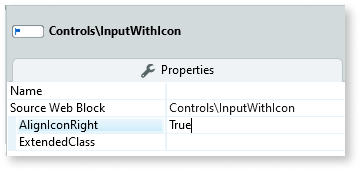

# Input with Icon

Applies only to Traditional Web Apps.

You can use the Input with Icon UI Pattern to allow the end user input data with the help of a hint in the form of an icon.

The Input with Icon UI Pattern includes an icon and placeholder text that supports the user when entering data. Is assists the user's comprehension by providing an example of the type of input required.  

**How to use the Input with Icon**

1. In Service Studio, in the Toolbox, search for `Input with Icon`.

    The Input with Icon widget is displayed.

    

    If the UI widget doesn't display, it's because the dependency isn't added. This happens because the Remove unused references setting is enabled. To make the widget available in your app:

    1. In the Toolbox, click **Search in other modules**.

    1. In **Search in other Modules**, remove any spaces between words in your search text.
    
    1. Select the widget you want to add from the **OutSystemsUIWeb** module, and click **Add Dependency**. 
    
    1. In the Toolbox, search for the widget again.

1. From the Toolbox, drag the Input with Icon widget into the Main Content area of your application's screen.

    

1. Select the Input widget, and on the **Properties** tab, from the **Variable** drop-down, select **New Local Variable**.

    

1. Enter a name for variable. In this example we enter `Username` and set the **Data Type** property to Text.

    

1. Select the Input widget again, and on the **Properties** tab, in the **Prompt** property, enter the text you want displayed in the input box that describes the expected value. In this example, we enter `Username`.

    

1. To change the icon, select the Icon widget, and from the **Name** drop-down, select the icon you want to display in the input box. In this example, we select the user icon.

    

1. You can change the Input with Icon's look and feel by setting the (optional) properties on the **Property** tab.

    

After following these steps and publishing the module, you can test the pattern in your app.

## Properties

| Property | Description |
|---|---|
| AlignIconRight (Boolean): Optional | If True, the icon is displayed on the right of the input box. If False, the icon is displayed on the left of the input box. This is the default. |
| ExtendedClass (Text): Optional | Adds custom style classes to the Pattern. You define your [custom style classes](../../../look-feel/css.md) in your application using CSS.  Examples   <ul><li>Blank - No custom styles are added (default value).</li><li>"myclass" - Adds the ``myclass`` style to the UI styles being applied.</li><li>"myclass1 myclass2" - Adds the ``myclass1`` and ``myclass2`` styles to the UI styles being applied.</li></ul>You can also use the classes available on the OutSystems UI. For more information, see the [OutSystems UI Cheat Sheet](https://outsystemsui.outsystems.com/OutSystemsUIWebsite/CheatSheet). |
